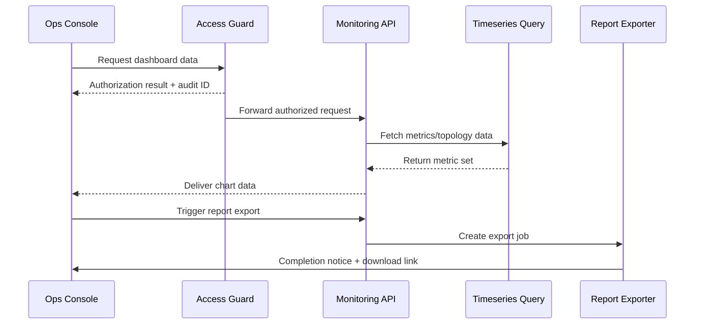

# Usecase Overview

- **Business Goal**: Provide Ops with a unified dashboard covering plugin health, topology, and inspection report exports, keeping data latency under one minute and enabling cross-tenant comparisons.
- **Success Metrics**: Dashboard refresh latency < 60 seconds; report export success rate ≥ 99%; unauthorized access blocks 100% of violations; topology render latency P95 < 3 seconds.
- **Scenario Alignment**: Delivers Stage 4 of the parent scenario by handling visualization, inspection workflows, and evidence retention that support alert remediation and leadership reporting.

> Centralized visualization and export capabilities accelerate inspections, increase SLA transparency, and reduce repetitive follow-ups.

# Context & Assumptions

- **Prerequisites**
  - Feature flags `ops-console-monitoring` and `monitoring-report-export` are enabled.
  - Metrics, logs, and events are written to the time-series and log stores with tenant/plugin/instance dimensions.
  - The Ops console integrates with unified authentication and RBAC, enforcing tenant isolation.
  - The export service supports asynchronous jobs and notifications, defaulting to CSV/PNG outputs.
- **Inputs / Outputs**
  - Inputs: Metric query parameters, tenant and plugin filters, time ranges, export formats.
  - Outputs: Dashboard charts, instance topology, inspection report files, access audit records.
- **Boundaries**
  - Does not cover tenant-defined metric widgets; only platform-standard metrics are provided.
  - Export formats default to CSV/PNG; additional formats require future enhancements.
  - SLA compensation reporting is handled by commercial systems outside this usecase.

# Solution Blueprint

## Architecture Layers

| Layer | Module | Responsibility | Code Entry |
|-------|--------|----------------|------------|
| Query | `internal/monitoring/query/timeseries_repository.go` | Multi-metric queries, aggregation, span validation, cache hits | `services/monitoring/query` |
| API | `internal/api/ops/monitoring_controller.go` | Expose dashboard APIs, enforce access checks, trigger export jobs | `services/api/ops` |
| UI | `apps/ops-console/pages/monitoring/dashboard.vue` | Render charts, topology, filters, and export entry points | `apps/ops-console` |
| Access | `internal/iam/policy/ops_access_guard.go` | Role/tenant validation, sensitive metric masking, audit writes | `services/iam` |
| Export | `internal/monitoring/export/report_generator.go` | Generate inspection reports, manage async queues, notify and archive | `services/monitoring/export` |

## Flow & Sequence

1. **Step 1 – Access Validation**: Requests pass through `ops_access_guard` to validate roles and tenant scope, producing an audit entry.
2. **Step 2 – Metric Query**: APIs call the query layer for CPU, memory, latency, and error-rate metrics with aggregation and caching applied.
3. **Step 3 – Topology Rendering**: Deployment data is fetched to render instance lists, dependencies, and health states.
4. **Step 4 – Report Export**: Export actions trigger async jobs, generate files, send notifications, and write to the export archive table.
5. **Step 5 – Inspection Notes**: Ops record findings and follow-ups, persisting inspection logs for later audits.

# Contracts & Interfaces

- **REST / GraphQL**
  - `GET /ops/monitoring/dashboard?tenant_id=&plugin_id=&range=` — Returns metrics, instances, and event summaries.
  - `POST /ops/monitoring/export` — Creates export jobs supporting `csv` and `png` formats.
- **Data Sources**
  - `timeseries.metrics` tables/topics (Prometheus/ClickHouse) for metric aggregation.
  - `ops_topology_nodes` and `ops_topology_edges` for instance and dependency data.
- **Access & Audit**
  - `ops_access_guard` reads `iam_roles` and `tenant_permissions`, writing entries to `audit_logs`.
- **Scripts**
  - `scripts/workflows/monitoring-dashboard-regression.mjs` — Regression script for dashboard inspections.

# Implementation Checklist

| Item | Description | Status | Owner |
|------|-------------|--------|-------|
| Access matrix | Define role/tenant isolation strategy and audit coverage | [ ] | Matrix Ops |
| Metric query optimization | Add caching, multi-resolution queries, and guard against N+1 | [ ] | Iris Chen |
| Dashboard components | Build charts, topology view, empty/loading states | [ ] | Iris Chen |
| Report export | Implement async exports, notifications, archival & cleanup | [ ] | Matrix Ops |
| Inspection records | Add inspection forms, history lists, and filters | [ ] | Iris Chen |

# Testing Strategy

- **Unit**: Access guard validations, metric query parameter checks, export job state machine, topology data transforms.
- **Integration**: Simulate multi-tenant access to verify isolation, cache hits, and export notifications.
- **End-to-End**: Execute meta scenario test cases B-1/B-2 to confirm inspection flow and access denial paths.
- **Performance**: Load-test the dashboard API at 100 RPS to measure response latency and cache impact; export 50 reports and track completion time.

# Observability & Ops

- **Metrics**: `monitoring.dashboard.latency_p95`, `monitoring.dashboard.render_total`, `monitoring.export.success_total`, `monitoring.audit.denied_total`.
- **Logs**: Capture `tenant_id`, `plugin_id`, `user_id`, `role`, `resource`, `action`, `result`, `latency_ms`.
- **Alerts**: Dashboard API error rate >2% over 5 minutes raises P1; export failure rate >5% raises P2.
- **Dashboards**: Grafana “Ops Console / Monitoring Dashboard”, Datadog `ops_console.*`.

# Rollback & Failure Handling

- **Rollback Strategy**: Disable `ops-console-monitoring` or revert to the previous dashboard bundle; retain export history for comparison.
- **Mitigation Steps**: Display placeholders when metrics are missing, prompt data collection checks, notify tenant admins, and provide manual inspection templates.
- **Data Validation**: Run `scripts/workflows/monitoring-verify-dashboard.mjs` to reconcile source metrics with UI output.

# Follow-ups & Risks

| Risk / Item | Impact | Mitigation | Owner | ETA |
|-------------|--------|------------|-------|-----|
| Metric coverage gaps | Inspections may miss latent issues | Expand metric catalogue, add custom metric plugins | Matrix Ops | 2025-11-20 |
| Export job backlog | Slow exports and delayed notifications | Increase queue consumers, rate-limit per tenant, surface progress | Iris Chen | 2025-11-25 |

# References & Links

- Scenario: `docs/scenarios/runtime-ops/SCN-OPS-SYSTEM-MONITORING-001.md`
- Background: `docs/meta/scenarios/powerx/core-platform/runtime-ops/system-monitoring-and-alerting/primary.md`
- Access governance: `docs/standards/_shared/downstream-readonly-setup.md`
