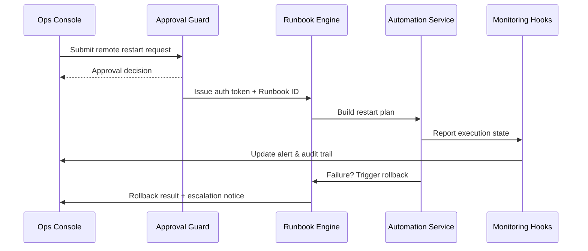

# Usecase Overview

- **Business Goal**: Allow Ops or tenant administrators to launch remote restarts directly from alert details, with automatic approval, rolling restart, health validation, and rollback to keep MTTR under five minutes.
- **Success Metrics**: Remote restart success rate ≥ 95%; average recovery time ≤ 5 minutes; approval latency P95 < 2 minutes; rollback success rate 100%.
- **Scenario Alignment**: Covers Stage 3/4 automation in the parent scenario, standardizing runbooks and ensuring auditability.

> A standardized remote restart flow lets on-call teams recover services from a single console without risky manual SSH operations.

# Context & Assumptions

- **Prerequisites**
  - Feature flags `remote-ops-automation` and `ops-approval-center` are enabled.
  - The alert center supports ownership and approval workflows with initiator, approver, and observer roles.
  - Plugins support rolling restart strategies (graceful drain, health probes, timeout-driven rollback).
  - Automation services have credentials and network access to target instances.
- **Inputs / Outputs**
  - Inputs: Alert context, tenant/plugin metadata, approval outcome, runbook template.
  - Outputs: Restart execution plan, instance status, health probe results, audit trails, rollback actions.
- **Boundaries**
  - Cross-region failover is out of scope; separate runbooks cover multi-region rollback.
  - Plugin code fixes are excluded; this usecase focuses on restart and rollback only.
  - Approval policies are governed elsewhere; this flow consumes their outcomes.

# Solution Blueprint

## Architecture Layers

| Layer | Module | Responsibility | Code Entry |
|-------|--------|----------------|------------|
| Approval | `internal/iam/policy/remote_action_guard.go` | Validate RBAC, MFA, approval tickets, and issue auth tokens | `services/iam` |
| Orchestration | `pkg/automation/runbook_engine.go` | Load runbooks, handle branches, trigger rollback hooks | `pkg/automation` |
| Execution | `internal/automation/remote_restart_workflow.go` | Execute rolling restarts and health probes via automation services | `services/automation` |
| Monitoring | `internal/monitoring/hooks/restart_status_sink.go` | Collect restart status, probe results, and publish monitoring/audit data | `services/monitoring/hooks` |
| Console | `apps/ops-console/pages/alerts/detail.vue` | Display alert details, approvals, restart controls, and status updates | `apps/ops-console` |

## Flow & Sequence

1. **Step 1 – Alert Ownership & Approval**: On-call Ops clicks “Remote Restart”; the approval center validates permissions and triggers the approval flow.
2. **Step 2 – Runbook Orchestration**: After approval, the runbook engine loads templates and builds the rolling restart plan (batches, wait intervals, probe checks).
3. **Step 3 – Restart Execution**: Automation services stop/start instances per plan, invoke health probe APIs, and record state transitions.
4. **Step 4 – Status Feedback**: Execution results sync back to the alert center, monitoring services, and the audit store; successful runs close the alert.
5. **Step 5 – Rollback & Escalation**: Failures trigger rollback (restoring previous instances/config), escalate the alert to P0, and notify human responders.

# Contracts & Interfaces

- **Inbound**
  - `POST /ops/alerts/{alert_id}/remote-restart` — Initiates restart with approval token and notes.
  - `EVENT monitoring.alert.escalated` — Escalations may auto-trigger approvals and runbooks.
- **Outbound**
  - `POST /automation/restart` — Payload includes `tenant_id`, `plugin_id`, `instances`, `batch_size`, `health_check`.
  - `POST /automation/rollback` — Restores previous instances or configuration.
  - `EVENT monitoring.restart.status` — States `PENDING`, `IN_PROGRESS`, `SUCCEEDED`, `FAILED`, `ROLLED_BACK`.
- **Configs / Scripts**
  - `config/automation/runbooks/remote_restart.yaml` — Standard runbook template.
  - `scripts/workflows/monitoring-remote-restart-smoke.mjs` — Sandbox drill script.

# Implementation Checklist

| Item | Description | Status | Owner |
|------|-------------|--------|-------|
| Approval integration | Wire in approval center, MFA, and audit logging | [ ] | Iris Chen |
| Runbook template | Author rolling restart & rollback templates with parameters | [ ] | Matrix Ops |
| Automation execution | Implement batch control, health probes, failure retries | [ ] | Matrix Ops |
| Console UX | Surface status, approvals, and progress in alert details | [ ] | Iris Chen |
| Alert escalation | Auto-promote failed restarts to P0 and notify channels | [ ] | Matrix Ops |

# Testing Strategy

- **Unit**: Approval token validation, runbook branching logic, state machine transitions, rollback hooks.
- **Integration**: Run sandbox restarts to verify approvals, execution, health checks, and rollback.
- **End-to-End**: Execute meta scenario cases D-1/D-2 to confirm success and failure/rollback paths.
- **Drills**: Conduct quarterly disaster recovery drills, tracking success rate and mean duration.

# Observability & Ops

- **Metrics**: `monitoring.remote_restart.trigger_total`, `monitoring.remote_restart.success_total`, `monitoring.remote_restart.failure_total`, `monitoring.remote_restart.mfa_latency`, `monitoring.remote_restart.rollback_total`.
- **Logs**: Capture `alert_id`, `runbook_id`, `instance_id`, `batch`, `status`, `elapsed_ms`, `approver`.
- **Alerts**: Failure rate >5% per day triggers P0; approval delay >3 minutes triggers P1.
- **Dashboards**: Grafana “Automation / Remote Actions”, approval center reports, audit logs.

# Rollback & Failure Handling

- **Rollback Strategy**: Automation engine executes `automation/rollback`, restores prior state or read-only mode; alert escalates and notifies human responders.
- **Mitigation**: Launch manual runbooks, freeze new restart requests, inform tenant admins, log incident tickets.
- **Data Repair**: Run `scripts/workflows/monitoring-reconcile-remote-actions.mjs` to reconcile executions with audit records.

# Follow-ups & Risks

| Risk / Item | Impact | Mitigation | Owner | ETA |
|-------------|--------|------------|-------|-----|
| Limited health probe coverage | Rollback may trigger too late | Expand probe catalog and custom checks | Matrix Ops | 2025-11-24 |
| Approval delays affect MTTR | Alerts remain unresolved too long | Introduce on-call auto-approval, IM reminders, timeout escalation | Iris Chen | 2025-11-21 |

# References & Links

- Scenario: `docs/scenarios/runtime-ops/SCN-OPS-SYSTEM-MONITORING-001.md`
- Background: `docs/meta/scenarios/powerx/core-platform/runtime-ops/system-monitoring-and-alerting/primary.md`
- Runbook template: `config/automation/runbooks/remote_restart.yaml`
