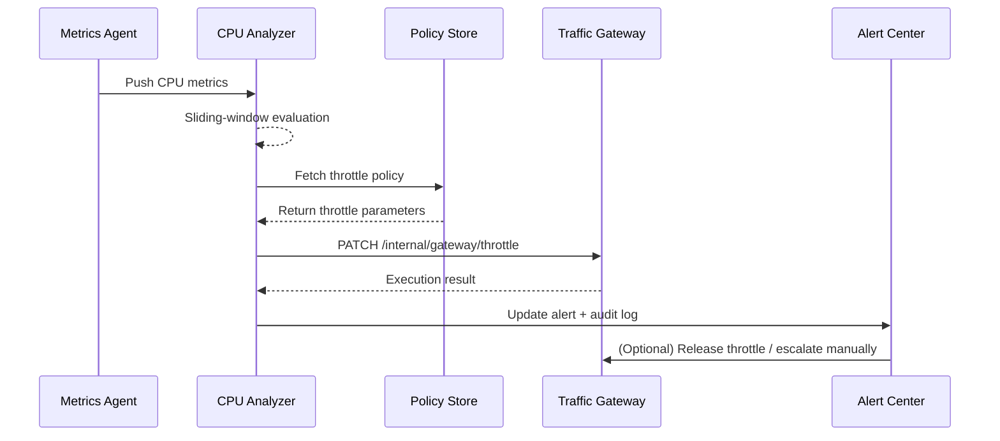

# Usecase Overview

- **Business Goal**: Trigger auto-throttling within 30 seconds when plugin CPU usage exceeds thresholds across three consecutive samples, preventing blast radius while notifying Ops and plugin owners.
- **Success Metrics**: Throttling execution latency ≤ 30 seconds; CPU drops below 70% within two minutes after throttling; false-positive rate < 1%; throttle failure escalations acknowledged within five minutes.
- **Scenario Alignment**: Implements Stage 2/3 automation in the parent scenario, following anomaly detection to keep multi-tenant runtime stability.

> Auto-throttling preserves service availability, reduces manual intervention, and buys time for deeper remediation.

# Context & Assumptions

- **Prerequisites**
  - Feature flags `monitoring-service` and `ops-throttle-automation` are enabled.
  - Metric agents publish CPU, memory, and call-volume data every 10 seconds with tenant/plugin dimensions.
  - The traffic gateway exposes `PATCH /internal/gateway/throttle` supporting idempotent throttling.
  - The alert center provides the “CPU anomaly auto throttle” template for Ops and plugin owners.
- **Inputs / Outputs**
  - Inputs: CPU metric stream, tenant and plugin metadata, threshold policies, throttle templates.
  - Outputs: Throttle commands (target instances, concurrency caps, TTL), alert events, audit records, recovery guidance.
- **Boundaries**
  - Threshold configuration UI is managed in the Ops console outside this usecase.
  - Network-layer throttling (e.g., CDN, API Gateway) is out of scope; focus is on plugin instances.
  - If throttling cannot proceed, escalation to manual remediation is required.

# Solution Blueprint

## Architecture (Layers)

| Layer | Module | Responsibility | Code Entry |
|-------|--------|----------------|------------|
| Ingestion | `internal/monitoring/analyzer/cpu_anomaly_detector.go` | Aggregate CPU metrics, run sliding-window checks, draft anomaly payloads | `services/monitoring` |
| Policy | `internal/monitoring/policy/throttle_policy_store.go` | Load tenant/plugin throttle policies, allowlists, tolerance thresholds | `services/monitoring/policy` |
| Dispatch | `internal/automation/throttle_dispatcher.go` | Generate throttle commands, call gateway APIs, persist execution status | `services/automation` |
| Alerts | `pkg/alerts/notifier.go` | Send alerts, detect failures, escalate, and log audits | `pkg/alerts` |
| Console | `ui/ops-console/throttle-history.vue` | Display throttle timelines, manual release controls, false-positive feedback | `apps/ops-console` |

## Flow & Sequence

1. **Step 1 – Anomaly Detection**: The CPU analyzer applies a sliding window to detect threshold breaches and builds the anomaly payload.
2. **Step 2 – Policy Validation**: Policy store validates tenant/plugin rules, allowlists, and tolerance thresholds; allowlisted entries only raise alerts.
3. **Step 3 – Auto-Throttling**: The dispatcher invokes the gateway API to set a new concurrency cap and verifies execution within five seconds.
4. **Step 4 – Status Broadcast**: Results are published to the monitoring event bus; the alert center marks the incident as “Auto remediation” and records audits.
5. **Step 5 – Recovery / Rollback**: Policies lift throttles once CPU stabilizes; Ops can manually release or escalate if throttling was incorrect.

# Contracts & Interfaces

- **Inbound**
  - `STREAM monitoring.cpu.sampled` — CPU samples containing tenant, plugin, instance, usage.
  - `GET /internal/monitoring/policy/throttle?tenant_id=&plugin_id=` — Retrieve throttle policies and tolerance thresholds.
- **Outbound**
  - `PATCH /internal/gateway/throttle` — Request body includes `tenant_id`, `plugin_id`, `instance_id`, `max_concurrency`, `ttl_seconds`.
  - `EVENT monitoring.alert.updated` — States include `AUTO_THROTTLED`, `FAILED`, `RECOVERED`.
- **Configs / Scripts**
  - `config/monitoring/thresholds.yaml` — Default thresholds and allowlists.
  - `scripts/workflows/monitoring-throttle-smoke.mjs` — Sandbox stress and throttle validation script.

# Implementation Checklist

| Item | Description | Status | Owner |
|------|-------------|--------|-------|
| Metric coverage | Ensure tenant/plugin/instance coverage; add CPU replay script | [ ] | Matrix Ops |
| Policy store | Implement policy storage, allow/block lists, and dynamic rollout | [ ] | Iris Chen |
| Gateway idempotency | Validate signatures, retries, and concurrency conflict handling | [ ] | Matrix Ops |
| Alert messaging | Update templates, state machine, false-positive feedback | [ ] | Iris Chen |
| Console visualization | Add throttle timeline, manual release, and audit linkage | [ ] | Iris Chen |

# Testing Strategy

- **Unit**: Sliding-window logic, threshold parsing, policy allowlist hits, throttle request idempotency.
- **Integration**: Stress-test sandbox plugins, validate throttling execution, failure retries, and release flows.
- **End-to-End**: Run meta scenario test cases A-1/A-2 to verify escalation and recovery paths.
- **Non-Functional**: Push 500 QPS metric streams to confirm detection latency < 10 seconds; simulate network delays to exercise retries.

# Observability & Ops

- **Metrics**: `monitoring.throttle.trigger_total`, `monitoring.throttle.success_total`, `monitoring.throttle.failure_total`, `monitoring.throttle.mttr`.
- **Logs**: Record `tenant_id`, `plugin_id`, `instance_id`, `max_concurrency`, `decision_reason`, `attempt`.
- **Alerts**: Consecutive throttle failures >2 trigger P1; >3 false-positive reports per day trigger governance tasks.
- **Dashboards**: Grafana “Runtime Ops / Auto Throttle”, alert center throttle board, audit queries.

# Rollback & Failure Handling

- **Rollback Strategy**: Disable `ops-throttle-automation` to revert to manual throttling; clear cached auto-throttle state.
- **Mitigation**: Launch manual runbooks to adjust concurrency caps; publish advisories for tenant awareness.
- **Data Repair**: Run `scripts/workflows/monitoring-reconcile-throttle.mjs` to reconcile throttle events with audit logs.

# Follow-ups & Risks

| Risk / Item | Impact | Mitigation | Owner | ETA |
|-------------|--------|------------|-------|-----|
| Overly sensitive thresholds | Business jitter and degraded UX | Introduce adaptive thresholds and tenant weighting | Matrix Ops | 2025-11-12 |
| Slow gateway responses | Throttle latency breaches targets | Add caching, tune concurrency, prewarm connection pools | Iris Chen | 2025-11-18 |

# References & Links

- Scenario: `docs/scenarios/runtime-ops/SCN-OPS-SYSTEM-MONITORING-001.md`
- Background: `docs/meta/scenarios/powerx/core-platform/runtime-ops/system-monitoring-and-alerting/primary.md`
- Configuration: `config/monitoring/thresholds.yaml`
