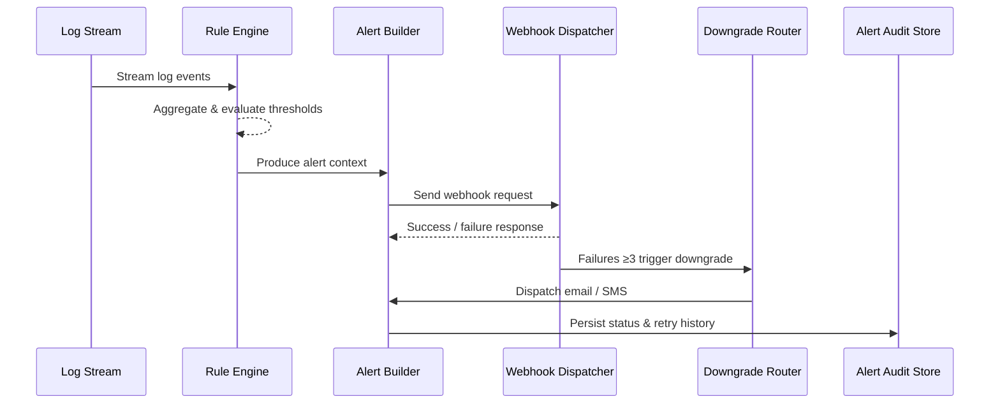

# Usecase Overview

- **Business Goal**: Detect error or security events in plugin logs, raise alerts within one minute, and deliver them to external platforms via webhook with at least three retries and downgrade options.
- **Success Metrics**: Initial webhook delivery success ≥ 97%, cumulative ≥ 99%; downgrade engages email/SMS after three failures; alert acknowledgement rate ≥ 95%.
- **Scenario Alignment**: Implements Stage 2/3 detection and notification in the parent scenario, providing context for manual or automated remediation.

> Rule-driven detection plus downgrade controls ensures log anomalies are surfaced promptly and routed into the correct incident flows.

# Context & Assumptions

- **Prerequisites**
  - Feature flags `monitoring-service`, `alert-gateway-v2`, and `webhook-delivery-fallback` are enabled.
  - Log shippers push structured fields (level, tenant_id, plugin_id, trace_id) into the centralized log service.
  - Tenants configure webhook endpoints, auth methods, and fallback channels.
  - External alerting platforms support HMAC signatures and idempotent retry handling.
- **Inputs / Outputs**
  - Inputs: Log stream, rule configuration, tenant alert preferences, retry policy.
  - Outputs: Webhook requests, retry schedules, downgrade email/SMS, alert state transitions.
- **Boundaries**
  - Rule configuration UI is managed by governance teams outside this usecase.
  - Does not create downstream tickets directly; webhook payloads allow external systems to do so.
  - Bulk generation for offline log replay relies on separate compensation scripts.

# Solution Blueprint

## Architecture Layers

| Layer | Module | Responsibility | Code Entry |
|-------|--------|----------------|------------|
| Parsing | `internal/logs/rules/error_burst_detector.go` | Parse rules, run sliding windows, aggregate anomalies | `services/logs/rules` |
| Alerting | `internal/alerts/alert_builder.go` | Build alert events, set severity, enrich context | `services/alerts` |
| Delivery | `internal/alerts/webhook_dispatcher.go` | Dispatch webhooks, handle retries, validate signatures, manage delays | `services/alerts` |
| Downgrade | `pkg/alerts/downgrade_router.go` | Switch to email/SMS after three failures, persist downgrade state | `pkg/alerts` |
| Audit & Reporting | `internal/alerts/reporting/alert_audit_repository.go` | Track alert statuses, audits, and exportable reports | `services/alerts/reporting` |

## Flow & Sequence

1. **Step 1 – Log Parsing**: Rule engine subscribes to log streams, aggregates by tenant/plugin, and detects spikes within five minutes.
2. **Step 2 – Alert Construction**: Builds alert payloads with tenant, plugin, summary, recommended actions, and trace identifiers.
3. **Step 3 – Webhook Delivery**: Webhook dispatcher signs requests, applies retry policies, and records attempts.
4. **Step 4 – Downgrade Handling**: After three consecutive failures, downgrade router switches to email/SMS and flags the state as “Downgraded”.
5. **Step 5 – Audit Updates**: Alert audit store records delivery results and updates the alert center for ownership.

# Contracts & Interfaces

- **Inbound**
  - `STREAM logs.plugin.*` — Includes `level`, `message`, `tenant_id`, `plugin_id`, `ts`.
  - `config/log_rules/*.yaml` — Defines rules, keywords, thresholds, and severity.
- **Outbound**
  - `POST <tenant_webhook>` — Uses headers `X-PowerX-Signature`, `X-PowerX-Alert-ID`; payload contains tenant, plugin, error summary, recommended action.
  - `POST /alerts/fallback/email`, `POST /alerts/fallback/sms` — Downgrade channels.
  - `EVENT monitoring.alert.updated` — States `DELIVERED`, `FAILED`, `DOWNGRADED`.
- **Scripts**
  - `scripts/workflows/monitoring-webhook-simulator.mjs` — Sandbox webhook simulator.
  - `scripts/workflows/monitoring-alert-retry.mjs` — Batch retry and remediation script.

# Implementation Checklist

| Item | Description | Status | Owner |
|------|-------------|--------|-------|
| Rule engine | Implement error/security keyword detection, tenant thresholds, windowing | [ ] | Matrix Ops |
| Webhook delivery | Support signature generation, exponential backoff, failure logging | [ ] | Iris Chen |
| Downgrade policy | Build email/SMS channels, downgrade states, notification templates | [ ] | Matrix Ops |
| Audit reporting | Establish audit storage, dashboards, and export scripts | [ ] | Iris Chen |
| Alert center integration | Update alert UI states, ownership flow, and notes field | [ ] | Iris Chen |

# Testing Strategy

- **Unit**: Rule parsing, sliding-window computation, signature verification, downgrade switching.
- **Integration**: Trigger alerts in sandbox logs, validate retries, downgrades, and audit writes.
- **End-to-End**: Execute meta scenario cases C-1/C-2 to confirm delivery and downgrade flows.
- **Reliability**: Simulate webhook timeouts, HTTP 500, network jitter to ensure retries and downgrades engage.

# Observability & Ops

- **Metrics**: `monitoring.webhook.delivery_success_rate`, `monitoring.webhook.retry_total`, `monitoring.alert.downgrade_total`, `monitoring.alert.confirmed_total`.
- **Logs**: Record `alert_id`, `tenant_id`, `plugin_id`, `attempt`, `channel`, `status`, `latency_ms`.
- **Alerts**: Webhook success rate <95% over 15 minutes triggers P1; >20 downgrades per day trigger governance tasks.
- **Dashboards**: Grafana “Alert Delivery”, Ops alert center status board.

# Rollback & Failure Handling

- **Rollback Strategy**: Disable `webhook-delivery-fallback` to revert to legacy channels; pause new rule rollouts.
- **Mitigation**: Batch retry failed alerts, prompt tenants to validate webhooks, switch to manual notifications.
- **Data Repair**: Run `scripts/workflows/monitoring-reconcile-alerts.mjs` to reconcile alert states with audit logs.

# Follow-ups & Risks

| Risk / Item | Impact | Mitigation | Owner | ETA |
|-------------|--------|------------|-------|-----|
| Rule noise causing alert storms | Increased on-call load and false positives | Add noise suppression, dynamic thresholds, aggregation | Matrix Ops | 2025-11-16 |
| Misconfigured webhooks | Failed alert deliveries | Provide self-check scripts, console validation, automated reminders | Iris Chen | 2025-11-18 |

# References & Links

- Scenario: `docs/scenarios/runtime-ops/SCN-OPS-SYSTEM-MONITORING-001.md`
- Background: `docs/meta/scenarios/powerx/core-platform/runtime-ops/system-monitoring-and-alerting/primary.md`
- Event model: `docs/standards/powerx/backend/integration/06_gateway/EventBus_and_Message_Fabric.md`
