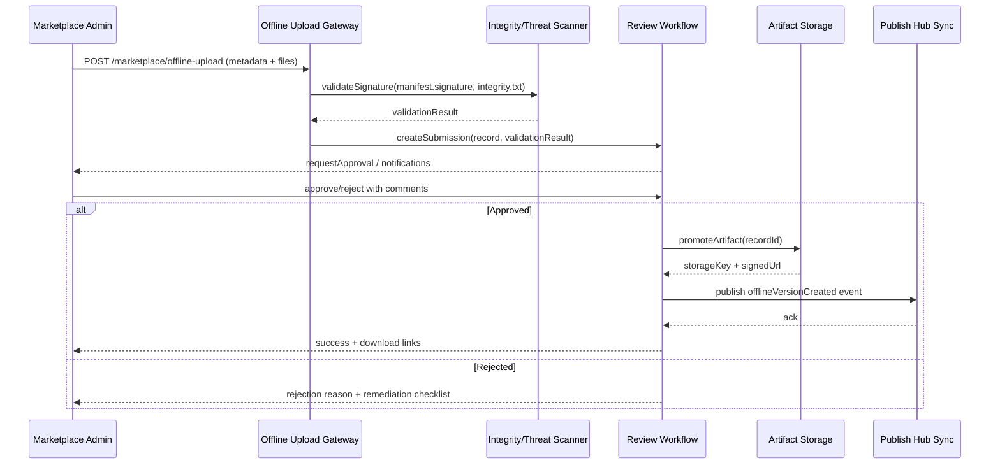

# Positioning & Goals

- **Business Goal**: Support offline plugin listing by providing auditable upload, validation, review, and distribution capabilities so the plugin ecosystem remains secure without public internet.
- **Scenario Link**: Feeds Stages 2–3 of `SCN-PUBLISH-OFFLINE-001`, accepting bundles produced by `PLG-PUBLISH-OFFLINE-001` and publishing compatible versions for `PX-PUBLISH-OFFLINE-001` and `PX-PUBLISH-OFFLINE-UI-001`.
- **Success Metrics**: Offline upload success rate ≥ 99%; review SLA ≤ 1 business day; signature/hash failure rate < 1%; version sync latency ≤ 30 minutes.

The Marketplace offline pipeline relies on layered review, compliance checks, and controlled storage to keep the offline bundle life cycle traceable and reversible while matching online compliance standards.

# Core Capabilities

- **Secure Offline Upload**: Provide an upload pipeline with signature validation, hash verification, and threat scanning.
- **Review & Approval Workflow**: Support multi-level approvals, role separation, audit logs, and state rollback.
- **Artifact Management**: Store `.pxp` bundles and companion files in managed object storage with download credentials.
- **Metadata Registration**: Persist plugin version metadata (compatibility, dependencies, compliance status) for Admin/Core consumption.
- **Tenant Distribution Hooks**: Synchronize approvals to the Publish Hub so tenant subscription notifications and batch distribution can begin.

# Target Roles & Responsibilities

- **Marketplace Administrator**: Upload offline bundles, supplement metadata, trigger initial review.
- **Compliance / Security Reviewer**: Perform second-level approval, validate signatures/certificates, assess risk.
- **Operations Team**: Maintain object storage, review logs, credentials, and alert channels.
- **Publish Hub Steward**: Connect scenario and PX usecases, ensuring version lists propagate to core services promptly.

# Concept & Scope

- **Prerequisites**
  - Feature flags `PX_MARKET_OFFLINE_UPLOAD` and `PX_MARKET_REVIEW_CHAIN` enabled.
  - Object storage or MinIO cluster available with dedicated bucket/prefix.
  - Marketplace admin console exposes offline upload entry with MFA or hardware signing.
  - Trusted certificate lists, hash policies, and threat scanning services configured.
- **Inputs**
  - `.pxp` bundle, `manifest.json`, `integrity.txt`, `manifest.signature`.
  - Metadata entered in the upload form: basic plugin info, compatible tenants, review notes.
- **Outputs**
  - Reviewed plugin version records; downloadable URLs/credentials; events that sync status to the Publish Hub.
  - Audit trails, approval chains, risk ratings, exception alerts.
- **Boundaries**
  - Does not generate `.pxp` bundles (`PLG-PUBLISH-OFFLINE-001`).
  - Excludes tenant installation behavior (`PX-PUBLISH-OFFLINE-001`, `PX-PUBLISH-OFFLINE-UI-001`).
  - Does not provide the online publishing flow (`MKP-PUBLISH-ONLINE-001`).

# Architecture & Workflow

## Module Breakdown

| Module                    | Scope              | Responsibility                                                | Notes                                         |
|---------------------------|--------------------|----------------------------------------------------------------|-----------------------------------------------|
| Upload Gateway            | powerx-marketplace | Accept uploads, validate digests/signatures, stage artifacts   | REST/GraphQL endpoints; chunked upload support |
| Malware & Integrity Scanner | powerx-marketplace | Invoke security scans, verify `integrity.txt`, ensure certificate validity | Integrates with CRL and threat scanners        |
| Review Workflow Engine    | powerx-marketplace | Manage multi-level approval, state transitions, audit records  | Tracks SLA, reminders, rejection/rollback      |
| Artifact Storage Adapter  | powerx-marketplace | Promote compliant bundles to canonical storage, issue signed URLs | Supports versioning, freeze/unfreeze           |
| Metadata Registry         | powerx-marketplace | Record plugin versions, dependency matrices, policy tags       | Provides query APIs, event stream, diff views  |
| Notification & Sync       | powerx-marketplace | Broadcast approval results to Publish Hub and subscribers      | Sends webhooks, bus events, in-app alerts      |

## Review Flow

# Interface & Configuration Contracts

- **Inbound APIs**
  - `POST /api/marketplace/plugins/offline-upload`: Multipart form carrying the `.pxp` bundle, `manifest.json`, `integrity.txt`, `manifest.signature`, and metadata; requires admin token plus MFA.
  - `POST /api/marketplace/plugins/{id}/offline-review`: Submit approval actions (`decision`, `comments`, `riskLevel`) with audit logging.
  - `GET /api/marketplace/plugins/{id}/offline-versions`: Retrieve reviewed versions with download links and compliance status.
- **Outbound Integrations**
  - `POST PublishHub::/events/offline-version`: Push version state for tenant synchronization.
  - Notification channels: Slack/email/webhook defined via `PX_MARKET_NOTIFICATION_ENDPOINTS`.
- **Configuration**
  - Storage: `PX_OFFLINE_STORAGE_BUCKET`, `PX_OFFLINE_STORAGE_PREFIX`, `PX_OFFLINE_STORAGE_REGION`.
  - Review policy: `PX_MARKET_REVIEW_CHAIN_LEVELS`, `PX_MARKET_REVIEW_TIMEOUT`, `PX_MARKET_APPROVER_ROLES`.
  - Security: `PX_SIGNATURE_TRUST_ANCHORS`, `PX_OFFLINE_SCAN_ENDPOINT`, `PX_OFFLINE_SCAN_RETRY`.

# Implementation Checklist

| Item           | Description                                                  | Status | Owner                 |
|----------------|--------------------------------------------------------------|--------|-----------------------|
| Upload gateway | Implement signed/hash-validated, chunked upload entry points | [ ]    | Marketplace Backend   |
| Security scan  | Integrate malware detection, certificate CRL checks, integrity verification | [ ]    | Security & Compliance |
| Review workflow| Configure multi-level approval, rejection, audit logging, notifications | [ ]    | Marketplace PMO       |
| Storage & rollback | Promote artifacts to canonical storage, support freeze/rollback | [ ]    | Marketplace Infra     |
| Metadata registry | Update version registry so Publish Hub / tenants can discover releases | [ ]    | Publish Hub Steward   |
| Documentation  | Refresh offline upload playbook, review guide, FAQ           | [ ]    | Docs Steward Team     |

# Quality Assurance Strategy

- **Unit Tests**: Validate upload request parameters, signature checks, review state machine.
- **Integration Tests**: Simulate multipart upload plus review workflow, verifying interactions with storage, scanning, and notifications.
- **End-to-End**: Execute “upload → review → Publish Hub sync → tenant install drill”, capturing audit evidence.
- **Non-functional**: Large bundle (>500 MB) throughput, concurrent approvals, review SLA monitoring, storage capacity/latency, disaster recovery exercises.

# Observability & Telemetry

- **Metrics**: `offline.upload.success_rate`, `offline.review.sla_hours`, `offline.scan.failure_count`, `offline.version.publish_latency`.
- **Logs**: Record request ID, uploader, plugin ID, version, signature result, approval actions, storage keys (with sensitive fields redacted).
- **Alerts**: Signature validation failure, scan timeout, review SLA breach, Publish Hub sync errors; notify `#powerx-marketplace-alerts` and PagerDuty.
- **Dashboards**: Offline upload operations dashboard (success rate, SLA), security incident board, storage capacity trends.

# Rollback & Recovery

- **Rollback Steps**: Revoke approval (state back to `Pending`), remove noncompliant bundles from storage, notify Publish Hub to withdraw the version; suspend offending uploader if necessary.
- **Remediation**: Allow re-upload/resubmit flows, publish rapid risk bulletins, trigger secondary review or re-scan.
- **Data Repair**: Correct metadata, update audit logs, re-sync with Publish Hub; preserve audit snapshots for accountability.

# Risks & Mitigations

| Risk / Item                                 | Impact                        | Mitigation                                       | Owner                | ETA        |
|---------------------------------------------|-------------------------------|--------------------------------------------------|----------------------|------------|
| Credential leakage allows malicious bundle upload | Ecosystem security & compliance | Short-lived credentials + MFA, anomaly detection, manual cross-checks | Security Team        | 2025-01-20 |
| Review backlog causes SLA breaches          | Slower releases               | Automated reminders, visible queues, reviewer capacity planning | Marketplace PM       | 2025-02-01 |
| Object storage outage                       | Offline distribution stops    | Multi-region redundancy, caching, emergency fallback to local storage | Marketplace Infra    | 2025-02-10 |
| Publish Hub sync failure                    | Downstream cannot see versions | Retries with manual fallback, event alerts       | Publish Hub Steward  | 2025-01-25 |

# References & Links

- Scenario document: `docs/scenarios/publish/SCN-PUBLISH-OFFLINE-001.md`
- Related standards: `docs/standards/powerx-marketplace/pxp插件压缩包.md`, `docs/standards/powerx-marketplace/vendor/02_plugin_development/Testing_and_Sandbox.md`
- Operations guide: `docs/guides/usecases/publish-usecase-seeds.md`
- Validation command: `npm run publish:usecases -- --scn-id SCN-PUBLISH-HUB-001 --validate-only`

> Once implementation and documentation are complete, coordinate with Publish Hub and PowerX Core teams to rehearse offline publishing end-to-end, ensuring approval, distribution, and rollback form a closed loop.
