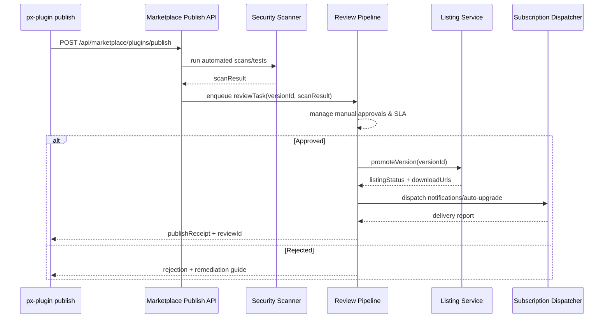

# Usecase Overview

- **Business Goal**: Provide PowerX Marketplace with an auditable, scalable online publishing and review workflow so the path from CLI publish to tenant notification remains efficient and controlled.
- **Success Metrics**: Average queueing time ≤ 5 minutes; automated review pass rate ≥ 95%; notification delivery ≥ 99%; review SLA (4 hours) breach rate < 2%.
- **Scenario Link**: Consumes inputs from `PLG-PUBLISH-ONLINE-001` and delivers version metadata, notifications, and auto-upgrade instructions to `PX-PUBLISH-ONLINE-001` (core installation) and `PX-PUBLISH-ONLINE-UI-001` (Admin UI).

The Marketplace online publish API validates artifact safety, coordinates review, lists versions, and broadcasts updates to tenants, ensuring compliant and timely releases.

# Context & Assumptions

- **Prerequisites**
  - Feature flags `MKP_PUBLISH_ONLINE=1` and `MKP_AUTOMATED_REVIEW=1` enabled with downstream services (scanners, test clusters) configured.
  - Marketplace database stores artifact metadata and signatures (`plugins`, `versions`, `reviews` tables).
  - Signature and integrity services (CMS/PKCS#7, hash verification) are available.
  - Reviewer roster, SLA thresholds, and notification templates are managed in the configuration center.
- **Inputs**
  - CLI-submitted version metadata (manifest, dependencies, permission declarations), signatures, test summary, release channel.
  - Artifact storage location and integrity details (hash, size, credentials).
  - Publisher-provided changelog, risk notes, auto-upgrade strategy.
- **Outputs**
  - Review queue items (with `reviewId`, `versionId`, `priority`, `slaDeadline`).
  - Marketplace version records, tenant notifications (webhook/email/in-app), auto-upgrade plans.
  - Audit logs and telemetry events: `marketplace.publish.received/approved/rejected/notified`.
- **Boundaries**
  - Does not build or sign artifacts (handled by the CLI).
  - Does not perform tenant installation (PowerX Core handles that).
  - Does not cover the offline pipeline (`MKP-PUBLISH-OFFLINE-001`).

# Solution Blueprint

## Module Breakdown

| Module                  | Scope              | Responsibility                                                | Entry Point / Host                                           |
|-------------------------|--------------------|----------------------------------------------------------------|--------------------------------------------------------------|
| PublishController       | powerx-marketplace | Receive publish requests, parse metadata, trigger review flow | `backend/internal/marketplace/publish/controller.go`         |
| ReviewPipelineService   | powerx-marketplace | Coordinate automated scans, compatibility tests, manual approvals | `backend/internal/marketplace/publish/review_pipeline.go`    |
| SecurityScannerAdapter  | powerx-marketplace | Run vulnerability scans, static analysis, signature validation | `backend/internal/marketplace/publish/security_scanner.go`   |
| CompatibilityTestRunner | powerx-marketplace | Execute compatibility/regression suites via test clusters      | `backend/internal/marketplace/publish/compatibility_runner.go` |
| ReviewQueueWorker       | powerx-marketplace | Assign manual review tasks, collect decisions, log audits      | `backend/workers/review_queue_worker.go`                     |
| ListingService          | powerx-marketplace | Persist catalog entries, expose status, generate download list | `backend/internal/marketplace/listing/service.go`            |
| SubscriptionDispatcher  | powerx-marketplace | Notify tenants/subscribers, push auto-upgrade instructions     | `backend/internal/marketplace/notifications/dispatcher.go`   |

# Review Workflow

# Interface & Configuration Contracts

- **Inbound APIs**
  - `POST /api/marketplace/plugins/publish`: Accepts metadata, signatures, telemetry; requires OAuth2 client credentials (`plugin.publish` scope). Returns `publishId`, `versionId`, `reviewId`, `status`.
  - `PATCH /api/marketplace/plugins/{versionId}/review`: Submit manual review decisions with `decision`, `notes`, `approvers`.
  - `GET /api/marketplace/plugins/{pluginId}/versions`: Expose version list and status for Core/Admin.
- **Outbound Calls**
  - `POST /internal/security-scanner/run`: Trigger static scans and signature validation.
  - `POST /internal/compatibility/run`: Execute compatibility/regression suites and return reports.
  - `POST /internal/notifications/dispatch`: Send tenant notifications (webhook/email/in-app).
  - `POST /telemetry/marketplace/publish`: Report review latency, failure reasons, notification coverage.
- **Configuration**
  - `MKP_REVIEW_SLA_HOURS`: Review SLA (default 4 hours).
  - `MKP_SECURITY_BLOCKLIST`: Permissions/dependencies that are disallowed.
  - `MKP_AUTO_UPGRADE_RULES`: Tenant/channel-based auto-upgrade policies.
  - `MKP_NOTIFICATION_TEMPLATES`: Multilingual notification templates with upgrade guidance.

# Implementation Checklist

| Item               | Description                                                   | Status | Owner                     |
|--------------------|---------------------------------------------------------------|--------|---------------------------|
| Publish API        | Request parsing, auth, idempotency, error taxonomy            | [ ]    | Chen Qiang                |
| Review pipeline    | Integrate scanning, testing, manual approvals                 | [ ]    | Marketplace Backend Team  |
| Data model & migration | Tables/indexes for `plugins`, `plugin_versions`, `reviews`, `notifications` | [ ]    | DB Engineering            |
| Notification stack | Support webhook/email/in-app channels with templates         | [ ]    | Growth & Ops Team         |
| Auto-upgrade policy | Configurable batches, allow/deny lists, rollback plan       | [ ]    | Marketplace PM            |
| Docs & SOP         | Refresh review playbook, operations guide, emergency rollback | [ ]    | Docs Steward Team         |

# Testing Strategy

- **Unit Tests**: `backend/internal/marketplace/publish/controller_test.go` for auth/idempotency/errors; `backend/internal/marketplace/publish/security_scanner_test.go` for scan outcomes; `backend/internal/marketplace/notifications/dispatcher_test.go` for multi-channel delivery.
- **Integration Tests**: Use mock services for scanning/testing/notifications via `pnpm test:integration --filter marketplace-publish-online`.
- **End-to-End**: Coordinate with CLI and Core repositories to rehearse “publish → review → notification → tenant install”, capturing audit evidence.
- **Non-functional**: High-concurrency publish (>20 parallel), large metadata payloads (>500 MB), SLA monitoring, failover drills.

# Observability & Ops

- **Metrics**: `marketplace.publish.count`, `marketplace.publish.automation_pass_rate`, `marketplace.review.sla_breached`, `marketplace.notifications.failure_rate`.
- **Logs**: Structured audit trail with `publishId`, `versionId`, `decision`, `approver`, `slaDeadline`, `elapsedMs`, `errorCode` (sensitive data redacted).
- **Alerts**: Automated scan failures > 10%, impending SLA breaches, notification failures trigger Slack `#marketplace-alerts` and PagerDuty.
- **Dashboards**: Grafana “Marketplace Publish & Review”, telemetry funnel, workload and SLA visuals.

# Rollback & Failure Handling

- **Rollback Steps**: Disable `MKP_PUBLISH_ONLINE`, withdraw versions pending review, set status to `withdrawn` if necessary.
- **Remediation**: Provide retry tokens, retain failed scan/test reports, offer manual notification scripts, trigger incident playbook.
- **Data Repair**: Correct database state (versions/reviews/notifications), regenerate audit logs, re-sync auto-upgrade plans.

# Risks & Mitigations

| Risk / Item                         | Impact                     | Mitigation                                         | Owner         | ETA        |
|------------------------------------|----------------------------|----------------------------------------------------|---------------|------------|
| Automated scans block valid releases | Launch delays, dev friction | Maintain allowlists, human override path, telemetry feedback loops | Security Team | 2025-02-01 |
| Review SLA breaches                | Erodes ecosystem trust     | SLA alerts, reviewer scheduling automation, fast-track lanes | Marketplace PM | 2025-01-25 |
| Notification delivery failures     | Tenants miss upgrades      | Retries plus fallback channels, manual resend tooling | Ops Team      | 2025-01-20 |
| Artifact tampering or leakage      | Security incident          | Mandatory signature validation, encrypted storage, strict access auditing | Security Team | 2025-02-10 |

# References & Links

- Scenario document: `docs/scenarios/publish/SCN-PUBLISH-ONLINE-001.md`
- CLI capability: `docs/usecases-seeds/SCN-PUBLISH-HUB-001/PLG-PUBLISH-ONLINE-001.md`
- Core installation: `docs/usecases-seeds/SCN-PUBLISH-HUB-001/PX-PUBLISH-ONLINE-001.md`
- Review playbook: `docs/standards/powerx-marketplace/publish/review_playbook.md`

> After updating the seed, run `npm run publish:usecases -- --scn-id SCN-PUBLISH-HUB-001 --validate-only` and schedule a cross-repo drill to confirm the online pipeline end to end.
