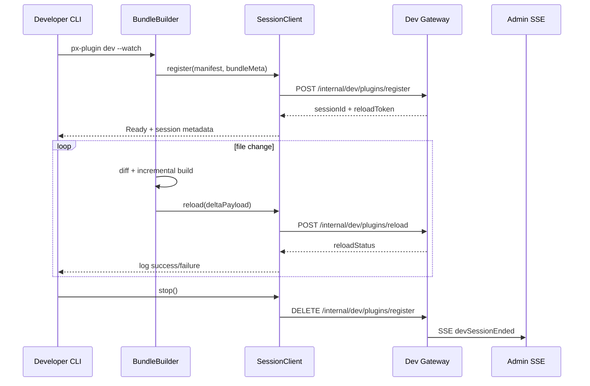

# Usecase Overview

- **Business Goal**: Provide plugin developers with the `px-plugin dev --watch` workflow that returns feedback within seconds. The CLI should automatically handle build, differential packaging, Dev API calls, and log aggregation so local edits become effective without restarts, while also producing manifest files that match offline/online publishing requirements.
- **Primary Actors**: Plugin engineers, CI validation bots (for hot-load smoke runs).
- **Success Metrics**: `px-plugin dev register` P95 ≤ 400 ms; hot reload finished ≤ 2 s; CLI log stream and Admin SSE latency ≤ 1 s; diagnostic coverage ≥ 95%; manifests and artifacts generated in this flow must pass later publishing checks with zero validation failures.
- **Scenario Relationship**: Depends on the sandbox services defined in SCN-DEV-HOTLOAD-001 and acts as the entry point for SCN-PUBLISH-HUB-001, supplying consistent manifests and build artifacts for both online and offline release.

# Context & Assumptions

- **Feature Flags**: `PX_DEV_PLUGIN_HOTLOAD=true` to allow the CLI to call Dev APIs; `PX_DEV_SESSION_AUDIT` to guarantee session auditing; enable `px.dev.multi_tenant` when multiple tenants debug concurrently.
- **Dependencies**: Local Node 18+, esbuild/tsc toolchain; Dev Gateway mTLS credentials (written by `px auth configure`); Redis for CLI telemetry; optional S3 pre-signed URLs for large bundles; repository SSH/HTTPS endpoints from `docs/_data/repos.yaml`.
- **Deployment**: Dev API can run anywhere (local containers, VMs, Kubernetes, etc.) as long as it exposes the interfaces below over HTTPS.
- **Input**: `plugin.yaml`, `manifest.json`, source change set, `px-plugin.config.ts`.
- **Output**: Hot reload delta bundle (in memory), `register`/`reload` request payloads, CLI telemetry events, Admin SSE logs (returned via backend).
- **Boundaries**: Excludes Dev API behavior, Admin panel rendering, and Marketplace release policies; the CLI only manages build/upload and local log output.

# Solution Blueprint

## Architecture Breakdown

| Layer | Scope           | Component / Module | Responsibility                                           | Entry Point / Host                                   |
|------|-----------------|--------------------|----------------------------------------------------------|------------------------------------------------------|
| proto | powerx-plugin   | WatchPipeline      | Parse config, initialize watchers, trigger incremental builds | `packages/cli/src/index.ts`                          |
| proto | powerx-plugin   | BundleBuilder      | Call esbuild/tsc, generate differential artifacts, enforce size & signature checks | `packages/cli/src/build`                             |
| proto | powerx-plugin   | SessionClient      | Handle Dev API register/reload/delete calls with retry and mTLS | `packages/cli/src/runtime`                           |
| proto | powerx-plugin   | TelemetryEmitter   | Capture build and API latency, push to Workflow Metrics / Kafka | `packages/cli/src/telemetry`                         |
| service | powerx        | PowerX Dev API (`register/reload/delete`) | Manage hot-load sessions, sandbox orchestration, rollback | `https://dev-api.powerx.local/internal/dev/plugins/*` |
| service | powerx        | `specs/005-cross-repo-documentation/contracts/powerxdoc-workflows.openapi.yaml` | Define field contracts and auth rules between CLI and Core | `specs/005-cross-repo-documentation/contracts/powerxdoc-workflows.openapi.yaml` |

## Flow & Timing

# Contracts & Interfaces

- **CLI Commands**
  - `px-plugin dev --watch [--tenant <id>] [--entry <dir>] [--upload s3]`
    - Outputs `sessionId`, `reloadToken`, and an Admin panel link.
    - Supports safety switches such as `--max-bundle-size`, `--no-telemetry`.
  - `px-plugin dev --stop`: Uses the cached `sessionId` to call DELETE.
- **Dev API Calls** (sent by SessionClient)
  - `POST https://dev-api.powerx.local/internal/dev/plugins/register`: Includes manifest, bundle metadata, `cliVersion`, `traceId`; host override through `PX_DEV_API_BASE_URL`.
  - `POST https://dev-api.powerx.local/internal/dev/plugins/reload`: Includes `sessionId`, `reloadToken`, `changedFiles`, `diagnostics`; supports `x-reload-id` for idempotency.
- **Configuration**
  - `px-plugin.config.ts`: Declares entry points, assets, env vars, watch ignore list.
  - `plugin.yaml`: Ensures `id/version/runtime` align with backend.
- **Scripts / Utilities**: `px auth configure` writes mTLS credentials; `px-plugin doctor` verifies prerequisites.
- **Telemetry**: `px-plugin telemetry flush` pushes `dev.hotload.*` events to Kafka topic `dev.hotload.cli`.

# Implementation Checklist

| Item            | Description                                                     | Status | Owner                         |
|-----------------|-----------------------------------------------------------------|--------|-------------------------------|
| Watch entry     | Shared config for `--watch`, ESM/CJS plugin resolution          | [ ]    | PowerX Plugin CLI Team        |
| Incremental build | Diff computation, hashing strategy, large file skip policy    | [ ]    | PowerX Plugin CLI Team        |
| Dev API client  | mTLS, retry, backoff, throttling                                | [ ]    | PowerX Core Dev API Team      |
| Telemetry       | `dev.hotload.cli_build_time_ms`, `dev.hotload.cli_error`        | [ ]    | Workflow Telemetry Steward    |
| Automatic checks | `px-plugin lint --hotload` to validate manifest and scripts    | [ ]    | PowerX Plugin CLI Team        |
| Documentation   | Update `README.dev.md`, `docs/guides/dev-hotload.md`            | [ ]    | Docs Steward Team             |

# Testing Strategy

- **Unit Tests**: `watch.test.ts` for debounce/retry logic; `session.test.ts` for register/reload token refresh; `bundle.test.ts` for diff and compression checks.
- **Integration Tests**: Use mock Dev API (`dev-api-stub`) in CI; build real plugin samples and assert CLI output plus API payloads.
- **End-to-End**: `npm run e2e:dev-hotload` starts a local sandbox, runs `px-plugin dev --watch`, verifies Admin SSE receives events; combine with `node scripts/qa/workflow-metrics.mjs --scope dev-hotload` to confirm metrics ingestion.
- **Non-functional**: Capacity test for 10 concurrent watchers; handle large files (>100 MB); failure retry and offline recovery.

# Observability & Ops

- **Metrics**: `dev.hotload.cli_build_time_ms`, `dev.hotload.cli_reload_duration_ms`, `dev.hotload.cli_error_total`, `dev.hotload.cli_session_lifetime`.
- **Logs**: Structured logs at `~/.powerx/logs/px-plugin-dev.log` with `sessionId`, `tenantId`, `reloadSeq`, `errorCode`.
- **Alerts**: CLI telemetry flags five consecutive reload failures to Slack `#powerx-dev-cli`; more than three bundle oversize incidents prompt configuration updates.
- **Dashboards**: Workflow Metrics dashboard “Dev Hotload CLI”; Sentry project `powerx-plugin-cli`.

# Rollback & Failure Handling

- **Rollback Steps**: Roll back CLI versions via npm tags, e.g., `npm dist-tag add @artisancloud/px-plugin@1.12.0 latest`; revert problematic watch feature PRs.
- **Remediation**: Provide `px-plugin dev --resume` to continue from checkpoints; `px-plugin dev --doctor` for diagnostics; disable `PX_DEV_PLUGIN_HOTLOAD` if necessary.
- **Data Repair**: Clear `~/.powerx/dev-session.json` cache and recreate sessions; if telemetry batches fail, run `scripts/fix-dev-telemetry.ts`.

# Follow-ups & Risks

| Risk / Item                                         | Impact              | Mitigation                                              | Owner                      | ETA        |
|-----------------------------------------------------|---------------------|---------------------------------------------------------|----------------------------|------------|
| Large repositories watching too many files, causing OOM | CLI stability        | Ignore build folders by default, expose `--watch-max-files`, prompt config | PowerX Plugin CLI Team     | 2025-02-05 |
| mTLS certificate rotation breaking CLI registration | Debug sessions halt  | `px auth rotate` auto-refresh; CLI warns 7 days before expiry | PowerX Core Dev API Team   | 2025-02-12 |
| Telemetry outages leading to blind spots            | Observability gap    | CLI buffers/replays locally; alert when CLI telemetry is disconnected | Workflow Telemetry Steward | 2025-02-08 |
| Manifest schema changes not reflected in time       | Release failures     | Pull Marketplace schema early, enforce CI checks, prompt upgrades | Docs Steward Team          | 2025-02-01 |

# References & Links

- Scenario document: `docs/scenarios/publish/SCN-DEV-HOTLOAD-001.md`
- Related standards: `docs/standards/powerx-plugin/deploy/local_debug.md`, `docs/standards/powerx/backend/plugins/dev_hotload_api.md`
- Code PRs: <https://github.com/ArtisanCloud/PowerXPlugin/pulls?q=dev+hotload>
- Design assets: `ADR-2024-DEV-HOTLOAD-CLI.md`, `Figma › Dev Hotload CLI UX`

> When finished, update `docmap.yaml` if any fields were added and run `npm run publish:usecases -- --scn-id SCN-PUBLISH-HUB-001 --validate-only`.
