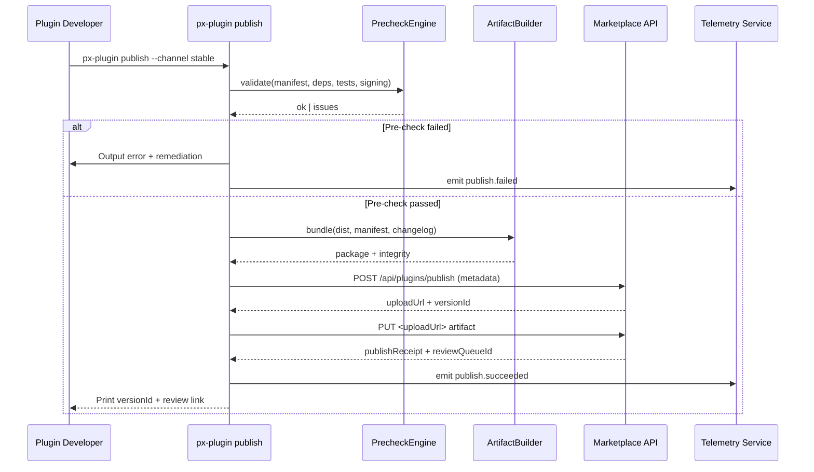

# Usecase Overview

- **Business Goal**: Allow plugin teams to produce online release artifacts, pass quality gates, upload, and register Marketplace versions with a single `px-plugin publish` command.
- **Success Metrics**: Publish command success rate ≥ 99%; time from publish to review queue ≤ 10 minutes; pre-check false-positive rate < 2%; telemetry coverage ≥ 98%.
- **Scenario Link**: Powers Stage 1 of `SCN-PUBLISH-ONLINE-001`, delivering reliable artifacts and metadata to `MKP-PUBLISH-ONLINE-001` (review & listing) and `PX-PUBLISH-ONLINE-001` (install/upgrade).

The PowerXPlugin repository aggregates build outputs, manifests, signatures, and auto-upgrade policies, then creates pending versions in Marketplace—serving as the starting point of the online distribution pipeline.

# Context & Assumptions

- Feature flags `PX_PLUGIN_PUBLISH` and `PX_PLUGIN_PUBLISH_PRECHECK` are enabled with the correct Marketplace endpoint.
- Publishers hold the `plugin:publish` permission; Marketplace API tokens are stored in `~/.powerx-plugin/config.json` or environment variables.
- Build pipelines already produced current artifacts (backend binaries, frontend bundles, migration scripts) and passed CI quality gates.
- The CLI can reach the signing service (local PEM or `PX_SIGNING_ENDPOINT`) and object storage (temporary credentials via `PX_ARTIFACT_STORE_*`).

# Core Capabilities

- **Pre-flight Validation**: Enforce version increments, dependency compatibility, permission declarations, test coverage, and signing prerequisites.
- **Deterministic Packaging**: Hash, compress, and sign build outputs into `.pxp` or multi-artifact bundles.
- **Metadata Assembly**: Auto-generate release notes, risk classifications, and rollout strategy before recording the Marketplace version.
- **Upload & Registration**: Upload artifacts, submit the review task, and receive `versionId` / `publishId` receipts.
- **Telemetry & Audit**: Capture publish latency, failure categories, and review links for diagnostics and auditability.

# Target Roles & Responsibilities

- **Plugin Developers**: Execute the publish command, fill in release notes, resolve pre-check failures, and re-trigger.
- **CLI Steward**: Maintain implementation, config schema, compatibility matrix, and documentation.
- **Marketplace Reviewer**: Review the version record, test reports, and signature evidence to decide the go-live window.
- **Ops / Product**: Use the publish receipt to schedule phased rollout and craft communication plans.

# Concept & Scope

- **Prerequisites**
  - `px-plugin lint`, `px-plugin test`, and CI pipelines pass with reports ready.
  - `px-plugin.config.ts` or `publish.yml` defines channels, tenant allow/deny lists, rollback plan.
  - Network access to Marketplace, signing service, object storage, and telemetry endpoints is available.
- **Inputs**
  - `manifest.json`, `plugin.yaml`, build artifacts (`dist/**`), `CHANGELOG.md`, test and coverage reports.
  - Publish configuration: channels (stable/beta), batch rollout plans, auto-upgrade policy, risk flags.
- **Outputs**
  - `publish-receipt.json` containing `publishId`, `versionId`, `reviewQueueId`, `nextCheckAt`.
  - Artifact URLs, integrity files, signatures, certificate chain.
  - Telemetry events and audit logs (`plugin.publish.started|succeeded|failed`).
- **Boundaries**
  - Does not implement Marketplace internal review/notification logic or trigger tenant installs directly.
  - Excludes offline bundle generation (`PLG-PUBLISH-OFFLINE-001`) and core installation details.

# Architecture & Workflow

## Module Breakdown

| Module                  | Scope           | Responsibility                                               | Entry Point / Host                          |
|-------------------------|-----------------|--------------------------------------------------------------|---------------------------------------------|
| PublishCommand          | powerx-plugin   | Parse CLI params, drive pipeline, print receipts             | `cli/src/commands/publish.ts`               |
| PublishPipeline         | powerx-plugin   | Coordinate validation, packaging, signing, upload, review    | `cli/src/lib/publish/pipeline.ts`           |
| PrecheckEngine          | powerx-plugin   | Validate versions, dependencies, permissions, test reports, signing profile | `cli/src/lib/publish/precheck.ts`           |
| ArtifactBuilder         | powerx-plugin   | Aggregate artifacts, create `.pxp` and integrity files       | `cli/src/lib/artifacts/builder.ts`          |
| MarketplaceRegistryClient | powerx-plugin | Call Marketplace publish/review APIs with retry handling     | `cli/src/clients/marketplaceRegistry.ts`    |
| TelemetryEmitter        | powerx-plugin   | Emit publish metrics, logs, and audit trail                  | `cli/src/lib/telemetry/emitter.ts`          |

## Flow & Timing

# Contracts & Interfaces

- **CLI Commands**
  - `px-plugin publish [--channel <stable|beta>] [--notes ./release.md] [--skip-precheck]`
  - Environment variables: `PX_MARKETPLACE_API_URL`, `PX_MARKETPLACE_TOKEN`, `PX_SIGNING_PROFILE`, `PX_ARTIFACT_STORE_ENDPOINT`, `PX_TELEMETRY_ENDPOINT`.
  - Configuration: `px-plugin.config.ts` / `publish.yml` define channels, tenant filters, rollback policy, auto-upgrade settings.
- **External APIs**
  - `POST /api/marketplace/plugins/publish` — Submit version metadata and review info with idempotency key `publishRequestId`.
  - `PUT <signed-url>` — Upload `.pxp` or multi-artifact bundles with multipart/chunked support.
  - `POST /api/marketplace/plugins/{versionId}/submit-review` — Provide supplemental review info or fast-track approvers.
  - `POST /telemetry/plugin/publish` — Report publish metrics, error categories, and receipt data.
- **Configuration & Scripts**
  - `px-plugin.config.ts`: `publish.targets[]`, `channels`, `telemetry`, `artifacts`, `signer`.
  - `publish.yml`: rollout batches, tenant allow/deny lists, auto-upgrade policy, rollback plan.
  - `scripts/publish/generate-release-notes.ts`: Generate release-note templates.

# Implementation Checklist

| Item               | Description                                                  | Status | Owner        |
|--------------------|--------------------------------------------------------------|--------|--------------|
| Publish command    | Parameter parsing, help text, multi-channel support          | [ ]    | Li Wei       |
| Precheck engine    | Version conflict detection, dependency/permission enforcement, coverage thresholds | [ ]    | Michael Hu   |
| Artifact build     | Aggregate backend/frontend artifacts, produce `.pxp`, integrity files, signatures | [ ]    | CLI Team     |
| Marketplace client | Authentication, retry, error taxonomy, audit logging         | [ ]    | Matrix-X     |
| Telemetry          | Emit publish events, latency, failure classes, versionId     | [ ]    | Workflow Telemetry Steward |
| Documentation      | Update `docs/guides/publish/online.md`, CLI README, sample configs | [ ]    | Docs Steward Team |

# Testing Strategy

- **Unit Tests**: `publish.command.spec.ts` for parameter parsing/error messaging; `precheck.spec.ts` for version/dependency/signature validation; `marketplaceRegistry.spec.ts` for mock API retries.
- **Integration Tests**: `pnpm test:integration --filter publish-online` with MSW or mock services for Marketplace API, storage, signing.
- **End-to-End**: Joint run with Marketplace/Core covering “build → publish → review → install”, documenting release notes and rollback steps.
- **Non-functional**: Upload performance for large artifacts (>300 MB), weak-network retries, concurrent publish conflict detection, CLI compatibility across Windows/macOS/Linux.

# Observability & Ops

- **Metrics**: `plugin.publish.duration_ms`, `plugin.publish.precheck.failure_rate`, `plugin.publish.retry.count`, `plugin.publish.bundle.size_bytes`.
- **Logs**: Structured CLI logs with `pluginId`, `version`, `channel`, `publishId`, `status`, `elapsedMs`, `errorCode`, `requestId`.
- **Alerts**: Three consecutive publish failures trigger Slack `#powerx-plugin-alerts`; publish latency > 10 minutes escalates via PagerDuty; telemetry loss > 5% notifies the CLI steward.
- **Dashboards**: Workflow Metrics “Plugin Online Publish” dashboard; Grafana SLO views; Sentry CLI crash monitoring.

# Rollback & Failure Handling

- **Rollback Steps**: Revert CLI using npm dist-tags; disable `PX_PLUGIN_PUBLISH` when necessary; request Marketplace to pause new reviews.
- **Remediation**: Offer `px-plugin publish --resume <publishId>` for interrupted uploads; generate `publish-debug.log`; surface support links for failure cases.
- **Data Repair**: Coordinate with Marketplace to remove incorrect versions and retract notifications; rebuild telemetry entries; adjust auto-upgrade policies.

# Risks & Mitigations

| Risk / Item                                | Impact                | Mitigation                                                     | Owner        | ETA        |
|--------------------------------------------|-----------------------|----------------------------------------------------------------|--------------|------------|
| Marketplace API changes break CLI          | Publish pipeline stalls | Contract tests, early notice, dual-version compatibility        | CLI Team     | 2025-01-31 |
| Precheck false positives/negatives         | Blocked releases or missed risks | Maintain allowlists, leverage telemetry feedback, tune thresholds | Michael Hu   | 2025-02-15 |
| Artifact upload interruptions              | Version registration failures | Support resume capability, automatic retries, progress indicators | Li Wei       | 2025-02-05 |
| Telemetry leaks sensitive data             | Compliance exposure    | Field whitelisting, TLS encryption, data minimization          | Workflow Telemetry Steward | 2025-01-20 |

# References & Links

- Scenario document: `docs/scenarios/publish/SCN-PUBLISH-ONLINE-001.md`
- Related standards: `docs/standards/powerx-plugin/integration/online_publish.md`
- CLI guide: `docs/guides/publish/online.md`
- Code samples: <https://github.com/ArtisanCloud/PowerXPlugin/pulls?q=px-plugin+publish>

> After updating the seed, run `npm run publish:usecases -- --scn-id SCN-PUBLISH-HUB-001 --validate-only` and rehearse the online publishing path with the Marketplace team.
