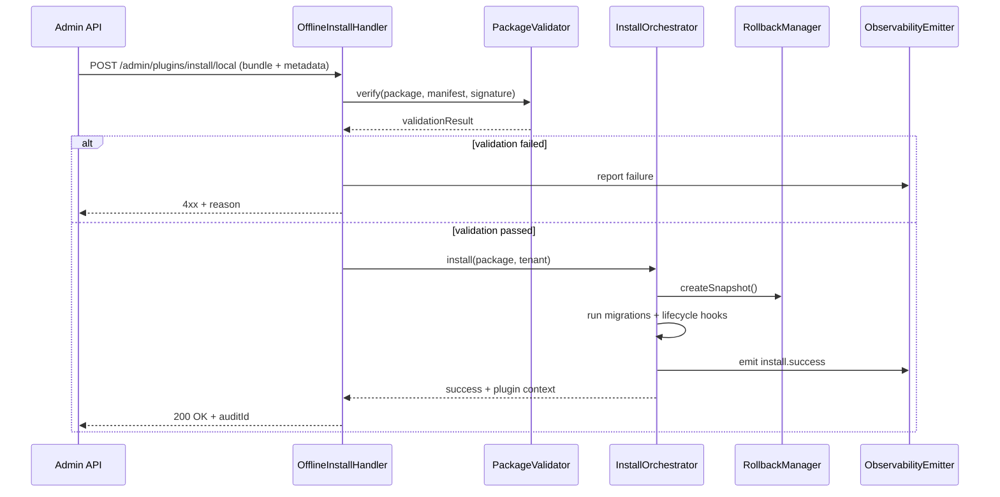

# Positioning & Goals

- **Business Goal**: Provide administrators in offline environments with a secure, reversible installation flow so `.pxp` bundles can be deployed quickly without internet connectivity while keeping a complete audit trail.
- **Scenario Link**: Closes the loop with Stage 4 of `SCN-PUBLISH-OFFLINE-001`, consuming bundles from `PLG-PUBLISH-OFFLINE-001` and approved versions from `MKP-PUBLISH-OFFLINE-001`.
- **Success Metrics**: Offline install success rate ≥ 98%; rollback time ≤ 5 minutes; audit/log success rate 100%; offline cache hit rate ≥ 90%.

PowerX Core validates offline bundle integrity, unpacks and executes lifecycle hooks, and synchronizes status to Admin and monitoring systems, ensuring compliant and fast recovery operations even with limited connectivity.

# Core Capabilities

- **Package Intake & Validation**: Read `.pxp` bundles, verify signatures/hashes, validate manifest and dependency versions.
- **Installation Engine**: Deploy plugins into isolated sandboxes, run migrations, register routes, refresh caches.
- **Rollback Mechanism**: Provide automated rollback and snapshot management for quick recovery.
- **Observability Hooks**: Emit installation metrics, structured logs, and audit events for operations and leadership tracking.
- **Offline Asset Cache**: Maintain local/object-storage caches to avoid re-uploading large bundles.

# Target Roles & Responsibilities

- **Ops / Platform Engineers**: Execute offline install commands, monitor progress, handle rollbacks.
- **Security / Compliance**: Review signatures, certificates, and audit logs to enforce security baselines.
- **Product Owners**: Define rollout windows and coordinate multi-tenant promotion schedules.

# Concept & Scope

- **Prerequisites**
  - Feature flag `PX_OFFLINE_INSTALL` is enabled.
  - Bundles were approved by Marketplace and include `manifest.json`, `integrity.txt`, `manifest.signature`.
  - PowerX Core has writable offline cache directories and active Admin API connectivity.
  - Audit pipelines and object-storage credentials are configured.
- **Inputs**
  - Uploaded `.pxp` bundle (local file or cached path).
  - Admin request specifying tenant, version, notes.
  - Manifest lifecycle hooks, dependency checks, migration scripts.
- **Outputs**
  - Install result (success/failure + details).
  - Plugin runtime registration status, event logs, audit records.
  - Rollback snapshot metadata and status reports.
- **Boundaries**
  - Excludes bundle creation and review (handled by PLG/MKP usecases).
  - Does not cover Admin UI components (`PX-PUBLISH-OFFLINE-UI-001`).

# Architecture & Workflow

| Module               | Responsibility                                               | Notes                                                  |
|----------------------|--------------------------------------------------------------|--------------------------------------------------------|
| OfflineInstallHandler| Accept Admin requests, parse bundles, trigger install pipeline | Validates permissions & flags, writes initial audit entry |
| PackageValidator     | Verify `manifest.signature`, check `integrity.txt`, scan for threats | May call security sandbox/external services           |
| InstallOrchestrator  | Control stages: unpack, dependency checks, migrations, registration | Supports idempotency, retries, state machine          |
| RollbackManager      | Create snapshots, drive rollback, restore previous version    | Keeps rollback logs and manual entry points           |
| ObservabilityEmitter | Emit metrics, structured logs, events                       | Integrates with Prometheus, Audit Trail, Publish Hub  |

# Contracts & Interfaces

- **Inbound API**
  - `POST /api/admin/plugins/install/local`
    - Body: `multipart/form-data` (`file` `.pxp`, `metadata` JSON with `tenantId`, `version`, `notes`)
    - Headers: `X-Audit-Reason`, `X-Request-Id`; admin permission required
    - Response: `200` returns `auditId`, `installId`, `status`; failures include error code and remediation hints
- **Internal Hooks**
  - `InstallOrchestrator.install(tenantId, packagePath, manifest, options)`
  - `RollbackManager.rollback(installId, reason)` for automated/manual fallback
- **Configuration**
  - `PX_OFFLINE_STORAGE_ROOT`, `PX_OFFLINE_MAX_SIZE_MB`, `PX_OFFLINE_TRUSTED_CERTS`, `PX_OFFLINE_TIMEOUTS`

# Implementation Checklist

| Item            | Description                                                  | Status | Owner                 |
|-----------------|--------------------------------------------------------------|--------|-----------------------|
| Package validation | Integrate manifest signature and hash checks               | [ ]    | Security Team         |
| Extraction       | Support multi-platform archives, protect against path traversal | [ ]    | PowerX Core Team      |
| Migration engine | Integrate DB/cache/config migrations with rollback support   | [ ]    | PowerX Core Team      |
| State machine    | Track install phases, retry logic, timeouts                  | [ ]    | PowerX Core Team      |
| Rollback process | Snapshot storage, rollback command, audit logging            | [ ]    | Ops Team              |
| Observability    | Metrics, logs, audit trail, alert rules                      | [ ]    | Observability Team    |
| Documentation    | Update offline install SOPs, support manuals, FAQ            | [ ]    | Docs Steward          |

# Quality Assurance Strategy

- **Unit Tests**: `package_validator_test.go`, `install_orchestrator_test.go`, `rollback_manager_test.go`.
- **Integration Tests**: Mock `.pxp` bundles covering large files, missing deps, timeouts.
- **End-to-End**: Joint drill “pack → review → install → rollback” with Marketplace/CLI.
- **Non-functional**: Test large bundle extraction, installation SLA, concurrent installs, failure recovery.

# Observability & Ops

- **Metrics**: `offline.install.success_rate`, `offline.install.duration_ms`, `offline.rollback.count`, `offline.validation.failure_rate`.
- **Logs**: Record `tenantId`, `packageDigest`, `installId`, `phase`, `duration`, `result`, `errorCode` (with sensitive data redacted).
- **Alerts**: Install/rollback failure thresholds, signature verification errors, migration timeouts (PagerDuty + Slack).
- **Dashboards**: Offline install overview, failure trends, rollback monitoring, audit event list.

# Rollback & Recovery

- **Rollback Steps**: Trigger snapshots via `PX_OFFLINE_ROLLBACK_GUARD`; if that fails use manual rollback command and restore config.
- **Remediation**: Produce incident reports, retain failed bundles/logs, request fresh bundles from Marketplace when required.
- **Data Repair**: Fix migration inconsistencies, restore previous dependencies, refresh caches; execute manual SQL when necessary.

# Risks & Mitigations

| Risk / Item                        | Impact                      | Mitigation                                           | Owner            | ETA        |
|------------------------------------|-----------------------------|------------------------------------------------------|------------------|------------|
| Corrupted or tampered bundles      | Install failure / security risk | Mandatory signature + hash checks, retain originals for audit | Security Team     | 2025-01-15 |
| Migration failure causes data drift | Business availability loss  | Idempotent migrations, auto rollback, manual scripts | PowerX Core Team | 2025-02-05 |
| Concurrent installs cause conflicts | Blocking / dirty state      | Queue execution, tenant isolation, conflict detection | Ops Team         | 2025-01-30 |
| Offline cache grows uncontrollably  | Disk pressure                | Scheduled cleanup, storage alerts, incremental caching | Infra Team       | 2025-02-20 |

# References & Links

- Scenario document: `docs/scenarios/publish/SCN-PUBLISH-OFFLINE-001.md`
- Standards: `docs/standards/powerx/backend/plugins/admin_plugins_user_guide.md`
- Runbook: `docs/guides/offline/install-runbook.md`
- Validation command: `npm run publish:usecases -- --scn-id SCN-PUBLISH-HUB-001 --validate-only`

> After go-live, coordinate with Marketplace and Admin teams for an offline release rehearsal covering install, rollback, and audit verification.
