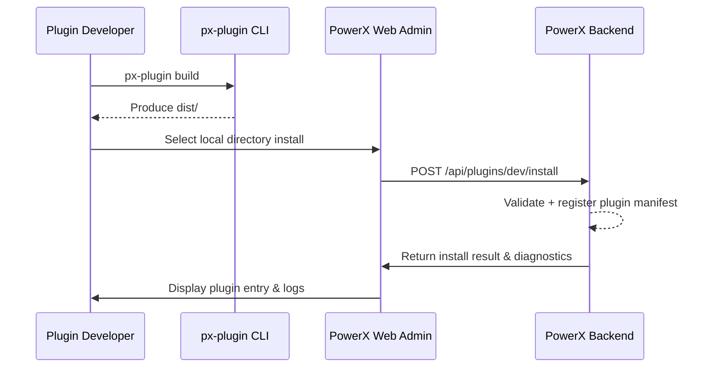

# Executive Summary

This scenario covers the end-to-end workflow for plugin developers to build, install, and hot reload plugins in a local environment. The goal is to validate functionality, APIs, and permission settings quickly without relying on Marketplace. Once the flow succeeds, developers can immediately verify plugin behavior in PowerX Web Admin and iterate rapidly.

# Scope & Guardrails

- **In Scope**: Plugin source build, artifact installation, backend registration, Admin hot reload and uninstall experience.
- **Out of Scope**: Marketplace review, version signing, cross-tenant distribution, production rollback strategy.
- **Environment & Flags**: `PX_PLUGIN_DEV_MODE` must be enabled; the local Core/Admin instance and plugin project need network connectivity or a shared filesystem; the plugin repository must pass SDK validation.

# Participants & Responsibilities

| Scope               | Repository    | Layer   | Responsibilities & Deliverables                               | Owners                           |
|---------------------|---------------|---------|----------------------------------------------------------------|----------------------------------|
| PowerXPlugin        | powerx-plugin | proto   | Provide the CLI, developer template, and build outputs         | Michael Hu (Plugin Tech Lead)    |
| PowerX (Core+Admin) | powerx        | service | Register plugins, expose debugging APIs, log events, surface the hot reload UI | Carol (Platform Lead)            |

# End-to-End Flow

1. **Stage 1 – Local Build**: The developer runs `px-plugin build` in the plugin project to produce the `dist/` directory or `.pxp` bundle.
2. **Stage 2 – Connect to Admin**: Sign in to PowerX Web Admin and choose “Install from local directory” on the plugin management page.
3. **Stage 3 – Hot Reload Execution**: Admin calls the backend `POST /api/plugins/dev/install`, copies the artifacts, and completes dependency injection.
4. **Stage 4 – Debug Iterate**: The developer inspects the plugin entry inside Admin, using `px-plugin dev --watch` for hot updates; logs and errors are streamed back by the backend.

# Key Interactions & Contracts

- **APIs / Events**: `POST /api/plugins/dev/install`, `DELETE /api/plugins/dev/install`, WebSocket channel `plugin.dev.logs`.
- **Configs / Schemas**: Local `manifest.json`, debugging permission policy YAML.
- **Security / Compliance**: Only developers with the `plugin:dev` permission may operate; logs are kept for 7 days for audit.

# Usecase Links

- `PLG-DEV-HOTLOAD-001` — Producing hot reload artifacts from the plugin project (proto layer).
- `PX-DEV-HOTLOAD-001` — Backend registration and lifecycle management (service layer).
- `PX-DEV-HOTLOAD-UI-001` — Admin hot reload UI and guidance (ui layer).

# Acceptance Criteria

1. Time from build artifact to successful Admin load is under 2 minutes.
2. Hot reload failures automatically roll back to the last stable version with a clear reason.
3. Debug mode actions are visible in real time from both the CLI and Admin.

# Telemetry & Ops

- Metrics: `plugin.dev.install.duration`, `plugin.dev.install.success_rate`, `plugin.dev.rollback.count`.
- Alert thresholds: Two consecutive install failures or success rate below 95%.
- Observability sources: Prometheus metrics, Admin debugging logs, real-time CLI output.

# Open Issues & Follow-ups

| Risk / Item                                | Impact               | Owner                               | ETA        |
|--------------------------------------------|----------------------|-------------------------------------|------------|
| Alignment between CLI and Admin logs       | Debugging efficiency | Matrix-X (Docs Coordinator)         | 2025-02-10 |
| Limited automatic detection of dependency conflicts | Plugin stability      | Michael Hu (Plugin Tech Lead)       | 2025-03-05 |

# Appendix

- Dev hot reload API design: <https://docs.artisancloud.com/powerx/dev-hotload>
- CLI hot reload debugging guide: `docs/guides/dev/hotload-debug.md`
