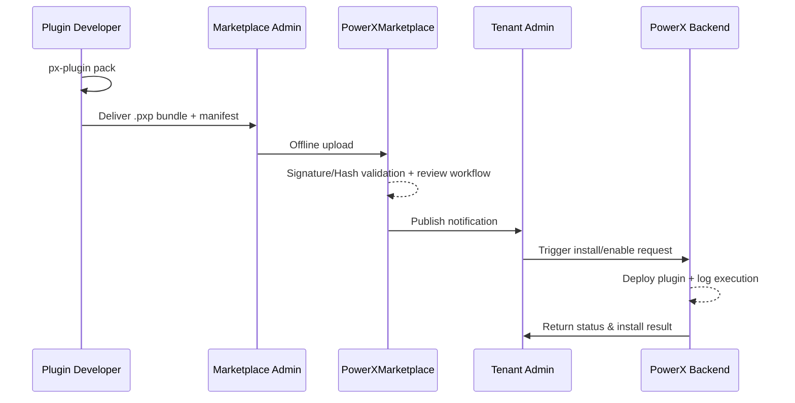

# Executive Summary

This scenario targets enterprise environments that either cannot access the public internet or require manual approval. Developers package plugins into offline files, and operators or administrators manually upload, review, and distribute them in the Marketplace console. The process ensures plugins can be introduced safely in offline or semi-offline settings while preserving the audit trail.

# Scope & Guardrails

- **In Scope**: Plugin packaging, offline upload, review and approval, installation distribution, rollback strategy.
- **Out of Scope**: Online automated release, cross-tenant synchronization, third-party Marketplace integrations.
- **Environment & Flags**: `PX_MARKET_OFFLINE_UPLOAD` must be enabled; operator accounts need the `marketplace:offline_upload` permission; plugin bundles must pass signature and hash checks.

# Participants & Responsibilities

| Scope               | Repository         | Layer  | Responsibilities & Deliverables                               | Owners                          |
|---------------------|--------------------|--------|----------------------------------------------------------------|---------------------------------|
| PowerXPlugin        | powerx-plugin      | proto  | Packaging scripts, `.pxp` format definition, validation tools  | Michael Hu (Plugin Tech Lead)   |
| PowerX Marketplace  | powerx-marketplace | api    | Offline upload APIs, review workflow, storage                   | Li Zhu (Marketplace PM)         |
| PowerX (Core+Admin) | powerx             | service| Installation execution, rollback mechanism, status broadcast, Admin list and actions | Carol (Platform Lead)           |

# End-to-End Flow

1. **Stage 1 – Packaging & Verification**: Developers run `px-plugin pack` to produce the `.pxp` bundle, along with `manifest.json` and signature digest files.
2. **Stage 2 – Offline Upload**: Administrators choose “Offline Upload” in the Marketplace console, submit the bundle and metadata, and the system performs hash/signature verification.
3. **Stage 3 – Review & Archival**: Operations reviews the plugin information, updates version status, and archives the approved version with an internal ID.
4. **Stage 4 – Installation & Activation**: Tenant administrators select the version in PowerX Web Admin, import the offline bundle through `POST /{{api_prefix}}/admin/plugins/install/local`, validate functionality, and roll back if needed.

# Key Interactions & Contracts

- **APIs / Events**: `POST /api/marketplace/plugins/offline-upload`, `POST /{{api_prefix}}/admin/plugins/install/local`, `Event::plugin.offline.approved`.
- **Configs / Schemas**: Plugin `manifest.json`, offline review checklist, signing policy.
- **Security / Compliance**: Offline bundles require dual approval; all upload and review operations are written to audit logs; bundles must be signed by the official or trusted CA.

# Usecase Links

- `PLG-PUBLISH-OFFLINE-001` — Plugin packaging and signing workflow.
- `MKP-PUBLISH-OFFLINE-001` — Marketplace offline upload and review.
- `PX-PUBLISH-OFFLINE-001` — Backend installation and rollback.
- `PX-PUBLISH-OFFLINE-UI-001` — Admin plugin management experience.

# Acceptance Criteria

1. Offline upload and review are completed within one business day with explicit failure reasons.
2. Plugin installation success rate ≥ 98%, with one-click rollback on failure.
3. Every offline bundle upload, review, and installation produces traceable logs and approval records.

# Telemetry & Ops

- Metrics: `plugin.offline.upload.count`, `plugin.offline.approval.duration`, `plugin.offline.install.success_rate`.
- Alert thresholds: Review SLA breaches, install failure rate above 5%, missing signature verification.
- Sources: Marketplace review logs, Admin operation audit logs, Prometheus metrics.

# Open Issues & Follow-ups

| Risk / Item                                   | Impact            | Owner                      | ETA        |
|-----------------------------------------------|-------------------|---------------------------|------------|
| Offline bundle encryption and transport policy needs refinement | Security & compliance | Zheng Ning (Ops Lead)     | 2025-02-28 |
| Batch installation scripts must support multi-tenant updates    | Operational efficiency | Carol (Platform Lead)     | 2025-03-15 |

# Appendix

- Offline upload operations manual and review workflow: `docs/guides/admin/offline-upload.md`
- Sample offline signing toolkit: <https://docs.artisancloud.com/powerx/plugin-offline-kit>
