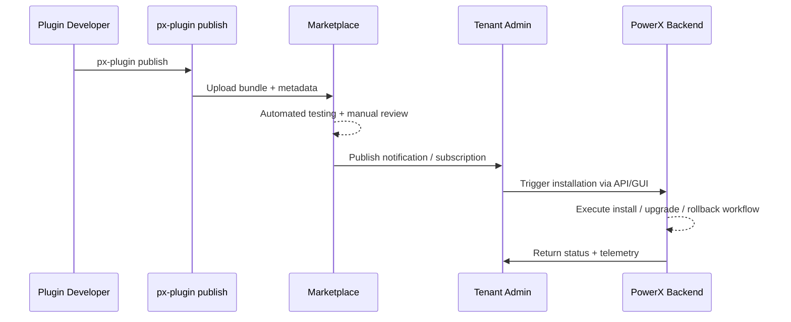

# Executive Summary

The online publishing scenario allows plugin authors to push new versions directly to PowerX Marketplace. Marketplace handles automated review, listing, notifications, and multi-tenant distribution. The workflow targets official ecosystem releases with standardized version control, signature validation, and rollback strategy so that ecosystem participants can obtain the latest capabilities quickly.

# Scope & Guardrails

- **In Scope**: Online build and publish, Marketplace approval workflow, version signing, subscriber notifications, automated installation rollout.
- **Out of Scope**: Offline or private distribution, channels outside Marketplace, third-party payment settlement.
- **Environment & Flags**: `PX_MARKET_PUBLISH_ENABLED` must be enabled; both `px-plugin publish` and Marketplace UI require `plugin:publish` permission; version signatures and dependency manifests must be complete.

# Participants & Responsibilities

| Scope               | Repository         | Layer   | Responsibilities & Deliverables                               | Owners                           |
|---------------------|--------------------|---------|----------------------------------------------------------------|----------------------------------|
| PowerXPlugin        | powerx-plugin      | proto   | Provide the `publish` command and manage version metadata      | Michael Hu (Plugin Tech Lead)    |
| PowerX Marketplace  | powerx-marketplace | api     | Review workflow, automated testing, listing, subscription push | Li Zhu (Marketplace PM)          |
| PowerX (Core+Admin) | powerx             | service | Install/upgrade APIs, automated rollback, plugin management UI and alerting | Zheng Ning (Ops Lead)            |

# End-to-End Flow

1. **Stage 1 – Release Preparation**: Developers run `px-plugin publish` locally; the CLI collects the manifest, dependencies, and signature information, then uploads to Marketplace.
2. **Stage 2 – Review & Automated Validation**: Marketplace triggers security scans, compatibility testing, and manual review, producing a review report.
3. **Stage 3 – Listing & Notification**: Once approved, the version is listed in Marketplace and notifications are sent to subscribed tenants; automatic or manual upgrades can be configured.
4. **Stage 4 – Installation & Operations**: Tenants choose versions through PowerX Web Admin or APIs, calling `POST /{{api_prefix}}/admin/plugins/install/url` to fetch the remote bundle; installation completes with logging and rollback readiness.

# Key Interactions & Contracts

- **APIs / Events**: `POST /api/marketplace/plugins/publish`, `Event::plugin.publish.approved`, `POST /{{api_prefix}}/admin/plugins/install/url`.
- **Configs / Schemas**: `manifest.json`, dependency graph, signing certificates, automatic upgrade policy.
- **Security / Compliance**: Publisher identity verification, mandatory version signing, audit logs retained for 180 days, multi-tenant isolation controls.

# Usecase Links

- `PLG-PUBLISH-ONLINE-001` — CLI publishing workflow.
- `MKP-PUBLISH-ONLINE-001` — Marketplace review and listing.
- `PX-PUBLISH-ONLINE-001` — Backend installation and upgrades.
- `PX-PUBLISH-ONLINE-UI-001` — Admin plugin management experience.

# Acceptance Criteria

1. Average time from publish to review approval ≤ 4 hours; breaches trigger SLA alerts.
2. 99% of tenants receive notification and can install within 30 minutes after release.
3. Installation failures roll back automatically within 5 minutes and alert both publisher and tenant.

# Telemetry & Ops

- Metrics: `plugin.online.publish.count`, `plugin.online.approval.duration`, `plugin.online.install.success_rate`.
- Alert thresholds: Review SLA breaches, install success rate < 98%, abnormal rollback frequency.
- Observability sources: Marketplace review logs, PowerX backend metrics, Admin alert dashboards.

# Open Issues & Follow-ups

| Risk / Item                                    | Impact             | Owner                           | ETA        |
|------------------------------------------------|--------------------|---------------------------------|------------|
| Automated testing coverage must include new review paths | Review efficiency & quality | Li Zhu (Marketplace QA)         | 2025-02-20 |
| Tenant-side automatic upgrade configuration needs refinement | Tenant operations experience | Zheng Ning (Ops Lead)           | 2025-03-10 |

# Appendix

- Marketplace online publish playbook: `docs/guides/publish/online.md`
- Review policy and automated testing templates: <https://docs.artisancloud.com/powerx/marketplace/review-playbook>
