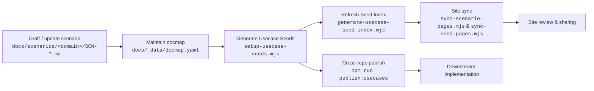

# Scenario Usage Flow

> Scope: `docs/scenarios/**`, `docs/_data/docmap.yaml`, `docs/usecases-seeds/**`, `docs/website/{zh,en}/scenarios/**`

## Flow Overview



## 1. Draft / Update Scenario (A)

- **Location**: `docs/scenarios/<domain>/SCN-*.md`
- **Template**: Follow the structure in the [Scenario Authoring Guide](/en/guides/scenarios/scenario-generation).
- **Preview**: Run:

  ```bash
  node scripts/site/sync-scenario-pages.mjs --scn-id <SCN_ID>
  ```

  This renders the Markdown into `docs/website/{zh,en}/scenarios/` for review.

## 2. Maintain docmap (B)

- **Source of truth**: `docs/_data/docmap.yaml`
- **Purpose**: Map each scenario to its child usecases, optional flag, and metadata.
- **Reference**: See [Docmap Maintenance](/en/guides/scenarios/docmap-maintenance) for common patterns.

## 3. Generate Usecase Seeds (C)

- **Command**:

  ```bash
  node .specify/scripts/node/setup-usecase-seeds.mjs --scn-id <SCN_ID>
  ```

- **Output**: Draft Seeds under `docs/usecases-seeds/<SCN_ID>/` (one `DOC_ID.md` file per usecase).
- **Next step**: Fill out each Seed following the [Usecase Seed Generation Guide](/en/guides/usecases/generate-usecase-seeds).

## 4. Refresh Seed Index (D)

- **Command**:

  ```bash
  node .specify/scripts/node/generate-usecase-seed-index.mjs --scn-id <SCN_ID>
  ```

- **Purpose**: Build `docs/usecases-seeds/<SCN_ID>/index.md` summarizing `doc_id`, status, optional flag, etc.
- **Tip**: The index first looks for `docs/usecases-seeds/<SCN_ID>/<DOC_ID>.md`; if missing, it falls back to the `path` declared in docmap.

## 5. Publish & Collected Views (E)

- **Dry run**:

  ```bash
  npm run publish:usecases -- --scn-id <SCN_ID> --dry-run
  ```

  Review the target repositories and file changes before touching downstream repos.
- **Reuse a run**:

  ```bash
  npm run publish:usecases -- --scn-id <SCN_ID> --dry-run --resume-token <token>
  ```

  Resume the same set of files reported by a previous dry run.
- **Single scenario**:

  ```bash
  npm run publish:usecases -- --scn-id <SCN_ID>
  ```

  Creates cross-repo branches and PRs after the dry run looks good.
- **Direct commit**: To push directly to the repository’s default branch (for example `dev/docs`) instead of creating a PR branch, run:

  ```bash
  npm run publish:usecases -- --scn-id <SCN_ID> --use-default-branch
  ```

  The script runs the following sequence inside each repository:

  ```bash
  git fetch
  git checkout <default_branch>
  git pull --ff-only origin <default_branch>
  # copy Seed updates
  git commit    # only when there are changes
  git push origin <default_branch>
  ```

  Afterward, you can verify remote state with `node scripts/setup/push-downstreams.mjs`, or clean up any legacy `docs/hub/<SCN_ID>-***` branches via `git branch -D` in the respective repo.
- **Aggregated views**: `npm run publish:collected -- --scn-id <SCN_ID>`
- **Checklist**: Follow [Publish Usecase Seeds](/en/guides/usecases/publish-usecase-seeds) before committing changes.

## 6. Site Sync & Consumption (F → H)

- **Scenario pages**: `node scripts/site/sync-scenario-pages.mjs --scn-id <SCN_ID> --force`
  - Copies the main scenario and any `child_scenarios` into `docs/website/{zh,en}/scenarios/`.
- **Seed pages**: `node scripts/site/sync-seed-pages.mjs --scn-id <SCN_ID> --force`
  - Copies the contents of `docs/usecases-seeds/<SCN_ID>/**` (including `index.md`) into the site directory.
  - Chinese pages keep the original content; English pages get placeholder copies that you can translate later.
- **Usage**: The website is used for reviews and high-level sharing; downstream repos consume the latest Seeds directly.

## FAQ

| Question | Check |
| --- | --- |
| Seed missing from site | Ensure `sync-seed-pages.mjs` ran and the changes were committed. |
| Child usecases out of order | Confirm the ordering in `docmap.yaml` and regenerate the index. |
| Publish command failed | Verify Node version and credentials, then re-run `npm run publish:*`. |

> Always commit scenarios, docmap, Seeds, and site copies together so reviewers can see a consistent state.
