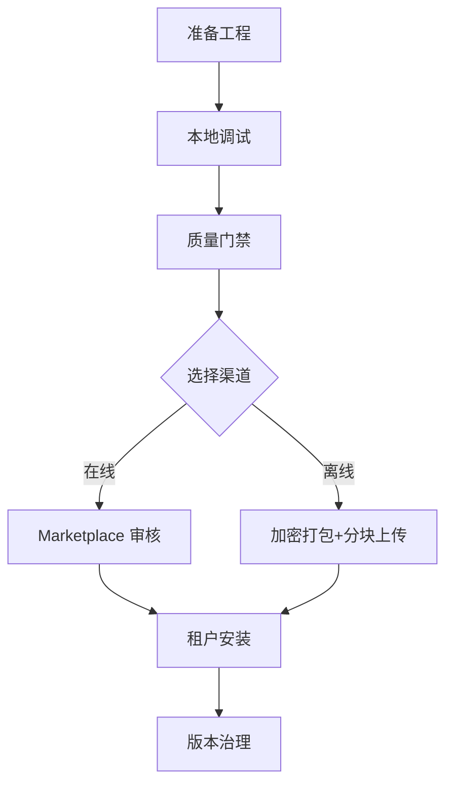

# PowerX 插件发布路线图

欢迎来到插件发布专区。在这里我们会手把手说明：**如何把一个插件从本地代码送进 PowerX，并让租户安心使用**。你只需要选择当下所在阶段，其余交给对应的操作指南。

---

## 我现在需要看哪一篇？

| 目标 | 适合阅读的指南 |
|------|---------------|
| 第一次搭插件工程、跑通热更新 | [初始化与本地调试](./local-dev-debug.md) |
| 确认 `plugin.yaml`/`manifest` 写法 | [插件元数据说明](./plugin-metadata.md) |
| 走在线发布 → Marketplace 审核 → 租户安装 | [在线发布与上架](./online-publish.md) |
| 给隔离环境交付 `.pxp`，处理密钥/分块上传 | [离线发布与导入](./offline-publish.md) |
| 检查租户兼容性、申请例外或做版本治理 | [版本兼容性与治理](./version-compatibility.md) |
| 想确认官方要求、产出是否满足标准 | [标准分发要求](./standards-distribution.md) |

> 小贴士：每份指南末尾都有“自检步骤”。踩坑时就按清单排查，通常能快速定位问题。

---

## 完整流程一目了然

每一站对应的指南：

1. **准备工程** → [初始化与本地调试](./local-dev-debug.md)：脚手架、`px-plugin dev --watch`、SSE 日志。  
2. **质量门禁** → [在线发布与上架](./online-publish.md)：`px-plugin publish precheck/create`、灰度、回滚。  
3. **离线渠道**（如有） → [离线发布与导入](./offline-publish.md)：临时密钥、50MB 分块、指纹记录。  
4. **安装与治理** → [版本兼容性与治理](./version-compatibility.md)：`px version scan/compat`、例外审批。

---

## 第一次发布？照着做就行

1. **初始化**：`px-plugin init <id>`，并按照 [初始化与本地调试](./local-dev-debug.md) 里的环境自检清单确认 Go/Node 版本与依赖。  
2. **调试与联调**：`px-plugin dev --watch --tenant demo`，在宿主 Console 查 SSE 日志；必要时执行 `scripts/qa/workflow-metrics.mjs --scenario SCN-DEV-PLUGIN-DEBUG-001` 收集记录。  
3. **准备元数据**：对照 [插件元数据说明](./plugin-metadata.md) 校准 `plugin.yaml`、`manifest.yaml`、`publish.yml`。  
4. **选择渠道**：
   - 在线：`px-plugin publish precheck/create/deploy` → Marketplace 审核 → 通过租户管理面板或 API 安装。  
   - 离线：`px-plugin pack --mode release` → 临时密钥加密 → `px-plugin offline upload` 分块 → 审核通过后导入。  
5. **上线后巡检**：`px version scan`、`px version compat check`，确认租户没有版本漂移；如需例外审批，直接使用 `px version compat exception`。

---

## 常备资源

- **场景剧本**（了解端到端故事线）：  
  `SCN-DEV-PLUGIN-INIT-001` / `SCN-DEV-PLUGIN-DEBUG-001` / `SCN-DEV-PLUGIN-PUBLISH-001` / `SCN-DEV-PLUGIN-VERSION-COMPAT-001`（位于 `../../website/zh/scenarios/`）。
- **更详实的标准要求**：如果需要交付材料或对齐内部审计，可回看 `../Plugins/PowerXPlugin/specs/004-publish-hub-spec`、`../PowerX/specs/009-install-plugin-pxp` 与 `../PowerXPluginMarket/specs/010-install-plugin-pxp`。
- **遥测&报表**：`scripts/qa/workflow-metrics.mjs` 会生成 `reports/_state/workflows/*.json`，方便在复盘会上引用。

---

准备好后，直接进入你需要的那篇指南，我们会在里边放上命令、表单字段示例，以及最常见的“踩坑提醒”。祝你发布顺利！
