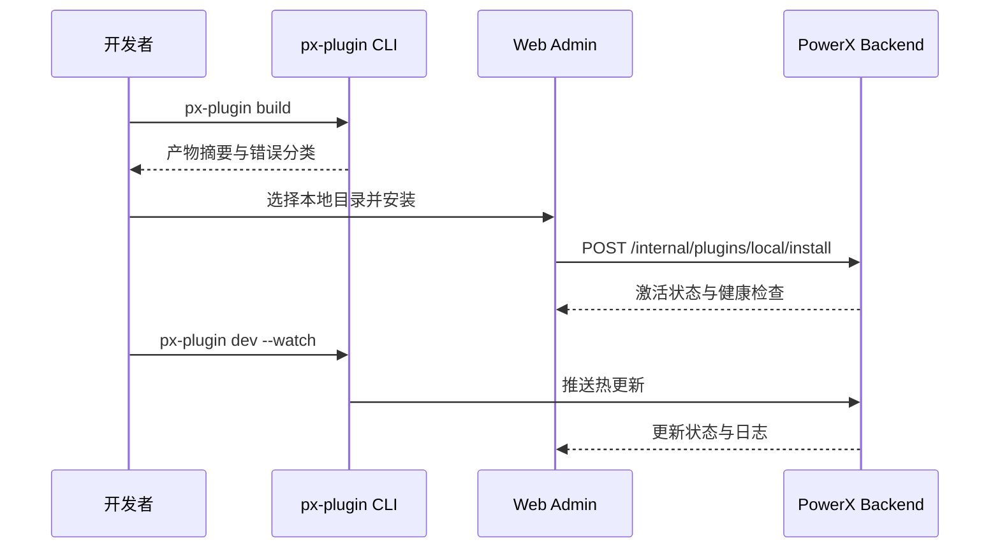

# Executive Summary

本子场景保障插件开发者在提交发布申请前，能够以分钟级节奏完成本地构建、安装、调试与热更新。借助 `px-plugin build/dev` 生成调试产物，并通过 PowerX Web Admin 的“从本地目录安装”入口触发 PowerX Backend 进行激活，形成快速闭环。目标是单次迭代耗时 ≤15 分钟、安装成功率 ≥97%、调试日志与权限操作全程可追踪，从而降低测试租户及发布审批阶段的返工。

# Scope & Guardrails

- **In Scope**：CLI 构建/调试命令、本地目录安装、插件激活/重载、调试日志聚合、权限模板提示。
- **Out of Scope**：测试租户部署、生产灰度、Marketplace 发布、插件业务功能验证。
- **Environment & Flags**：`px-plugin-local-dev`、`plugin-local-install`；依赖本地或内网 PowerX 环境、开发者 CLI 凭证、调试日志服务。

# Participants & Responsibilities

| Scope | Repository | Layer | 责任与交付物 | Owners |
|-------|------------|-------|--------------|--------|
| plugin-ecosystem | powerx-plugin | dev | CLI 构建/调试命令、产物缓存、热更新脚本、日志导出工具 | Michael Hu（Plugin Tech Lead / tech@artisan-cloud.com） |
| core-platform | powerx | ops | 本地安装与激活 API、权限校验、审计日志、健康检查接口 | Matrix Ops（Platform Ops Lead / ops@artisan-cloud.com） |
| admin-web | powerx-admin | app | Web Admin 插件管理界面、调试面板、健康检查展示 | Lily Zhang（Developer Experience Engineer / devexp@artisan-cloud.com） |

# End-to-End Flow

1. **Stage 1 – 构建准备**：执行 `px-plugin build/dev`，校验依赖并生成调试产物。
2. **Stage 2 – 本地安装**：在 Web Admin 选择本地目录，PowerX Backend 校验签名、权限并激活插件。
3. **Stage 3 – 调试与热更新**：`px-plugin dev --watch` 推送热更新，Web Admin 展示实时日志、健康检查、权限提示。
4. **Stage 4 – 归档与提交**：导出调试日志、记录权限模板差异，为测试租户与发布审批准备材料。

# Key Interactions & Contracts

- **APIs / Events**：`px-plugin build`、`px-plugin dev --watch`、`POST /internal/plugins/local/install`、`POST /internal/plugins/local/reload`、`EVENT plugin.local.debug.updated`。
- **Configs / Schemas**：`config/plugin/local_dev.yaml`、`config/plugin/permissions_minimal.json`、`docs/standards/powerx-plugin/dev/Local_Debug_Checklist.md`。
- **Security / Compliance**：本地安装需验证开发者凭证与最小权限模板；调试日志脱敏后存储；所有操作写入审计以支持追溯。

# Usecase Links

- `UC-DEV-PLUGIN-LOCAL-DEBUG-001` — 开发者本地调试与快速迭代保障。

# Acceptance Criteria

1. 单轮构建+安装 <= 15 分钟，失败会输出可追踪日志并分类。
2. 安装需通过签名、权限模板校验，审计日志记录操作者、版本与时间。
3. 热更新成功率 ≥95%，调试面板提供实时日志与健康检查、权限提示。

# Telemetry & Ops

- 指标：`plugin.local.iteration_cycle_time`、`plugin.local.install_success_rate`、`plugin.local.hot_reload_success_rate`。
- 告警：连续三次安装失败、热更新成功率 <95%、调试日志写入失败率 >5%。
- 观测来源：CLI 遥测、PowerX Backend 调试日志、`workflow-metrics.mjs` 本地模式上报。

# Open Issues & Follow-ups

| 风险/事项 | 影响范围 | 负责人 | ETA |
|-----------|----------|--------|-----|
| 跨平台路径兼容问题导致安装失败 | Windows/macOS 开发者 | Lily Zhang | 2025-12-18 |
| 权限模板提示仅中文，国际团队理解成本高 | 海外团队 | Michael Hu | 2025-12-25 |
| 热更新日志缺乏脱敏，存在信息泄露风险 | 安全合规 | Grace Lin | 2025-12-22 |

# Appendix

- Meta 设计：`docs/meta/scenarios/powerx/plugin-ecosystem/plugin-lifecycle/plugin-publish-and-release/primary.md`
- 配置文件：`config/plugin/local_dev.yaml`
- Checklist：`docs/standards/powerx-plugin/dev/Local_Debug_Checklist.md`
