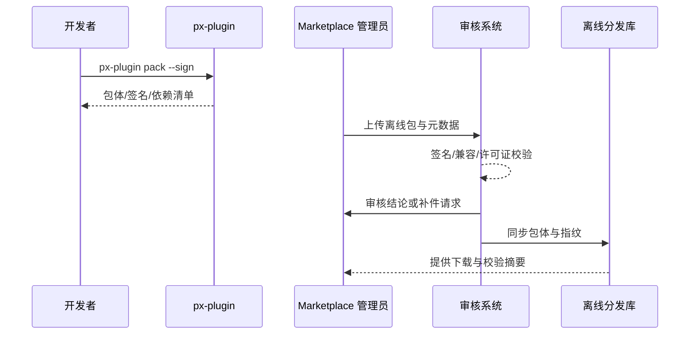

# Executive Summary

该子场景确保隔离网络或弱网环境的供应商可以通过离线包完成 Marketplace 审核与版本入库。开发者使用 `px-plugin pack` 生成含签名和依赖的 `.pxp` 包，Marketplace 管理员在离线上传入口提交材料，审核管道完成签名、兼容矩阵与许可证校验并同步至离线分发库。目标是签名校验通过率 ≥99%、补件率 <5%、审核 SLA ≤2 个工作日，使离线链路与在线生态保持一致的安全标准。

# Scope & Guardrails

- **In Scope**：离线包生成、签名与校验、补件流程、Marketplace 入库、离线分发库同步、审计与告警。
- **Out of Scope**：在线实时发布、生产租户导入、计费与结算。
- **Environment & Flags**：`plugin-offline-package`、`marketplace-offline-upload`；依赖签名服务、许可证服务、离线分发库、Marketplace 审核系统。

# Participants & Responsibilities

| Scope | Repository | Layer | 责任与交付物 | Owners |
|-------|------------|-------|--------------|--------|
| plugin-ecosystem | powerx-plugin | ops | 离线打包脚本、签名与依赖清单、版本说明与校验指纹 | Michael Hu（Plugin Tech Lead / tech@artisan-cloud.com） |
| marketplace | powerx-marketplace | marketplace | 离线上传界面、审核工单、补件指引、入库同步 | Ivy Chen（Marketplace Operations Lead / marketplace@artisan-cloud.com） |
| security | powerx | security | 签名与许可证验证、兼容矩阵校验、审计记录与告警 | Grace Lin（Security & Compliance Lead / compliance@artisan-cloud.com） |

# End-to-End Flow

1. **Stage 1 – 包体生成与签名**：执行 `px-plugin pack` 生成 `.pxp` 包、签名、依赖与说明文档。
2. **Stage 2 – 离线上传与登记**：在 `px-market` 控制台上传包体、填写元数据、绑定版本与兼容矩阵。
3. **Stage 3 – 校验与补件**：审核管道验证签名、兼容矩阵、许可证，必要时下发补件任务。
4. **Stage 4 – 入库与分发**：审核通过后写入 Marketplace 版本库并同步离线分发库，生成下载指纹与审计记录。

# Key Interactions & Contracts

- **APIs / Events**：`px-plugin pack`、`POST /marketplace/offline/upload`、`POST /marketplace/review/offline`、`EVENT marketplace.offline.review.status`。
- **Configs / Schemas**：`config/publish/offline_package.json`、`config/marketplace/offline_upload.yaml`、`docs/standards/powerx-plugin/publish/Offline_Package_Checklist.md`。
- **Security / Compliance**：离线包必须签名并验证许可证、兼容矩阵；补件原因需审计；离线分发库保留指纹 ≥180 天。

# Usecase Links

- `UC-DEV-PLUGIN-OFFLINE-MARKETPLACE-001` — 离线包送审与 Marketplace 入库。

# Acceptance Criteria

1. 签名与许可证校验通过率 ≥99%，兼容矩阵覆盖率 100%。
2. 补件率 <5%，补件响应 ≤1 个工作日，审核 SLA ≤2 个工作日。
3. 离线分发库同步延迟 ≤30 分钟，指纹校验可追溯并支持审计。

# Telemetry & Ops

- 指标：`marketplace.offline.upload_success_rate`、`marketplace.offline.review_sla_hours`、`marketplace.offline.rework_rate`。
- 告警：签名失败率 >1%、审核超 SLA、补件率 >5%、分发库同步失败。
- 观测来源：Marketplace 审核日志、签名/许可证服务、离线分发库监控、`workflow-metrics.mjs`。

# Open Issues & Follow-ups

| 风险/事项 | 影响范围 | 负责人 | ETA |
|-----------|----------|--------|-----|
| 企业内网无法访问签名服务需离线脚本 | 隔离环境 | Michael Hu | 2025-12-19 |
| 审核补件邮件缺少模板，沟通成本高 | 审核效率 | Ivy Chen | 2025-12-16 |
| 欧盟数据合规策略尚未覆盖许可证校验 | 国际市场 | Grace Lin | 2025-12-28 |

# Appendix

- Meta 设计：`docs/meta/scenarios/powerx/plugin-ecosystem/plugin-lifecycle/plugin-publish-and-release/primary.md`
- 配置文件：`config/publish/offline_package.json`
- Checklist：`docs/standards/powerx-plugin/publish/Offline_Package_Checklist.md`
