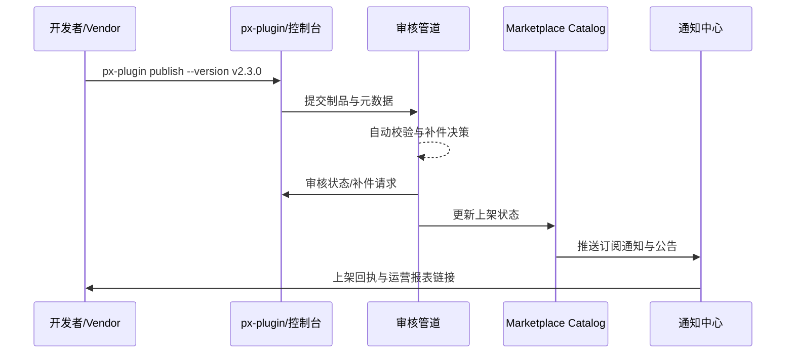

# Executive Summary

本子场景面向希望通过在线渠道直接发布插件的供应商。开发者使用 `px-plugin publish` 或管理界面提交版本、定价与支持策略，Marketplace 审核管道自动完成签名、兼容和合规校验，通过后即时上架并通知订阅租户。目标是在线发布成功率 ≥99%、审核 SLA ≤2 个工作日、通知延迟 ≤5 分钟，确保上线过程可追踪并与发布记录形成闭环。

# Scope & Guardrails

- **In Scope**：在线发布命令、元数据填写与校验、审核流程、版本对比、通知与报表。
- **Out of Scope**：离线包上传、生产灰度部署、商业计费与结算。
- **Environment & Flags**：`plugin-online-publish`、`marketplace-review-v2`；依赖 Marketplace 审核系统、签名与安全扫描服务、通知中心。

# Participants & Responsibilities

| Scope | Repository | Layer | 责任与交付物 | Owners |
|-------|------------|-------|--------------|--------|
| plugin-ecosystem | powerx-plugin | ops | `px-plugin publish` 命令、元数据模板校验、通知触发 | Alex Wei（Release Automation Engineer / automation@artisan-cloud.com） |
| marketplace | powerx-marketplace | marketplace | 审核编排、上架同步、订阅通知、运营报表 | Ivy Chen（Marketplace Operations Lead / marketplace@artisan-cloud.com） |
| ops | powerx | ops | 发布记录、版本差异比对、审计、告警与回退按钮 | Matrix Ops（Platform Ops Lead / ops@artisan-cloud.com） |

# End-to-End Flow

1. **Stage 1 – 发布申请**：开发者通过 CLI 或控制台提交制品引用、更新日志、定价与支持信息。
2. **Stage 2 – 自动校验**：审核管道执行签名、兼容矩阵、安全与合规校验，必要时生成补件任务。
3. **Stage 3 – 审核与回执**：审核员确认资料并出具结论，系统回传结果并记录审计。
4. **Stage 4 – 上架与触达**：Marketplace 上架插件，触发订阅通知与公告，生成初始运营报表。

# Key Interactions & Contracts

- **APIs / Events**：`px-plugin publish`、`POST /marketplace/online/apply`、`POST /marketplace/review/decision`、`EVENT marketplace.listing.status`、`EVENT marketplace.subscription.notify`。
- **Configs / Schemas**：`config/marketplace/online_publish.yaml`、`config/publish/metadata_template.json`、`docs/standards/marketplace/review/Online_Publish_Checklist.md`。
- **Security / Compliance**：发布需通过签名与合规声明；审核日志与版本 diff 保留 ≥180 天；敏感元数据加密存储。

# Usecase Links

- `UC-DEV-PLUGIN-ONLINE-PUBLISH-001` — 在线发布与 Marketplace 即时上架。

# Acceptance Criteria

1. 在线发布成功率 ≥99%，审核 SLA ≤2 个工作日，补件响应 ≤1 个工作日。
2. 订阅通知覆盖率 100%，通知延迟 ≤5 分钟，运营报表按版本生成。
3. 发布记录与审计日志包含提交人、审核人、签名指纹及版本差异。

# Telemetry & Ops

- 指标：`marketplace.online.publish_success_rate`、`marketplace.online.review_sla_hours`、`marketplace.notification.delivery_latency`。
- 告警：成功率 <99%、审核超 SLA、通知延迟 >5 分钟或失败率 >2%。
- 观测来源：Marketplace 上架日志、通知中心指标、`workflow-metrics.mjs` 在线发布报表。

# Open Issues & Follow-ups

| 风险/事项 | 影响范围 | 负责人 | ETA |
|-----------|----------|--------|-----|
| 区域化定价缺乏模板导致审核等待 | 国际 Marketplace | Ivy Chen | 2025-12-30 |
| CLI 缺少重复提交保护 | 发布一致性 | Alex Wei | 2025-12-19 |
| 通知通道峰值时延偏高 | 租户触达体验 | Matrix Ops | 2025-12-24 |

# Appendix

- Meta 设计：`docs/meta/scenarios/powerx/plugin-ecosystem/plugin-lifecycle/plugin-publish-and-release/primary.md`
- 配置文件：`config/marketplace/online_publish.yaml`
- Checklist：`docs/standards/marketplace/review/Online_Publish_Checklist.md`
