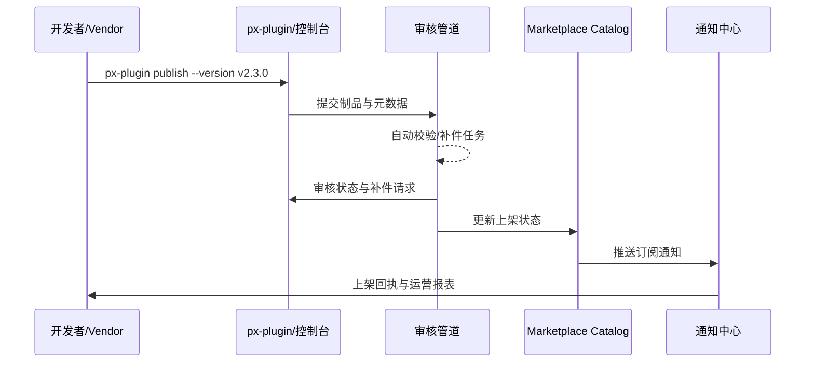

# Usecase Overview

- **业务目标**：让供应商通过在线渠道完成插件发布与上架，确保签名、合规与元数据同步一致，并即时触达订阅租户。
- **成功度量**：在线发布成功率 ≥ 99%；审核 SLA ≤ 48 小时；通知延迟 ≤ 5 分钟；补件率 < 8%。
- **场景关联**：对应主场景 Stage 4，覆盖 Marketplace 审核与上架同步流程。

> CLI 与控制台协同，打通发布申请、审核回执、订阅通知与运营报表的自动闭环。

# Context & Assumptions

- **前置条件**
  - Feature Flag `plugin-online-publish`、`marketplace-review-v2` 已启用。
  - 版本已通过测试与审批，制品签名有效并存储在制品仓。
  - 开发者准备好更新日志、定价、支持策略与合规声明。
  - 通知中心、审计日志、报表生成服务可用。
- **输入/输出**
  - 输入：制品引用、版本元数据、定价/支持信息、截图、合规文档。
  - 输出：审核状态、补件任务、上线通知、订阅推送、运营报表链接。
- **边界**
  - 不涉及离线导入；不覆盖生产灰度；不处理商业结算。

# Solution Blueprint

## 体系分解

| 层 | 主要组件/模块 | 责任 | 代码入口 |
|----|---------------|------|---------|
| 发布入口 | `packages/cli/src/commands/plugin/publish.ts` | 元数据收集与校验、提交申请、回执显示 | `packages/cli` |
| 审核编排 | `internal/review/online_pipeline.go` | 自动校验、人工复核、补件任务、SLA 打点 | `services/review` |
| Marketplace 前端 | `apps/market/src/modules/online-publish/index.tsx` | 资料填写、状态展示、补件指导 | `apps/market` |
| 发布记录 | `internal/publish/records/manager.go` | 版本 diff、审计、通知触发、回执归档 | `services/publish/records` |
| 通知 & 报表 | `internal/notify/marketplace/listing.go` | 订阅通知、公告、初始运营报表生成 | `services/notify/marketplace` |

## 流程与时序

1. **Step 1 – 发布申请**：开发者执行 `px-plugin publish` 或在控制台填写元数据、定价、支持信息。
2. **Step 2 – 校验与补件**：审核管道自动校验签名、兼容、合规、安全项，必要时生成补件任务。
3. **Step 3 – 审核决策**：审核员完成人工复核并给出结论，系统回传结果并记录审计。
4. **Step 4 – 上架与通知**：Marketplace 上架插件，触发订阅通知与公告，生成初始运营报表。

# Contracts & Interfaces

- **Inbound APIs / Events**：`px-plugin publish`、`POST /marketplace/online/apply`、`POST /marketplace/review/decision`。
- **Outbound 调用**：`POST /internal/security/signature/verify`、`POST /internal/compliance/review`、`POST /internal/notify/marketplace/listing`、`POST /internal/analytics/marketplace/report`。
- **配置与脚本**：`config/marketplace/online_publish.yaml`、`config/publish/metadata_template.json`、`scripts/workflows/marketplace-online-publish.mjs`。

# Implementation Checklist

| 项目 | 描述 | 完成状态 | 负责人 |
|------|------|----------|--------|
| CLI 校验 | 必填字段校验、智能补全、错误提示 | [ ] | Alex Wei |
| 审核管道 | 签名/合规自动化、补件任务、SLA 指标 | [ ] | Ivy Chen |
| 发布记录 | 版本 diff、审计链接、回执归档 | [ ] | Matrix Ops |
| 通知模板 | 多语言通知、订阅分群、Webhook | [ ] | Ivy Chen |
| 报表生成 | 下载量/订阅数初始统计、运营视图 | [ ] | Alex Wei |

# Testing Strategy

- **单元**：CLI 参数解析、元数据校验、审核状态机、通知模板。
- **集成**：运行 `scripts/workflows/marketplace-online-publish.mjs` 模拟成功与补件。
- **端到端**：复现 meta 用例 G，覆盖签名失败、补件、快速上架。
- **非功能**：高并发上架、通知风暴模拟、多区域定价配置。

# Observability & Ops

- **指标**：`marketplace.online.publish_success_rate`、`marketplace.online.review_sla_hours`、`marketplace.notification.delivery_latency`。
- **日志**：审核决策、补件明细、上架回执；统一入 `marketplace_online_publish` index。
- **告警**：成功率 <99%、通知延迟 >5 分钟、审核超 SLA、补件率 >8%。
- **Dashboards**：Online Publish Dashboard、Listing Notification Monitor、`workflow-metrics.mjs` 在线发布报表。

# Rollback & Failure Handling

- **回滚策略**：审核失败或上线异常时保留旧版本，支持一键下架与通知恢复。
- **补救措施**：补件任务自动推送，CLI 提供 `px-plugin publish --resume`；通知失败重试并提醒运维。
- **数据修复**：`scripts/workflows/marketplace-online-reconcile.mjs` 对账发布记录与 Marketplace 状态。

# Follow-ups & Risks

| 风险/事项 | 影响 | 缓解方案 | 负责人 | ETA |
|-----------|------|----------|--------|-----|
| 区域化定价缺少模板导致审核延迟 | 国际上线节奏 | Ivy Chen | 2025-12-27 |
| CLI 提交缺乏并发保护 | 数据一致性 | Alex Wei | 2025-12-19 |
| 通知通道峰值延迟过长 | 租户触达体验 | Matrix Ops | 2025-12-24 |

# References & Links

- 场景文档：`docs/scenarios/plugin-lifecycle/SCN-DEV-PLUGIN-ONLINE-PUBLISH-001.md`
- 主场景：`docs/scenarios/plugin-lifecycle/SCN-DEV-PLUGIN-PUBLISH-001.md`
- Meta 设计：`docs/meta/scenarios/powerx/plugin-ecosystem/plugin-lifecycle/plugin-publish-and-release/primary.md`
- 脚本：`scripts/workflows/marketplace-online-publish.mjs`
