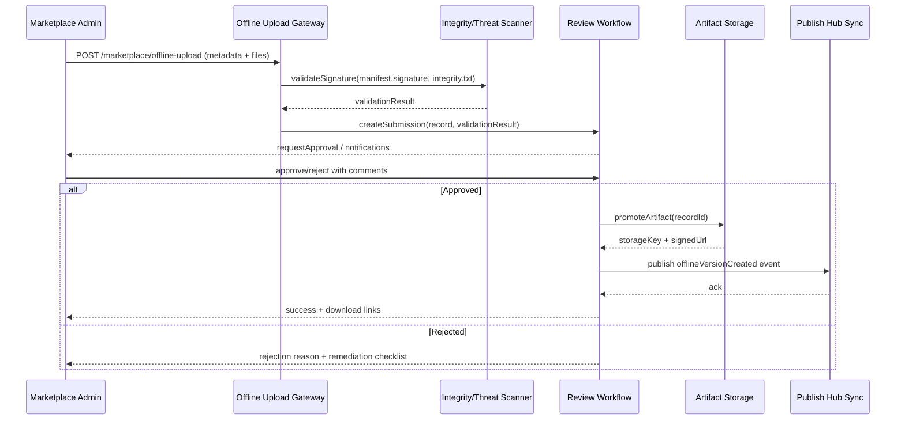

# Positioning & Goals

- **业务目标**：支撑离线场景下的插件上架流程，提供可审计的上传、校验、审核与分发能力，保障插件生态在无公网环境中也能安全流转。
- **场景关联**：承接 `SCN-PUBLISH-OFFLINE-001` Stage 2/3，接收 `PLG-PUBLISH-OFFLINE-001` 产出的离线包，并向 `PX-PUBLISH-OFFLINE-001`、`PX-PUBLISH-OFFLINE-UI-001` 输出可用版本。
- **成功度量**：离线包上传成功率 ≥ 99%；审核 SLA ≤ 1 个工作日；签名/哈希校验失败率 < 1%；版本同步延迟 ≤ 30 分钟。

Marketplace 离线发布链路通过多级审核、合规校验与对象存储托管，确保离线包全生命周期可追踪、可回滚，可与线上发布能力保持一致的合规标准。

# Core Capabilities

- **Secure Offline Upload**：提供带签名校验、哈希验证、恶意检测的上传管道。
- **Review & Approval Workflow**：支持多级审核、角色分工、审批日志与状态回滚。
- **Artifact Management**：将 `.pxp` 包及伴随文件托管到受控对象存储，记录版本与下载凭据。
- **Metadata Registration**：写入插件版本、兼容矩阵、依赖、合规状态，供 Admin/核心系统拉取。
- **Tenant Distribution Hooks**：把审批结果同步至 Publish Hub，触发租户订阅通知与批量分发。

# Target Roles & Responsibilities

- **Marketplace 管理员**：执行离线包上传、补充元数据、触发初审。
- **合规/安全审核员**：进行二级审批、签名证书验证、风险评估。
- **运维团队**：维护对象存储、审核日志、凭据与告警通道。
- **生态协调者（Publish Hub Steward）**：关联 SCN/PX Usecase，确保版本列表及时同步至核心系统。

# Concept & Scope

- **前置条件**
  - Feature Flag `PX_MARKET_OFFLINE_UPLOAD` 与 `PX_MARKET_REVIEW_CHAIN` 已启用。
  - 对象存储或 MinIO 集群可用，并配置专用 bucket/prefix。
  - Marketplace 管理后台开放离线上传入口，使用双因素或硬件签名。
  - 有效的证书信任列表、哈希校验策略、恶意扫描策略。
- **输入**
  - `.pxp` 离线包、`manifest.json`、`integrity.txt`、`manifest.signature`。
  - 上传表单中的插件基本信息、兼容租户、审批备注。
- **输出**
  - 审核后的插件版本记录；可下载的包体 URL/凭据；同步 Publish Hub 的版本状态事件。
  - 审计记录、审批链路、风险评级、异常警报。
- **边界**
  - 不负责 `.pxp` 打包（由 `PLG-PUBLISH-OFFLINE-001` 实现）。
  - 不覆盖租户安装细节（由 `PX-PUBLISH-OFFLINE-001` 与 `PX-PUBLISH-OFFLINE-UI-001` 实现）。
  - 不提供在线发布管道（对应 `MKP-PUBLISH-ONLINE-001`）。

# Architecture & Workflow

## 模块分解

| 模块 | Scope | 职责 | 实现备注 |
|------|-------|------|----------|
| Upload Gateway | powerx-marketplace | 接收离线包上传、校验摘要/签名、落盘临时存储 | 提供 REST/GraphQL 入口，支持分块上传与重试 |
| Malware & Integrity Scanner | powerx-marketplace | 调用安全扫描、验证 `integrity.txt` 与证书有效性 | 对接证书吊销列表与威胁扫描服务 |
| Review Workflow Engine | powerx-marketplace | 处理多级审批、状态流转、审批意见、退回逻辑 | 记录完整审计链、支持 SLA 与提醒 |
| Artifact Storage Adapter | powerx-marketplace | 将合规包体转存到正式存储、生成预签名下载链接 | 支持版本化、冻结/解冻、生命周期管理 |
| Metadata Registry | powerx-marketplace | 写入插件版本、依赖矩阵、策略标签供下游查询 | 提供查询接口、事件推送、差异对比 |
| Notification & Sync | powerx-marketplace | 向 Publish Hub、租户订阅方广播审批结果，触发更新 | 发送 Webhook、事件总线、站内提醒 |

## 审核流程

# Interface & Configuration Contracts

- **Inbound APIs**
  - `POST /api/marketplace/plugins/offline-upload`：多部分表单，包含 `.pxp`、`manifest.json`、`integrity.txt`、`manifest.signature`、元数据；要求管理员 token 与 MFA。
  - `POST /api/marketplace/plugins/{id}/offline-review`：提交审批动作，参数包括 `decision`, `comments`, `riskLevel`，记录审计轨迹。
  - `GET /api/marketplace/plugins/{id}/offline-versions`：查询已审核版本，返回下载地址与合规状态。
- **Outbound 集成**
  - `POST PublishHub::/events/offline-version`：推送版本状态，用于租户同步。
  - 通知渠道：Slack/邮件/Webhook（配置于 `PX_MARKET_NOTIFICATION_ENDPOINTS`）。
- **配置**
  - 存储：`PX_OFFLINE_STORAGE_BUCKET`, `PX_OFFLINE_STORAGE_PREFIX`, `PX_OFFLINE_STORAGE_REGION`。
  - 审核策略：`PX_MARKET_REVIEW_CHAIN_LEVELS`, `PX_MARKET_REVIEW_TIMEOUT`, `PX_MARKET_APPROVER_ROLES`。
  - 安全：`PX_SIGNATURE_TRUST_ANCHORS`, `PX_OFFLINE_SCAN_ENDPOINT`, `PX_OFFLINE_SCAN_RETRY`.

# Implementation Checklist

| 项目 | 描述 | 完成状态 | 负责人 |
|------|------|----------|--------|
| 上传网关 | 实现带签名、哈希验证、分块断点续传的上传入口 | [ ] | Marketplace Backend Team |
| 安全扫描 | 集成恶意检测、证书 CRL 校验与 integrity 检查 | [ ] | Security & Compliance |
| 审核流程 | 配置多级审批、退回、审计日志、通知 | [ ] | Marketplace PMO |
| 存储与回滚 | 推广至正式对象存储，支持版本冻结/回滚 | [ ] | Marketplace Infra |
| 元数据注册 | 更新版本 registry，确保 Publish Hub/租户可查询 | [ ] | Publish Hub Steward |
| 文档 & SOP | 更新离线上传操作手册、审核手册、常见问题 | [ ] | Docs Steward Team |

# Quality Assurance Strategy

- **单元测试**：覆盖上传请求参数校验、签名验证、审批状态机。
- **集成测试**：模拟分块上传 + 审核流程，验证与对象存储、扫描服务、通知通道的交互。
- **端到端验证**：执行 “上传 → 审核 → Publish Hub 同步 → 租户安装演练” 全链路，记录审计证据。
- **非功能测试**：大文件（>500MB）上传性能与并发、审批 SLA 监控、对象存储容量与延迟、灾备恢复演练。

# Observability & Telemetry

- **指标**：`offline.upload.success_rate`, `offline.review.sla_hours`, `offline.scan.failure_count`, `offline.version.publish_latency`.
- **日志**：记录请求 ID、上传者、插件 ID、版本、签名结果、审批动作、存储键；敏感信息脱敏。
- **告警**：签名验证失败、扫描超时、审批逾期、Publish Hub 同步失败触发告警；通知 `#powerx-marketplace-alerts` 与 PagerDuty。
- **Dashboards**：离线上传运营看板（成功率、SLA）、安全事件看板、对象存储容量趋势。

# Rollback & Recovery

- **回滚步骤**：撤销审批（状态回滚至 `Pending`）、从存储撤下违规包、通知 Publish Hub 撤销版本；必要时封禁上传者。
- **补救措施**：提供重新上传/补证流程；快速生成风险通告；触发补审或二次扫描。
- **数据修复**：修复元数据错误、更新审批日志、重新同步 Publish Hub；保留审计快照用于追责。

# Risks & Mitigations

| 风险/事项 | 影响 | 缓解方案 | 负责人 | ETA |
|-----------|------|----------|--------|-----|
| 上传凭据泄露导致恶意包注入 | 生态安全、合规风险 | 短时凭据 + MFA、异常检测、人工复核 | Security Team | 2025-01-20 |
| 审核积压导致 SLA 超时 | 发布效率下降 | 自动提醒、可见化队列、扩容审批人 | Marketplace PM | 2025-02-01 |
| 对象存储不可用 | 离线包分发中断 | 多区域冗余、缓存、紧急回滚到本地存储 | Marketplace Infra | 2025-02-10 |
| Publish Hub 同步失败 | 下游看不到最新版本 | 重试与人工兜底、事件告警 | Publish Hub Steward | 2025-01-25 |

# References & Links

- 场景文档：`docs/scenarios/publish/SCN-PUBLISH-OFFLINE-001.md`
- 相关规范：`docs/standards/powerx-marketplace/pxp插件压缩包.md`、`docs/standards/powerx-marketplace/vendor/02_plugin_development/Testing_and_Sandbox.md`
- 操作指南：`docs/guides/usecases/publish-usecase-seeds.md`
- 校验命令：`npm run publish:usecases -- --scn-id SCN-PUBLISH-HUB-001 --validate-only`

> 完成上述实现与文档后，请同步 Publish Hub、PowerX Core 团队共同演练离线包发布，确保审批、分发、回滚流程闭环。
