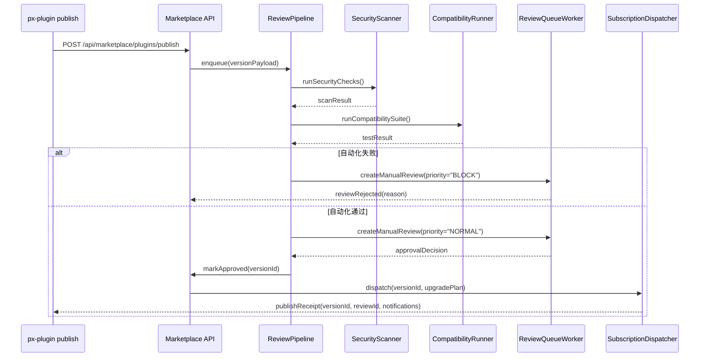

# Usecase Overview

- **业务目标**：为 PowerX Marketplace 提供可审计、可扩展的在线发布审核与上架流程，确保从 CLI 发布到租户通知的链路高效可控。
- **成功度量**：审核入队平均耗时 ≤ 5 分钟；自动化审核通过率 ≥ 95%；通知送达率 ≥ 99%；审核 SLA（4 小时）超时率 < 2%。
- **场景关联**：承接 `PLG-PUBLISH-ONLINE-001` 发布命令的输入，向 `PX-PUBLISH-ONLINE-001`（Core 安装）及 `PX-PUBLISH-ONLINE-UI-001`（Admin UI）提供版本元数据、通知与自动升级指令。

Marketplace 在线发布 API 是生态发布枢纽的中枢节点，负责验证 artefact 安全性、协调人工审核、上架版本与向租户广播通知，保障线上发布的合规性与时效性。

# Context & Assumptions

- **前置条件**
  - Feature Flags `MKP_PUBLISH_ONLINE=1`、`MKP_AUTOMATED_REVIEW=1` 在目标环境启用，并配置正确的下游服务（扫描引擎、测试集群）。
  - Marketplace 具备存储 artefact 元数据与签名信息的数据库（`plugins`, `versions`, `reviews` 表）。
  - 已配置签名与完整性验证服务，支持 CMS/PKCS#7 与哈希校验。
  - 审核人列表、SLA 阈值与通知模板在后台配置中心维护。
- **输入**
  - CLI 上传的版本元数据（manifest、依赖、权限声明）、签名、测试报告摘要、发布渠道。
  - Artefact 存储地址及完整性信息（hash、大小、凭据）。
  - 发布者附带的 changelog、风险说明、自动升级策略。
- **输出**
  - 审核队列任务（包含 `reviewId`, `versionId`, `priority`, `slaDeadline`）。
  - 上架后的 Marketplace 版本记录、租户通知（Webhook、邮件、站内信）与自动升级计划。
  - 审计日志与 Telemetry 事件：`marketplace.publish.received/approved/rejected/notified`.
- **边界**
  - 不负责插件 artefact 的实际构建或签名（由 CLI 侧完成）。
  - 不直接执行租户安装（由 PowerX Core 负责），仅提供通知与版本元数据。
  - 不覆盖离线发布流程（对应 `MKP-PUBLISH-OFFLINE-001`）。

# Solution Blueprint

## 体系分解

| 层/模块 | Scope | 职责 | 代码入口 / Host |
|---------|-------|------|-----------------|
| PublishController | powerx-marketplace | 接收发布请求、解析元数据、触发审核管线 | `backend/internal/marketplace/publish/controller.go` |
| ReviewPipelineService | powerx-marketplace | 组织自动化扫描、兼容性测试、人工审批 | `backend/internal/marketplace/publish/review_pipeline.go` |
| SecurityScannerAdapter | powerx-marketplace | 调度漏洞扫描、静态分析、签名验证 | `backend/internal/marketplace/publish/security_scanner.go` |
| CompatibilityTestRunner | powerx-marketplace | 调用测试集群执行兼容性/回归测试 | `backend/internal/marketplace/publish/compatibility_runner.go` |
| ReviewQueueWorker | powerx-marketplace | 分配人工审核任务、收集结论、记录审计日志 | `backend/workers/review_queue_worker.go` |
| ListingService | powerx-marketplace | 写入版本目录、公开状态、生成下载清单 | `backend/internal/marketplace/listing/service.go` |
| SubscriptionDispatcher | powerx-marketplace | 向租户与订阅系统发送通知/自动升级指令 | `backend/internal/marketplace/notifications/dispatcher.go` |

## 流程与时序

# Contracts & Interfaces

- **Inbound APIs**
  - `POST /api/marketplace/plugins/publish`
    - Body：`metadata`（版本、渠道、权限、依赖）、`artifacts`（urls, hash, size, storageType）、`signatures`、`telemetry`.
    - Auth：OAuth2 Client Credentials（scope: `plugin.publish`）。
    - 返回：`publishId`, `versionId`, `reviewId`, `status`（`queued`/`rejected`）。
  - `PATCH /api/marketplace/plugins/{versionId}/review`
    - 用于人工审核结果提交，包含 `decision`, `notes`, `approvers`.
  - `GET /api/marketplace/plugins/{pluginId}/versions`
    - 提供版本列表与状态供 Core/Admin 查询。
- **Outbound 调用**
  - `POST /internal/security-scanner/run` — 触发静态扫描、签名验真。
  - `POST /internal/compatibility/run` — 运行兼容性/回归测试，返回日志与报告。
  - `POST /internal/notifications/dispatch` — 推送租户通知（Webhook、邮件、站内信）。
  - `POST /telemetry/marketplace/publish` — 上报审核耗时、失败原因、通知覆盖率。
- **配置项**
  - `MKP_REVIEW_SLA_HOURS`：审核 SLA（默认 4 小时）。
  - `MKP_SECURITY_BLOCKLIST`：禁止上架的权限/依赖列表。
  - `MKP_AUTO_UPGRADE_RULES`：按租户/渠道定义自动升级策略。
  - `MKP_NOTIFICATION_TEMPLATES`：多语言通知模板与升级指引链接。

# Implementation Checklist

| 项目 | 描述 | 完成状态 | 负责人 |
|------|------|----------|--------|
| 发布 API 控制器 | 解析请求、鉴权、幂等处理、错误分类 | [ ] | Chen Qiang |
| 审核流水线 | 集成安全扫描、兼容性测试、人工审批节点 | [ ] | Marketplace Backend Team |
| 数据模型 & 迁移 | `plugins`, `plugin_versions`, `reviews`, `notifications` 表结构及索引 | [ ] | DB Engineering |
| 通知分发 | 支持 Webhook、邮件、站内信、多语言模板 | [ ] | Growth & Ops Team |
| 自动升级策略 | 配置化灰度、黑白名单、回滚策略 | [ ] | Marketplace PM |
| 文档与 SOP | 更新审核手册、运营指南、紧急回滚流程 | [ ] | Docs Steward Team |

# Testing Strategy

- **单元测试**：`backend/internal/marketplace/publish/controller_test.go` 覆盖鉴权、幂等、错误码；`backend/internal/marketplace/publish/security_scanner_test.go` 模拟扫描结果；`backend/internal/marketplace/notifications/dispatcher_test.go` 验证多渠道推送逻辑。
- **集成测试**：使用 Mock 服务模拟扫描/测试/通知，执行 `pnpm test:integration --filter marketplace-publish-online`，验证整条流水线。
- **端到端测试**：与 CLI、Core 仓库联动，从 `px-plugin publish` 到租户通知演练，上报完整审计链。
- **非功能测试**：高并发发布（≥ 20 并发）、大包元数据（>500MB）、审核 SLA 压力、灾备切换场景。

# Observability & Ops

- **指标**：`marketplace.publish.count`, `marketplace.publish.automation_pass_rate`, `marketplace.review.sla_breached`, `marketplace.notifications.failure_rate`.
- **日志**：结构化审计日志记录 `publishId`, `versionId`, `decision`, `approver`, `slaDeadline`, `elapsedMs`, `errorCode`。
- **告警**：自动化失败率 > 10% 提醒安全团队；审核 SLA 即将超时触发 PagerDuty；通知失败连续 3 次推送告警到 `#marketplace-alerts`。
- **Dashboards**：Grafana “Marketplace Publish & Review” 仪表板、Telemetry Publish Funnel、审核工作量与 SLA 可视化面板。

# Rollback & Failure Handling

- **回滚步骤**：暂停 `MKP_PUBLISH_ONLINE`，撤销已创建但未审核的版本；如必要，调用 `PATCH /api/marketplace/plugins/{versionId}/status` 将状态置为 `withdrawn`。
- **补救措施**：为发布者提供重试凭证、保留失败的扫描/测试报告；在通知失败时提供手动通知脚本；触发 incident 模板并通知相关团队。
- **数据修复**：校准数据库状态（版本、审核、通知表），重新生成审计记录；若自动升级错误，下发回滚通知、更新租户升级计划。

# Risks & Mitigations

| 风险/事项 | 影响 | 缓解方案 | 负责人 | ETA |
|-----------|------|----------|--------|-----|
| 自动化扫描误判阻断发布 | 发布延误、研发体验差 | 引入白名单、人工复核通道、Telemetry 反馈 | Security Team | 2025-02-01 |
| 审核 SLA 超时 | 影响生态信任度 | SLA 告警、审核排班自动化、加急通道 | Marketplace PM | 2025-01-25 |
| 通知推送失败 | 租户无法及时升级 | 重试 + 备用通道（Webhook/Email）、失败手动补发 | Ops Team | 2025-01-20 |
| Artefact 被篡改或泄漏 | 安全风险 | 强制签名校验、存储加密、访问控制与审计 | Security Team | 2025-02-10 |

# References & Links

- 场景文档：`docs/scenarios/publish/SCN-PUBLISH-ONLINE-001.md`
- CLI 发布能力：`docs/usecases-seeds/SCN-PUBLISH-HUB-001/PLG-PUBLISH-ONLINE-001.md`
- Core 安装能力：`docs/usecases-seeds/SCN-PUBLISH-HUB-001/PX-PUBLISH-ONLINE-001.md`
- 审核手册：`docs/standards/powerx-marketplace/publish/review_playbook.md`

> Seed 更新后，请运行 `npm run publish:usecases -- --scn-id SCN-PUBLISH-HUB-001 --validate-only` 校验结构，并安排一次跨仓发布演练验证端到端链路。
