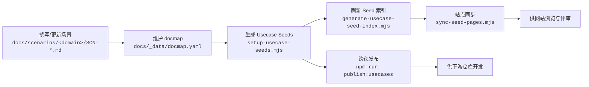

# 场景使用流程

> 适用范围：`docs/scenarios/**` 场景文档、`docs/_data/docmap.yaml`、`docs/usecases-seeds/**`、`docs/website/{zh,en}/scenarios/**`

## 流程总览



## 1. 生成 & 编辑场景草稿 (A)

- **目标**：根据需求说明快速生成场景草稿，并补充为正式的 Markdown 文档。
- **生成命令**（任选其一）：

  ```bash
  [scenario-generate-template.md](.specify/templates/scenario-generate-template.md) \
    根据当前文档 docs/meta/scenarios/<domain>/<需求稿>.md，实现主用例和子用例文档 
  ```

  或使用 Speckit Prompt 直接读取需求文本：

  ```bash
  [speckit.scenario.md](.codex/prompts/speckit.scenario.md) <@需求稿路径或自由文本>
  ```

- **Clarify 补充**：若生成后仍有 TODO 或缺少信息，可使用 Clarify Prompt 一问一答补齐：

  ```bash
  [speckit.scenario.clarify.md](.codex/prompts/speckit.scenario.clarify.md)  docs/meta/scenarios/<domain>/<需求稿>.md
  ```

- **预览**：补齐后的 Markdown 可运行

  ```bash
  node scripts/site/sync-scenario-pages.mjs --scn-id <SCN_ID>
  ```

  将主场景及子场景渲染到 `docs/website/{zh,en}/scenarios/` 方便浏览器预览。
- **输出**：`docs/scenarios/<domain>/SCN-*.md` 草稿更新完成。
- **继续**：场景内容确定后，进入 Step 2 在 docmap 中登记结构映射。

## 2. 维护 docmap (B)

- **目标**：将新撰写的场景及其子场景登记到 `docs/_data/docmap.yaml`，为 Seed 生成提供权威来源。
- **操作**：在 docmap 中补充 `scn_id`、`child_scenarios`、`children`（Usecase Seed 声明）等字段，可参考《[Docmap 维护记录](/zh/guides/scenarios/docmap-maintenance)》示例。
- **输出**：docmap 中对应场景节点与子节点齐全，路径指向最新 Markdown。
- **继续**：docmap 完成后，即可运行 Seed 生成脚本（Step 3），脚本会依据这里的 `children` 列表创建模板。

## 3. 生成 Usecase Seeds (C)

- **目标**：为 docmap 中的子用例生成 Seed 草稿，并准备撰写任务清单。
- **步骤 1 – 生成任务与草稿**：运行脚本读取 docmap，输出任务清单与基础 Seed 模板。

  ```bash
  node .specify/scripts/node/setup-usecase-seeds.mjs --scn-id <SCN_ID>
  ```

  或使用 Speckit Prompt：

  ```bash
  [speckit.usecase-seed-generate.md](.codex/prompts/speckit.usecase-seed-generate.md) <SCN_ID>
  ```

  脚本会：
  1. 在 `docs/usecases-seeds/<SCN_ID>/` 生成 `DOC_ID.md` 草稿；
  2. 在 `docs/usecases-seeds/<SCN_ID>/task.md` 输出撰写任务，每个子用例附带生成命令。
- **步骤 2 – 按任务撰写**：根据 `docs/usecases-seeds/<SCN_ID>/task.md` 中的命令逐条完善 Seed 内容，例如：

  ```bash
  [usecase-generate-template.md](.specify/templates/usecase-generate-template.md) \
    docs/usecases-seeds/<SCN_ID>/<DOC_ID>.md \
    --context docs/scenarios/<domain>/<SCN_ID>.md \
    --context docs/scenarios/<domain>/<子场景>.md \
    --context docs/_data/docmap.yaml \
    --context docs/_data/repos.yaml
  ```

  *可按任务表依次执行，也可继续使用 Speckit Prompt 辅助撰写。*
- **输出**：Seed 草稿完成补录，`task.md` 任务清单帮助追踪撰写进度。
- **继续**：全部 Seed 填写完毕后，前往 Step 4 构建索引。

## 4. 刷新 Seed 索引 (D)

- **目标**：生成汇总页面，展示该场景下所有 Seeds 的状态与位置。
- **命令**：

  ```bash
  node .specify/scripts/node/generate-usecase-seed-index.mjs --scn-id <SCN_ID>
  ```

- **输出**：生成/更新 `docs/usecases-seeds/<SCN_ID>/index.md`，包含 `doc_id`、层级、可选标记、状态等信息。
- **继续**：索引完成后，可开展 Seed 发布或站点同步等后续动作。若还需跨仓协作，请执行 Step 5。

## 5. 站点同步与消费 (E)

- **目标**：让最新场景与 Seeds 在站点呈现，便于评审、翻译或外部引用。
- **步骤顺序**：
  1. **同步场景正文**：

     ```bash
     node scripts/site/sync-scenario-pages.mjs --scn-id <SCN_ID> --force
     ```

     将主场景及 docmap 中的 `child_scenarios` 输出到 `docs/website/{zh,en}/scenarios/`。

  2. **同步 Seed 页面**：

     ```bash
     node scripts/site/sync-seed-pages.mjs --scn-id <SCN_ID> --force
     ```

     复制 `docs/usecases-seeds/<SCN_ID>/**` 到站点目录并生成索引页。

- **语言策略**：中文站点直接展示原文，英文站点自动生成占位提示，后续可人工或 AI 翻译。
- **输出**：`docs/website/{zh,en}/scenarios/**` 与 Seeds 对齐，便于浏览器确认文档内容是否正确。
- **继续**：站点确认无误后，再进入 Step 6 分发到下游仓库。

## 6. 分发与汇总 (F)

- **目标**：将完善后的 Seeds 分发到下游仓库，并生成领导层视图。
- **步骤顺序**：
  1. **准备仓库**（首次或新增 scope 时）：

     ```bash
     node scripts/setup/downstreams.mjs --scope <scope1,scope2>
     ```

     或仅同步指定仓库：

     ```bash
     node scripts/setup/downstreams.mjs --repo <repo-key>
     ```

  2. **Dry Run 检查**：确认即将分发的仓库与文件。

     ```bash
     npm run publish:usecases -- --scn-id <SCN_ID> --dry-run
     ```

  3. **复用 Dry Run**（如需）：使用 Dry Run 产出的 `resumeToken` 继续同一批次。

     ```bash
     npm run publish:usecases -- --scn-id <SCN_ID> --dry-run --resume-token <token>
     ```

     Dry Run 完成后，可在终端提示的报告路径或 `reports/_state/usecases:<SCN_ID>.json` 中找到对应的 `resumeToken`。

  4. **正式发布**（默认 PR 模式）：复用 Dry Run 的 `resumeToken`，脚本会在仓库中生成/切换到 `docs/hub/...` 分支，复制 Seed 文件并 `git commit`，随后推送远端并创建 PR。

     ```bash
     npm run publish:usecases -- --scn-id <SCN_ID> --resume-token <token>
     ```

  5. **直接提交模式**（跳过 PR）：复用 Dry Run 的 `resumeToken`，脚本会 `git fetch` / `checkout <default_branch>` / 同步 Seed 文件并 `git commit`，最后直接推送到默认分支，不走 PR 流程。

     ```bash
     npm run publish:usecases -- --scn-id <SCN_ID> --use-default-branch --resume-token <token>
     ```

     此模式会在各仓库执行 `git fetch → checkout <default_branch> → pull --ff-only → commit → push`。发布后可运行 `node scripts/setup/push-downstreams.mjs` 再次确认远端状态，并清理遗留的 `docs/hub/<SCN_ID>-***` 本地分支。

  5.b **批量推送已提交的仓库**（确认远端全部同步）：

     ```bash
     node scripts/setup/push-downstreams.mjs
     ```

  6. **生成领导层视图**：

     ```bash
     npm run publish:collected -- --scn-id <SCN_ID>
     ```

- **输出**：下游仓库获得最新 Seeds（PR 或直接提交），`reports/usecases/**` 写入分发报告。
- **继续**：流程结束后可进入评审或与下游团队协调上线。

### Workflow 状态与 Resume Token

- 发布脚本会在 `reports/_state/usecases:<SCN_ID>.json` 记录指纹（fingerprint）和 `resumeToken`，用于防止同一批内容重复执行。
- 如果 dry-run 结果确认无误，需要立刻执行正式分发，请在命令中追加 `--resume-token <token>` 并复用上一轮输出的 token，例如：

  ```bash
  npm run publish:usecases -- --scn-id <SCN_ID> --use-default-branch --resume-token <resume_token>
  ```

- token 会写入 `_state` 与 `reports/usecases/*.json`，可从这些文件查询；若希望彻底重新开始，也可删除或重命名对应的 `_state` 文件，再重新执行命令。

## 常见问题

| 问题 | 检查点 |
| --- | --- |
| Seed 未出现在站点 | 是否运行 `sync-seed-pages.mjs` 并提交对应文件 |
| 子用例顺序不一致 | `docmap.yaml` 中的排序是否正确，索引是否重新生成 |
| 发布命令失败 | `npm run publish:*` 需要合适的 Node 版本与凭证，请参考脚本输出 |

> 任何操作均应以版本控制提交为单位，保持场景、docmap、Seeds 和网站副本的同步。
