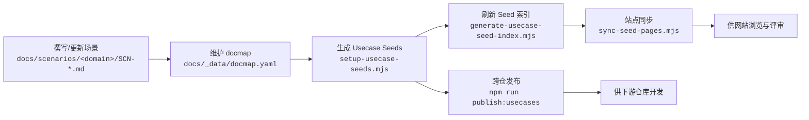

# 场景使用流程

> 适用范围：`docs/scenarios/**` 场景文档、`docs/_data/docmap.yaml`、`docs/usecases-seeds/**`、`docs/website/{zh,en}/scenarios/**`

## 流程总览



## 1. 撰写 / 更新场景 (A)

- **位置**：`docs/scenarios/<domain>/SCN-*.md`
- **模板**：遵循《[场景文档生成指南](/zh/guides/scenarios/scenario-generation)》中的字段与结构。
- **预览**：修改完成后运行：

  ```bash
  node scripts/site/sync-scenario-pages.mjs --scn-id <SCN_ID>
  ```

  在 `docs/website/{zh,en}/scenarios/` 内查看渲染效果。

## 2. 维护 docmap (B)

- **真相源**：`docs/_data/docmap.yaml`
- **内容**：记录每个场景的子用例、种子状态、可选标记与分组信息。
- **追溯**：变更流程与示例可参考《[Docmap 维护记录](/zh/guides/scenarios/docmap-maintenance)》。

## 3. 生成 Usecase Seeds (C)

- **命令**：

  ```bash
  node .specify/scripts/node/setup-usecase-seeds.mjs --scn-id <SCN_ID>
  ```

- **输出**：在 `docs/usecases-seeds/<SCN_ID>/` 生成 Seed 草稿（每个子用例一个 `DOC_ID.md` 文件）。
- **验收**：根据《[Usecase Seed 生成指南](/zh/guides/usecases/generate-usecase-seeds)》补充描述、验收条件与依赖。

## 4. 刷新 Seed 索引 (D)

- **命令**：

  ```bash
  node .specify/scripts/node/generate-usecase-seed-index.mjs --scn-id <SCN_ID>
  ```

- **作用**：在 `docs/usecases-seeds/<SCN_ID>/index.md` 构建 Seed 总览页（含 `doc_id/status/optional` 等信息），供站点和下游仓库引用。
- **提示**：索引脚本会优先读取 `docs/usecases-seeds/<SCN_ID>/<DOC_ID>.md`；若缺少该文件，将回落到 `docmap.yaml` 的 `path` 字段。

## 5. 分发与汇总 (E)

- **下游仓库准备**：首次分发或新增 scope 时运行：

  ```bash
  node scripts/setup/downstreams.mjs --scope <scope1,scope2>
  ```

  若只处理特定仓库，可改用：

  ```bash
  node scripts/setup/downstreams.mjs --repo <repo-key>
  ```

-  脚本会根据 `docs/_data/repos.yaml` 在 `repos/` 目录下克隆或更新对应仓库，并尝试切换到默认分支。
- **Dry Run 检查**：先运行以下命令确认目标仓库与文件清单：

  ```bash
  npm run publish:usecases -- --scn-id <SCN_ID> --dry-run
  ```

- **继续同一批次**：需要复用 Dry Run 结果时，附加 `--resume-token <token>`：

  ```bash
  npm run publish:usecases -- --scn-id <SCN_ID> --dry-run --resume-token <token>
  ```

- **正式发布**：确认无误后执行：

  ```bash
  npm run publish:usecases -- --scn-id <SCN_ID>
  ```

  触发跨仓分发流程并自动创建 PR。
- **直接提交**：如需跳过 PR 分支，追加 `--use-default-branch`：

  ```bash
  npm run publish:usecases -- --scn-id <SCN_ID> --use-default-branch
  ```

  脚本会在每个仓库依次执行：

  ```
  git fetch
  git checkout <default_branch>
  git pull --ff-only origin <default_branch>
  # 复制 Seed 文件
  git commit   # 若存在内容差异
  git push origin <default_branch>
  ```

  发布后，可运行 `node scripts/setup/push-downstreams.mjs` 一次性执行 `git push` 校验远端状态；若早期存在遗留的 `docs/hub/<SCN_ID>-***` 本地分支，也可以 `git branch -D docs/hub/<SCN_ID>-***` 清理。
- **汇总视图**：执行 `npm run publish:collected -- --scn-id <SCN_ID>`，生成领导层汇总页面。
- **核对**：提交前按照《[发布 Usecase Seeds 指南](/zh/guides/usecases/publish-usecase-seeds)》中的检查清单逐项确认。

## 6. 站点同步与消费 (F → H)

- **场景正文**：先执行：

  ```bash
  node scripts/site/sync-scenario-pages.mjs --scn-id <SCN_ID> --force
  ```

  将主场景与 `child_scenarios`（docmap 登记的子场景文档）同步到 `docs/website/{zh,en}/scenarios/`。
- **Seed 页面**：随后运行：

  ```bash
  node scripts/site/sync-seed-pages.mjs --scn-id <SCN_ID> --force
  ```

  把 `docs/usecases-seeds/<SCN_ID>/**` 复制到站点目录，并生成 Seed 索引页。
- **语言策略**：
  - `zh`：直接复制 Seed 与场景原文。
  - `en`：脚本生成带占位提示的英文文件，指向中文原文，等待翻译或 AI 生成内容。
- **用途**：网站用于评审与对外展示；下游仓库可直接引用最新 Seeds 进行实现或测试。如需多语言正式稿，可在英文占位文件基础上人工或 AI 翻译后提交。

## 常见问题

| 问题 | 检查点 |
| --- | --- |
| Seed 未出现在站点 | 是否运行 `sync-seed-pages.mjs` 并提交对应文件 |
| 子用例顺序不一致 | `docmap.yaml` 中的排序是否正确，索引是否重新生成 |
| 发布命令失败 | `npm run publish:*` 需要合适的 Node 版本与凭证，请参考脚本输出 |

> 任何操作均应以版本控制提交为单位，保持场景、docmap、Seeds 和网站副本的同步。
