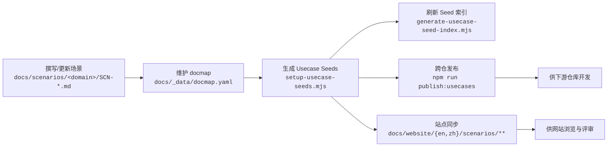

# 场景使用流程

> 适用范围：`docs/scenarios/**` 场景文档、`docs/_data/docmap.yaml`、`docs/usecases-seeds/**`、`docs/website/{zh,en}/scenarios/**`

## 流程总览

## 1. 撰写 / 更新场景 (A)

- **位置**：`docs/scenarios/<domain>/SCN-*.md`
- **模板**：遵循《[场景文档生成指南](/zh/guides/scenarios/scenario-generation)》中的字段与结构。
- **预览**：修改完成后运行 `node scripts/site/sync-scenario-pages.mjs --scn-id <SCN_ID>`，在 `docs/website/{zh,en}/scenarios/` 内查看渲染效果。

## 2. 维护 docmap (B)

- **真相源**：`docs/_data/docmap.yaml`
- **内容**：记录每个场景的子用例、种子状态、可选标记与分组信息。
- **追溯**：变更流程与示例可参考《[Docmap 维护记录](/zh/guides/scenarios/docmap-maintenance)》。

## 3. 生成 Usecase Seeds (C)

- **命令**：`node .specify/scripts/node/setup-usecase-seeds.mjs --scn-id <SCN_ID>`
- **输出**：在 `docs/usecases-seeds/scenarios/<SCN_ID>/` 生成 Seed 草稿。
- **验收**：根据《[Usecase Seed 生成指南](/zh/guides/usecases/generate-usecase-seeds)》补充描述、验收条件与依赖。

## 4. 刷新 Seed 索引 (D)

- **命令**：`node .specify/scripts/node/generate-usecase-seed-index.mjs --scn-id <SCN_ID>`
- **作用**：构建 Seed 总览页（含 `doc_id/status/optional` 等信息），供站点和下游仓库引用。
- **同步**：如需强制覆盖站点副本，可执行 `node scripts/site/sync-seed-pages.mjs --scn-id <SCN_ID> --with-index --force`。

## 5. 分发与汇总 (E)

- **单场景发布**：`npm run publish:usecases -- --scn-id <SCN_ID>`
- **汇总视图**：`npm run publish:collected -- --scn-id <SCN_ID>`
- **核对**：提交前按照《[发布 Usecase Seeds 指南](/zh/guides/usecases/publish-usecase-seeds)》清单逐项确认。

## 6. 站点同步与消费 (F → H)

- **站点内容**：`node scripts/site/sync-seed-pages.mjs --scn-id <SCN_ID> --with-index` 会把场景与 Seeds 复制到 `docs/website/{zh,en}/scenarios/**`。
- **用途**：网站用于评审与对外展示；下游仓库可直接引用最新 Seeds 进行实现或测试。

## 常见问题

| 问题 | 检查点 |
| --- | --- |
| Seed 未出现在站点 | 是否运行 `sync-seed-pages.mjs` 并提交对应文件 |
| 子用例顺序不一致 | `docmap.yaml` 中的排序是否正确，索引是否重新生成 |
| 发布命令失败 | `npm run publish:*` 需要合适的 Node 版本与凭证，请参考脚本输出 |

> 任何操作均应以版本控制提交为单位，保持场景、docmap、Seeds 和网站副本的同步。
