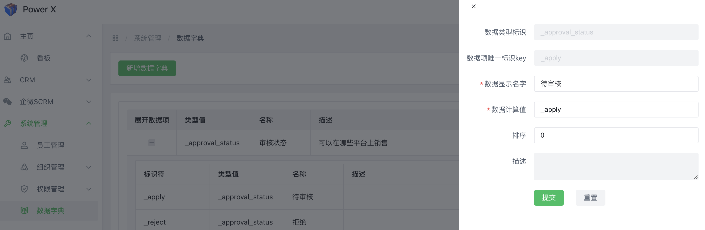

# 数据字典

数据字典是一个记录和描述数据元素、数据结构、数据域、数据关系以及数据流的文档或数据库。它用于存储关于数据的定义、属性和用途的信息，以便在组织内部共享、理解和管理数据。

## 编辑数据字典功能入口

导航路径： 进入【PowerX后台】>【系统管理】>【数据字典】。

## 新增数据字典

1. 点击【新增数据字典】按钮，填写：**字典类型**、**显示名称**，其中带*是必填字段。

然后点击【提交】。

 
2. 点击+号，新增标识符。

3. 填写完成后，点击提交。

## 修改数据字典

1. 点击修改按钮，在弹出的列表框中，修改字典名称和描述的信息。

2. 修改具体数据项的信息，点击+展开列表项

3. 在需要修改的对应项，点击铅笔形状的修改按钮。

4. 在弹出框中修改对应的内容，其中带*是必填字段。

5. 确认修改后，点击【**提交**】

## 删除数据字典

点击操作下的【**删除**】按钮，删除具体的标识项或者删除整个字典项。

