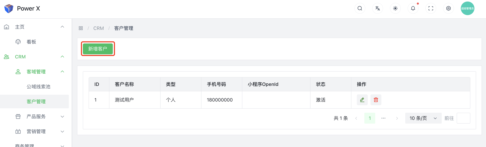
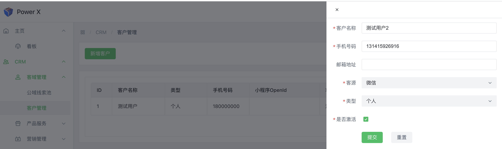
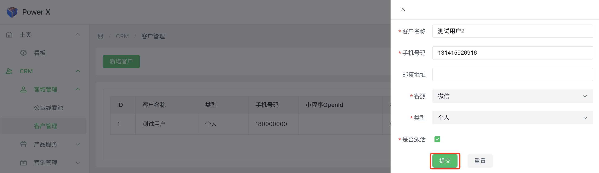

# 新增客户

在CRM（Customer Relationship Management）系统中，新增客户是指将新的客户信息添加到系统中，以便更好地管理和跟踪与这些客户的关系

## 新增客户功能入口

导航路径： 进入【PowerX后台】>【CRM】>【客域管理】>【客户管理】。

## 新增客户

点击【**新增客户**】按钮，进入信息填写页面。

2. 填写相关信息，其中带*是必填字段。

3. 填写好后点击【**提交**】。

