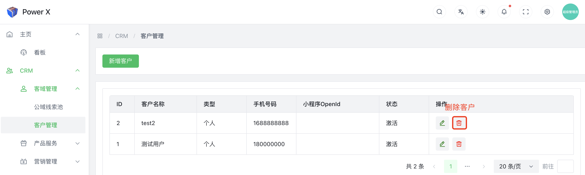
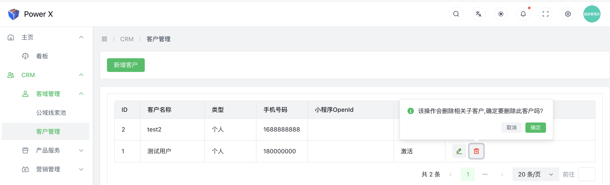
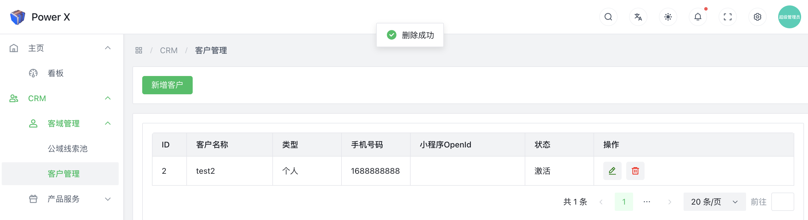

# 删除客户

在CRM（Customer Relationship Management）系统中删除客户是一个重要且敏感的操作，因为它涉及到与客户关系相关的信息的永久性删除。在执行删除客户操作之前，请务必十分谨慎，并了解其可能的影响。

## 删除客户功能入口

导航路径： 进入【PowerX后台】>【CRM】>【客域管理】>【客户管理】。

## 删除客户

点击【**删除**】按钮。

在弹出框中，点击【**确定**】，即可删除该条客户信息。

