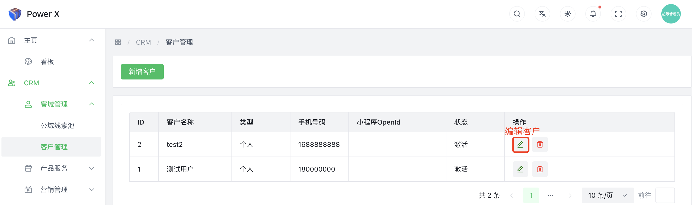
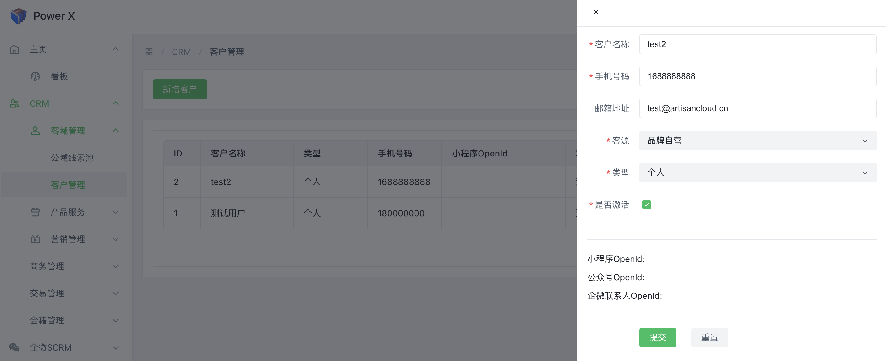
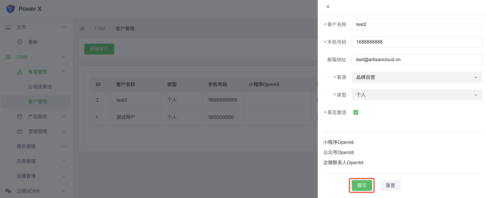
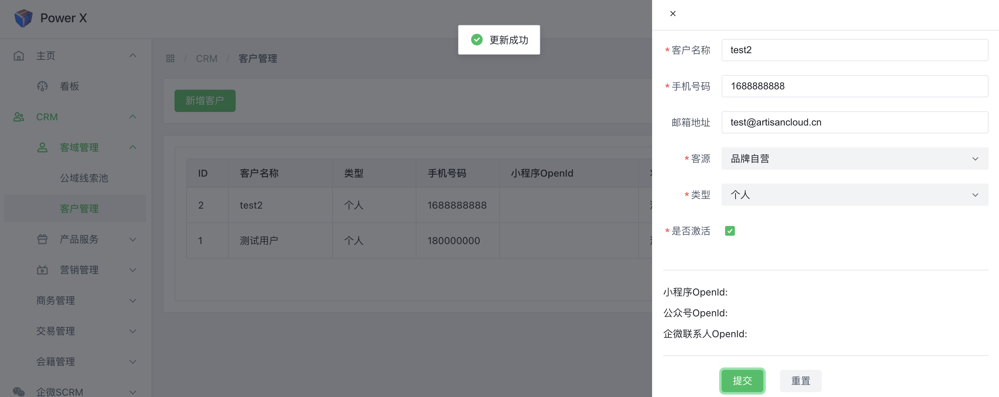

# 编辑客户

在CRM（Customer Relationship Management）系统中，编辑客户是指对现有客户的信息进行修改、更新或添加的操作。这允许你在系统中保持客户信息的准确性和最新性。

## 编辑客户功能入口

导航路径： 进入【PowerX后台】>【CRM】>【客域管理】>【客户管理】。

## 编辑客户

点击铅笔样式的【**编辑**】按钮。

填写需要修改的内容，确认后点击【**提交**】。

提示**提交成功**。

