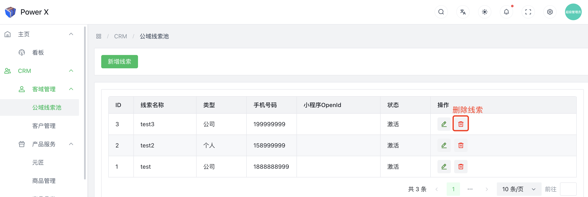
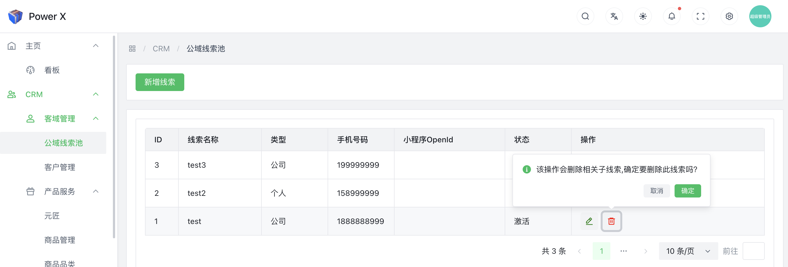
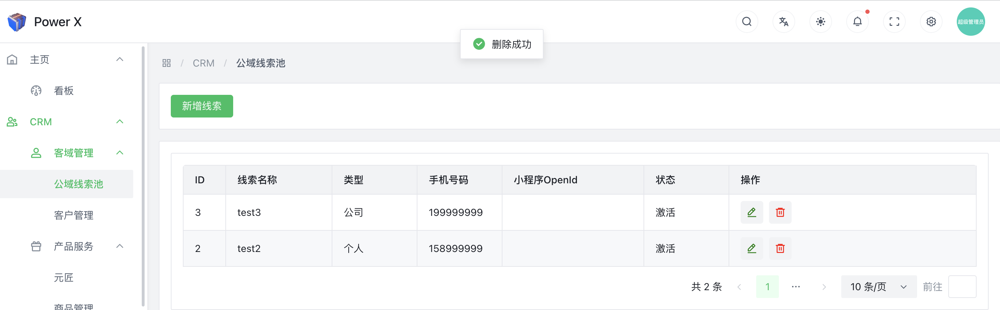

# 删除线索

在客户关系管理（CRM）系统中，删除线索是指从系统中永久性地移除一个潜在客户的记录。删除线索可能是因为该线索不再具有潜在价值，或者因为它不再符合企业的目标或标准。

## 删除线索功能入口

导航路径： 进入【PowerX后台】>【CRM】>【客域管理】>【公域线索池】。

## 删除线索

点击【**删除**】按钮。

在弹出框中，点击【**确定**】，即可删除该条线索。

