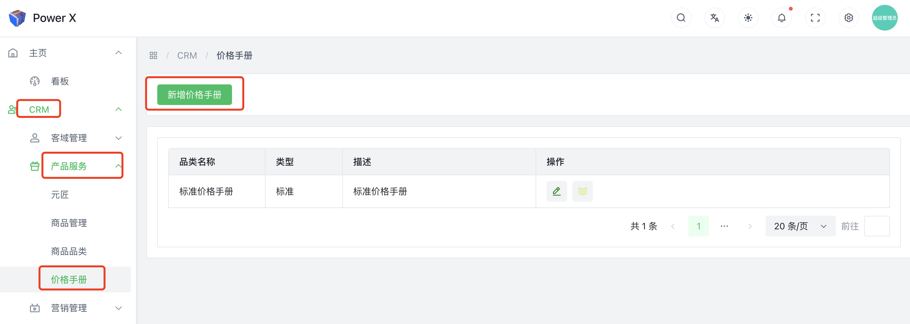
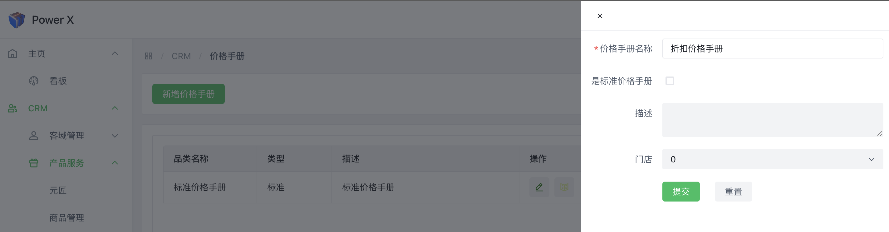
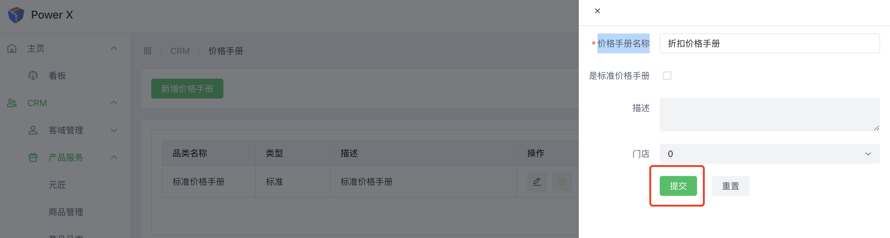
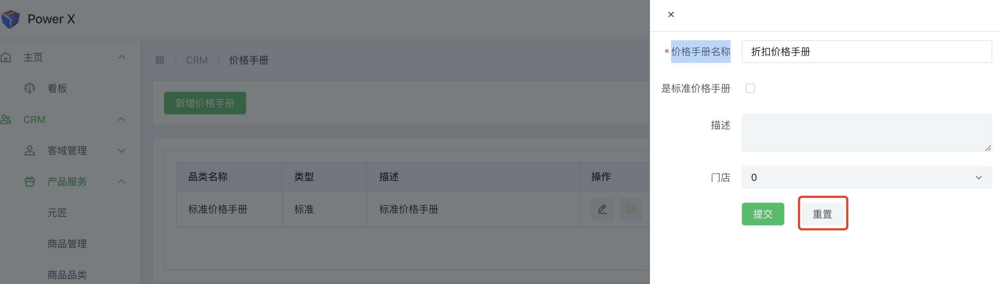

# 价格手册

**价格手册（Price List）**是一种用于管理产品或服务价格的工具，通常在销售和营销领域使用。价格手册用于集中记录和维护不同产品或服务的定价信息，以便销售团队和客户能够准确地了解和应用相关价格。

在CRM系统中，价格手册是一个重要的功能，它可以帮助企业更好地管理产品定价和价格策略。以下是价格手册的主要特点和用途：

**产品定价**：价格手册用于记录不同产品或服务的定价信息。每个产品通常与一个或多个价格相关联，这些价格可能因客户类型、销售地区、购买数量等因素而异。

**多级定价**：价格手册可以支持多级定价，即对于同一产品，可以根据不同的条件设置不同的价格。例如，对于批量购买的客户可以享受折扣价，而零售客户则按照零售价购买。

**客户定价策略**：价格手册可以根据不同的客户群体或客户等级设置不同的定价策略。这样，企业可以实现对特定客户的差异化定价，以满足不同客户的需求和特定合同要求。

**生效日期和历史记录**：价格手册通常支持设置价格的生效日期，确保定价策略按计划执行。同时，系统可能会保留历史价格记录，方便回溯和审计。

**报价生成**：CRM系统可以根据价格手册自动生成针对客户的报价单。当销售团队创建新的销售机会或报价时，系统会根据客户和所选产品自动应用相应的定价信息。

**价格调整**：价格手册允许管理员或授权用户对价格进行调整。这包括临时的促销折扣、全局的价格调整等。

总体而言，价格手册在CRM系统中起到了重要的作用，它帮助企业管理产品的定价信息，优化销售策略，实现定价的灵活性和差异化，以满足客户需求，并提高销售效率和利润率。

## 新增价格手册功能入口

导航路径： 进入【PowerX后台】>【CRM】>【产品服务】>【价格手册】。

## 填写基本信息

填写对应的价格手册名称。

填写好相关信息后，点击【**提交**】，保存当前的修改。

如果需要重新填写，点击【**重置**】，重新填写相关信息。

