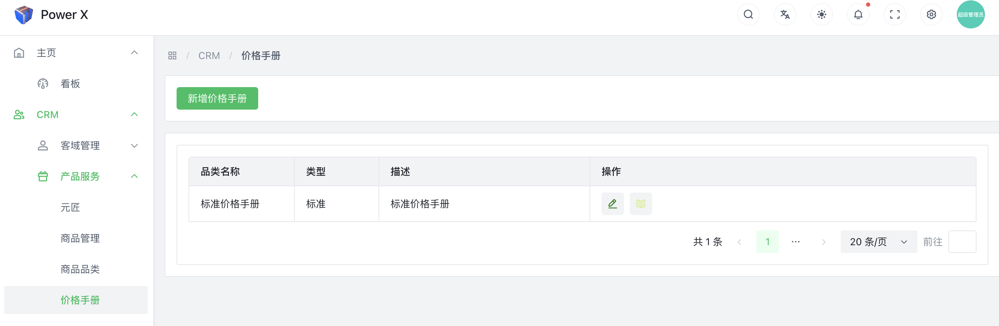
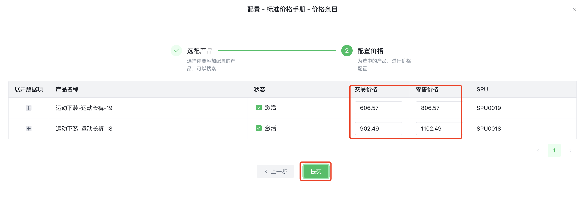
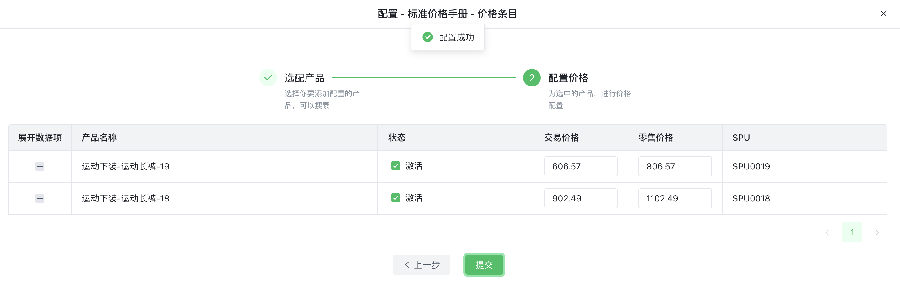

# 标准价格手册

"标准价格手册"（Standard Price List）是指在CRM系统中用于记录产品或服务的标准定价信息的一个特定价格手册。它是CRM系统中常见的一个功能，用于集中管理标准的产品定价，以便在销售和营销过程中应用。

以下是标准价格手册的主要特点和用途：

**标准化定价**：标准价格手册用于记录产品或服务的标准定价。这些定价通常是公司对产品或服务的正式标价，适用于普遍的销售场景。

**统一定价策略**：通过标准价格手册，企业可以实现对所有客户或特定客户群体的统一定价策略。这有助于确保产品定价的一致性，避免因客户类型或地区而导致的混乱。

**管理产品价格**：标准价格手册可以包含所有产品或服务的定价信息，包括不同规格、型号、包装等。这样，销售团队可以方便地查找并应用正确的价格信息。

**价格调整**：管理员或授权用户可以在标准价格手册中进行价格调整。这可能包括定期的价格审查、特殊促销价格等。

**报价生成**：CRM系统可以根据标准价格手册为客户自动生成标准化的报价单。当销售团队与客户进行交谈时，他们可以快速选择合适的产品并生成准确的报价。

**生效日期和历史记录**：标准价格手册通常支持设置价格的生效日期，确保定价策略按计划执行。同时，系统可能会保留历史价格记录，方便回溯和审计。

标准价格手册对于企业实现定价标准化、提高销售流程效率、确保报价准确性都具有重要意义。它使销售团队能够便捷地找到正确的产品价格，并根据不同情况进行灵活的调整，以满足客户需求，同时保持定价的一致性和合理性。

## 编辑价格手册功能入口

导航路径： 进入【PowerX后台】>【CRM】>【产品服务】>【价格手册】。

### 编辑价格手册

编辑价格手册需要注意，确认是否为“标准价格手册”，如果是✅。

点击【**提交**】，然后关闭抽屉。

### 配置价格手册

选择你要配置的价格手册，点击【**配置**】按钮。

进入产品价格配置详情页，这里你可以添加配置产品，或者编辑商品的具体价格。

 

#### 添加配置产品

1. 选择需要配置的产品。

2. 页面滚动到最底部，点击【**下一步**】。

3. 展开产品列表，填写每个商品SKU对应的【**交易价格**】、【**零售价格**】。

4. 在最后确认商品的总价，点击【**提交**】，保存配置。

5. 提交后，点击【**关闭**】按钮，关闭当前页面。
