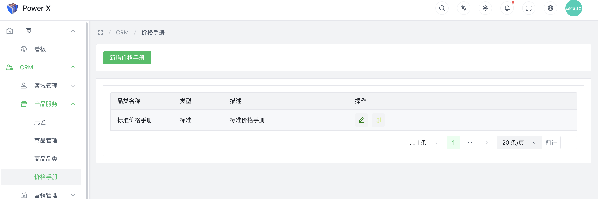

# 价格手册

产品价格手册是一份包含不同产品定价信息的目录或列表。它在企业的产品定价和销售策略中扮演着重要的角色。以下是产品价格手册的作用：

**定价依据**：产品价格手册提供了产品的定价依据和参考，使企业能够根据成本、市场需求、竞争情况等因素来确定合理的价格策略。

**统一定价**：价格手册确保在企业内部对相同产品的定价保持一致，避免不同销售渠道或销售人员之间因为定价不一致而造成混淆或争议。

**灵活定价**：通过价格手册，企业可以为不同的市场、客户或销售渠道制定不同的定价策略，以满足不同客户的需求和市场变化。

**透明度和公平性**：价格手册向客户展示了产品的价格，提供了透明度，确保定价的公平性，避免因为信息不对称而影响客户信任。

**销售依据**：销售人员可以依据价格手册来报价和进行谈判，确保在销售过程中的定价合理、公平，并减少谈判时间和不确定性。

**新产品定价**：对于新产品，价格手册提供了一个参考框架，使企业能够根据市场需求和竞争情况来制定合适的定价策略。

**市场调研**：通过观察价格手册中的竞争对手的价格，企业可以进行市场调研，了解市场行情和竞争力，从而做出相应的调整。

**价格优化**：定期更新价格手册，可以根据市场反馈和销售数据进行价格优化，提高产品的竞争力和销售效率。

总体而言，产品价格手册是一个重要的工具，能够帮助企业管理产品定价、提高销售效率，并更好地满足客户需求，实现业务目标。

## 标准价格手册

系统默认会提供一套标准价格手册，这套标准价格手册，不能被删除。
这样的设计通常出现在涉及产品或服务定价的管理系统中，目的是确保系统的稳定性和准确性。以下是一些可能的原因和优点：

**数据一致性**：标准价格手册的不可删除性可以确保所有用户或客户看到的价格都是统一的，避免因误操作或错误导致价格数据的不一致。

**稳定性**：系统默认提供的标准价格手册作为固定的参考，确保系统在任何情况下都有一个稳定的价格基准，避免因手册的变动导致系统出现问题。

**合规性**：标准价格手册可能包含一些必须遵守的法规或政策要求的定价信息，将其设为不可删除有助于确保企业遵循相关的合规性要求。

**管理权限**：标准价格手册的不可删除性可能是由系统管理员或高级权限用户设定的，以保护核心数据不受未经授权的更改。

**便捷性**：标准价格手册作为系统默认提供，用户可以方便地查阅和参考，无需担心误删或遗失价格数据。

当然，这仅是对于标准价格手册不可删除性的一种常见设计，具体实现方式可能因不同系统和需求而异。无论是不是系统提供的标准价格手册，保证产品和服务的定价准确性对于企业来说都是非常重要的，特别是涉及到客户交易的情况。

## 自定义价格手册

如果需要对PowerX进行多渠道，或者多场景化的价格分配，可以尝试自己新增多个价格手册。

## 价格手册列表

导航路径： 进入【PowerX后台】>【CRM】>【产品服务】>【价格手册】。

