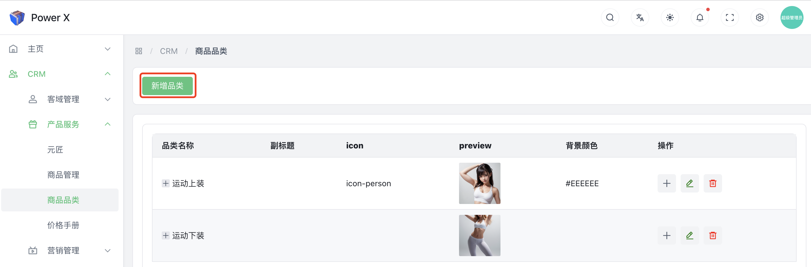
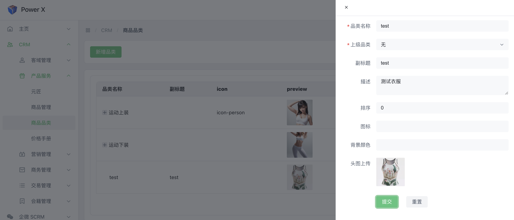
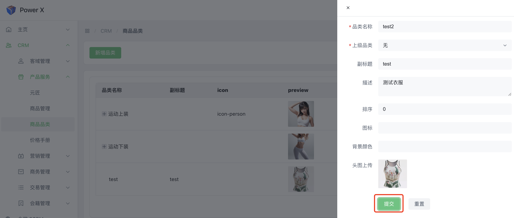
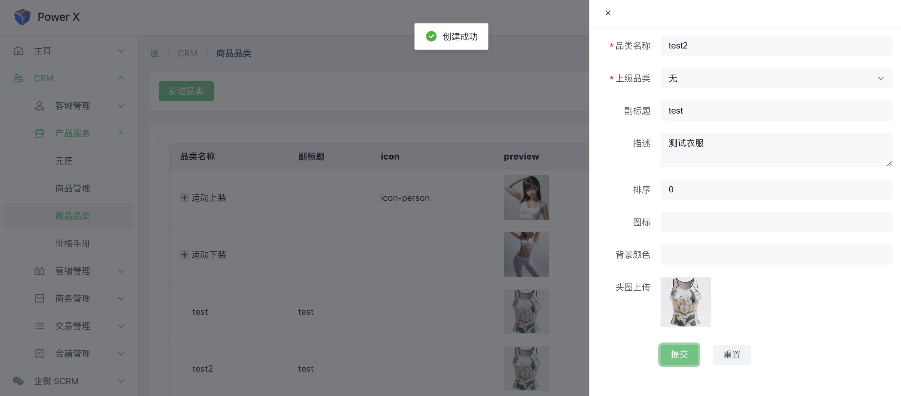
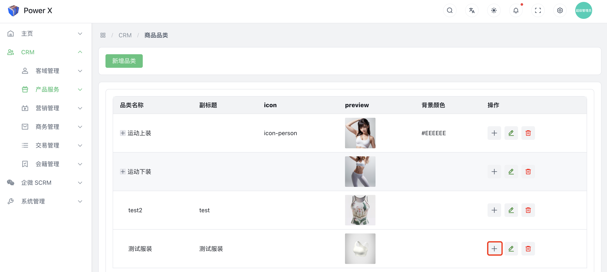
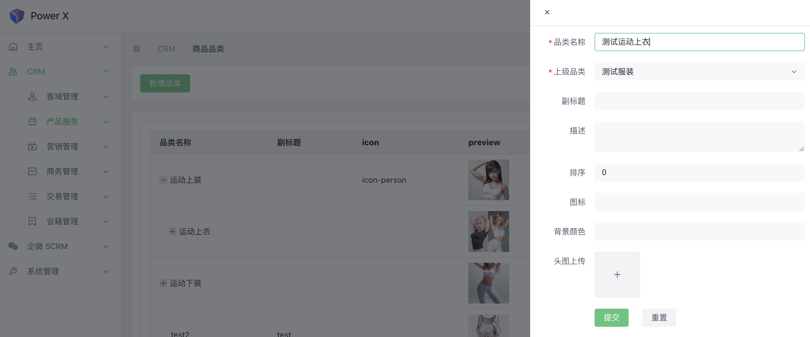
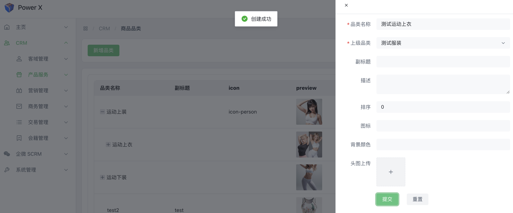
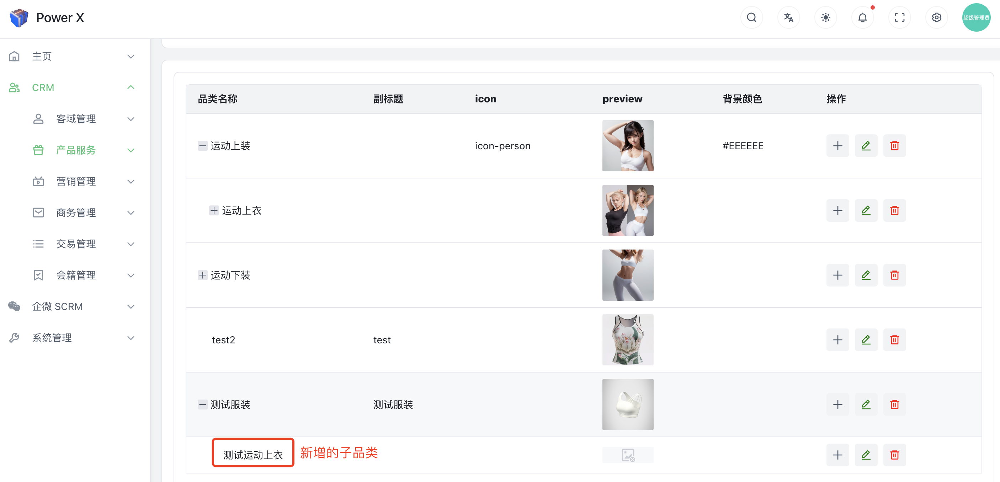

# 新增品类

新增商品品类是在商业环境中将新的、尚未存在的商品类型或分类添加到已有的品类体系中的过程。这可以帮助商家更好地组织和展示各种商品，同时也使消费者更容易找到他们感兴趣的商品。

## 新增品类功能入口

导航路径： 进入【PowerX后台】>【CRM】>【产品服务】>【商品品类】

## 新增品类

点击【**新增品类**】按钮。

填写相关信息，其中带*是必填字段。

点击【**提交**】，保存本次新增。

## 新增子品类

点击所选品类后面的+号，添加子类。

填写子品类名称，点击【**提交**】。

