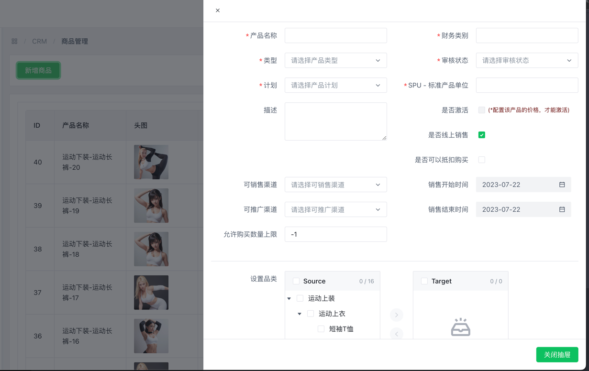

# 新增商品

## 产品的基本属性字段

** 标注红色星的字段，都是必填项

**产品名称**：产品名称是商品在市场上的标识符，是用户和客户用来识别和区分不同商品的名称。一个好的产品名称能够提高商品的辨识度和品牌价值。

**产品类型**：是对商品或服务按照其特性、属性或特征进行分类的方式。不同类型的产品具有不同的特点和用途，通过对产品进行分类，可以帮助客户和企业更好地识别和理解不同商品的特性，从而更有效地进行销售、营销和运营管理。
    普通类型：指一般的商品类型，通常没有特殊要求或限制，符合市场标准的商品类型。
    周期性类型：指具有周期性销售特征的商品，例如订阅服务或定期购买的产品。
**计划**：
    实体商品：指具体的物理商品，例如衣服、电子产品等。
    虚拟商品：指无形的数字或服务类商品，例如软件、电子书、会员服务等。

**财务类别**：财务类别是对商品在财务上的分类。这可以帮助您更好地管理商品的成本、收入和利润。例如，常见的财务类别可能包括成本品、高利润品、畅销品等。

**审核状态**：
    待审核：指商品信息提交后，等待审核人员进行审核的状态。
    拒绝：指商品信息审核不通过的状态，通常会附带拒绝原因。
    通过：指商品信息审核通过，可以正常销售和推广的状态。

**是否激活**：(*配置该产品的价格，才能激活)，可以先保存当前产品属性，随后配置好价格，在开启激活状态。

允许购买数量上限： -1 表示不限制购买数量

---

## 配置产品品类

如果先前还没有配置过，请先看[产品品类](../product-category/index.md)介绍

1. 选中左侧需要的品类
2. 点击中间的箭头，指向右侧列表的箭头按钮  

3. 最终会获得想要新增的分类

如果需要撤回，可按照截图操作  

---

## 配置预览图

你可以多选照片

上传完的图片

可以点击眼睛icon，放大预览  
可以点击删除icon，删除图片

---

## 保存产品

"提交"按钮： 可以将输入好的产品信息，进行保存，如果保存正确，可以直接点击"关闭抽屉"按钮
"关闭抽屉"按钮：可以关闭抽屉表单
"重置"按钮：可以重新刷新表单先前的字段值

接下来就可以去配置价格了