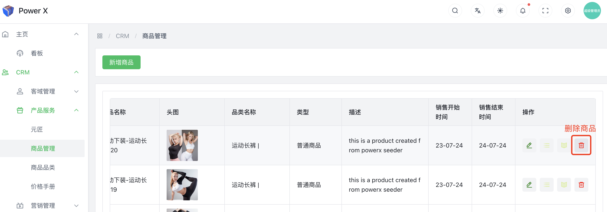
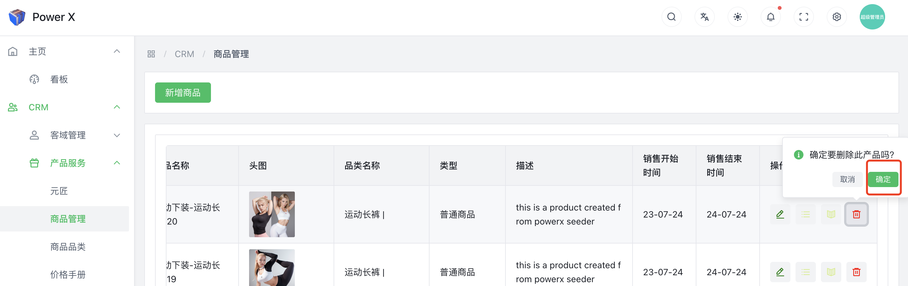
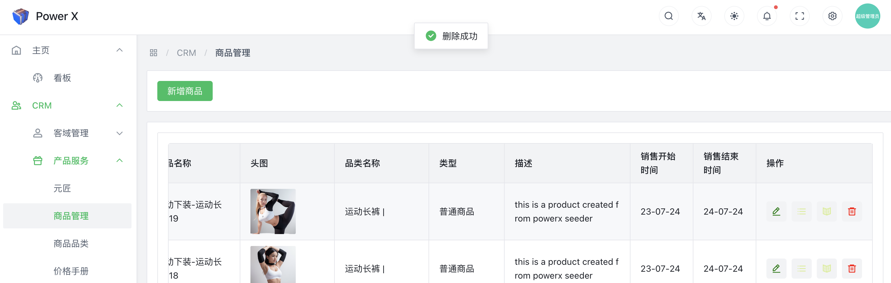

# 删除商品

在CRM（Customer Relationship Management）系统中，"删除商品"通常是指将产品或商品从系统中永久性地移除的操作。删除商品的功能允许用户在系统中删除不再需要的产品或商品信息。

在进行"删除商品"操作时，通常会出现以下情况和注意事项：

操作确认：删除商品通常是一项敏感的操作，系统会要求用户进行确认，以防止意外的删除。

数据备份：一些CRM系统在执行删除操作之前会要求用户备份相关数据，以确保即使误删，数据也能恢复到之前的状态。

影响警示：在删除商品时，系统可能会显示与该商品相关的其他信息，例如与之关联的销售记录、订单、报价等，以帮助用户确认删除的影响范围。

权限控制：为了保护数据的安全性，一般只有特定的用户或管理员拥有删除商品的权限。

需要特别注意的是，删除商品是一个不可逆的操作，一旦执行删除，相关数据将无法恢复。因此，在进行删除操作之前，务必确认是否真正需要删除该商品，并在可能的情况下备份数据。通常情况下，删除操作应该谨慎进行，避免误删对业务和数据造成不必要的损失。

## 编辑商品功能入口

导航路径： 进入【PowerX后台】>【CRM】>【产品服务】>【商品管理】。

 

## 删除商品

点击删除商品按钮，点击【**确定**】。

点击确认后，提示“**删除成功**”，删除该商品信息完成。

