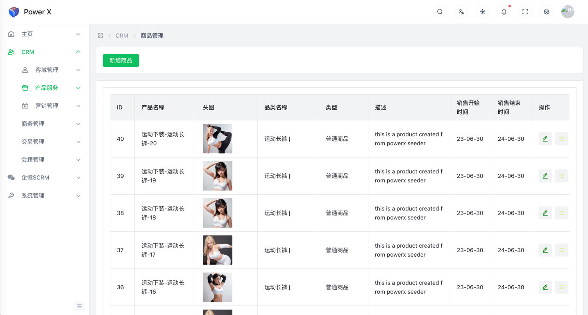

# 编辑商品

在CRM（Customer Relationship Management）系统中，"编辑商品"通常是指对产品或商品信息进行修改、更新或添加的功能。CRM系统的主要目标是帮助企业有效管理客户关系和销售流程，其中商品编辑功能是与销售和库存管理密切相关的重要功能之一。
是CRM系统中的一项关键功能，它帮助企业管理商品信息、库存和价格，从而更好地支持销售团队的工作和提高客户满意度。

## 编辑商品功能入口

1、导航路径： 进入【PowerX后台】>【CRM】>【产品服务】>【商品管理】。

 

2、点击铅笔样式的【编辑按钮】

## 编辑商品

在编辑商品列表中以下字段带*是必填字段：

#### 产品名称：

> - 商品的标识性名称或标题

#### 财务类别：

> - 对商品进行财务分类的标签或类别，用于将不同类型的商品进行分组，以便进行财务数据分析和报告。

#### 类型：

> - 用于区分不同类型的商品，通常表示商品的性质、属性或分类。包含：【**普通商品**】、【**周期性商品**】

#### 审核状态：

> - 用于标识商品信息或交易当前所处的审核阶段。包含：【**通过**】、【**待审核**】、【**拒绝**】

#### 计划：

> - 通常指与商品相关的财务计划或预算，例如计划的销售额、采购成本、库存量等信息。包含：【**实体商品**】、【**虚拟商品**】

#### SPU - 标准产品单位：

> - SPU是标准产品单位的缩写，它指的是标准化的产品单位，用于标识和管理产品的基本规格或型号。

    参考如下：

---

非必填字段，可以根据具体情况填写

#### 设置品类：

在左侧source列表框内选择需要添加的类别选项，然后点击中间的“>”，添加到右侧的target列表框中，参考如下：

#### 更新商品图片

上传需要的商品头图和详情图片，是可选的，根据实际需求确认是否要删除图片。

> - 上传图片

> - 删除图片

#### 提交

在确认所有的信息都填写好后，点击【提交】按钮，提交当前的所有修改。

