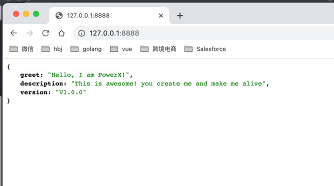

# 本地命令行启动

##  进入PowerX

``` bash
> cd /{your_project_root_location}/PowerX

```

## 方案1 - 采用Makefile 启动

### 1.1 第一次初始化项目

``` bash
> cp etc/powerx.yaml etc/powerx-local.yaml

```
* 直接复制一个etc/powerx.yaml -> etc/powerx-local.yaml
* 配置etc/powerx-local.yaml文件，主要配置数据库DSN，暂时我们默认使用Postgres DB。
配置参数[详见介绍](common.md)

``` bash
# 项目中Makefile默认引用的是 etc/powerx-local.yaml
# 可以直接看Makefile文件的内容
> make app-init
go build -o /private/var/www/html/ArtisanCloud/PowerX/Core/PowerX/powerxctl /private/var/www/html/ArtisanCloud/PowerX/Core/PowerX/cmd/ctl/powerxctl.go
/private/var/www/html/ArtisanCloud/PowerX/Core/PowerX/powerxctl database migrate -f /private/var/www/html/ArtisanCloud/PowerX/Core/PowerX/etc/powerx-local.yaml
go build -o /private/var/www/html/ArtisanCloud/PowerX/Core/PowerX/powerxctl /private/var/www/html/ArtisanCloud/PowerX/Core/PowerX/cmd/ctl/powerxctl.go
/private/var/www/html/ArtisanCloud/PowerX/Core/PowerX/powerxctl database seed -f /private/var/www/html/ArtisanCloud/PowerX/Core/PowerX/etc/powerx-local.yaml
go build -o /private/var/www/html/ArtisanCloud/PowerX/Core/PowerX/powerx /private/var/www/html/ArtisanCloud/PowerX/Core/PowerX/cmd/server/powerx.go
/private/var/www/html/ArtisanCloud/PowerX/Core/PowerX/powerx -f /private/var/www/html/ArtisanCloud/PowerX/Core/PowerX/etc/powerx-local.yaml

Starting server at 0.0.0.0:8888...

```


### 1.2 启动后台服务


### 1.2.1 打开浏览器，输入访问地址:   
http://127.0.0.1:8000




### 如果不是第一次初始化运行，可以直接启动命令 make app-run

``` bash
> make app-run
go build -o /private/var/www/html/ArtisanCloud/PowerX/Core/PowerX/powerx /private/var/www/html/ArtisanCloud/PowerX/Core/PowerX/cmd/server/powerx.go
/private/var/www/html/ArtisanCloud/PowerX/Core/PowerX/powerx -f /private/var/www/html/ArtisanCloud/PowerX/Core/PowerX/etc/powerx-local.yaml

Starting server at 0.0.0.0:8888...

```

### 如果需要单独跑migrate数据表
``` bash
> make app-migrate
go build -o /private/var/www/html/ArtisanCloud/PowerX/Core/PowerX/powerxctl /private/var/www/html/ArtisanCloud/PowerX/Core/PowerX/cmd/ctl/powerxctl.go
/private/var/www/html/ArtisanCloud/PowerX/Core/PowerX/powerxctl database migrate -f /private/var/www/html/ArtisanCloud/PowerX/Core/PowerX/etc/powerx-local.yaml

```

### 如果需要单独跑seed，初始化一些seed数据
``` bash
> make app-seed
go build -o /private/var/www/html/ArtisanCloud/PowerX/Core/PowerX/powerxctl /private/var/www/html/ArtisanCloud/PowerX/Core/PowerX/cmd/ctl/powerxctl.go
/private/var/www/html/ArtisanCloud/PowerX/Core/PowerX/powerxctl database seed -f /private/var/www/html/ArtisanCloud/PowerX/Core/PowerX/etc/powerx-local.yaml

```

## 方案2 - 编译源代码

### 2.1 编译 powerctl，初始化数据库
``` bash
# 在根目录下编译一个powerctl
> go build -o powerxctl cmd/ctl/powerxctl.go
# 执行 powerctl
> ./powerxctl database migrate -f ./etc/powerx-local.yaml
> ./powerxctl database seed -f ./etc/powerx-local.yaml

```

### 2.2 编译 powerx，启动项目
``` bash
# 在根目录下编译一个powerx
> go build -o powerx cmd/server/powerx.go

# 执行 powerx
> ./powerx -f ./etc/powerx-local.yaml

Starting server at 0.0.0.0:8888...


```

编译不同平台的可行性文件，确保在根目录上有powerx可执行文件

```bash
# Linux环境编译
> CGO_ENABLED=0  GOOS=linux  GOARCH=amd64 go build -o powerx cmd/server/powerx.go
```

```bash
# Windows环境编译
> CGO_ENABLED=0  GOOS=windows  GOARCH=amd64 go build -o powerx.exe cmd/server/powerx.go
```

```bash
# Linux环境编译
> CGO_ENABLED=0  GOOS=darwin  GOARCH=arm64 go build -o powerx cmd/server/powerx.go
```


