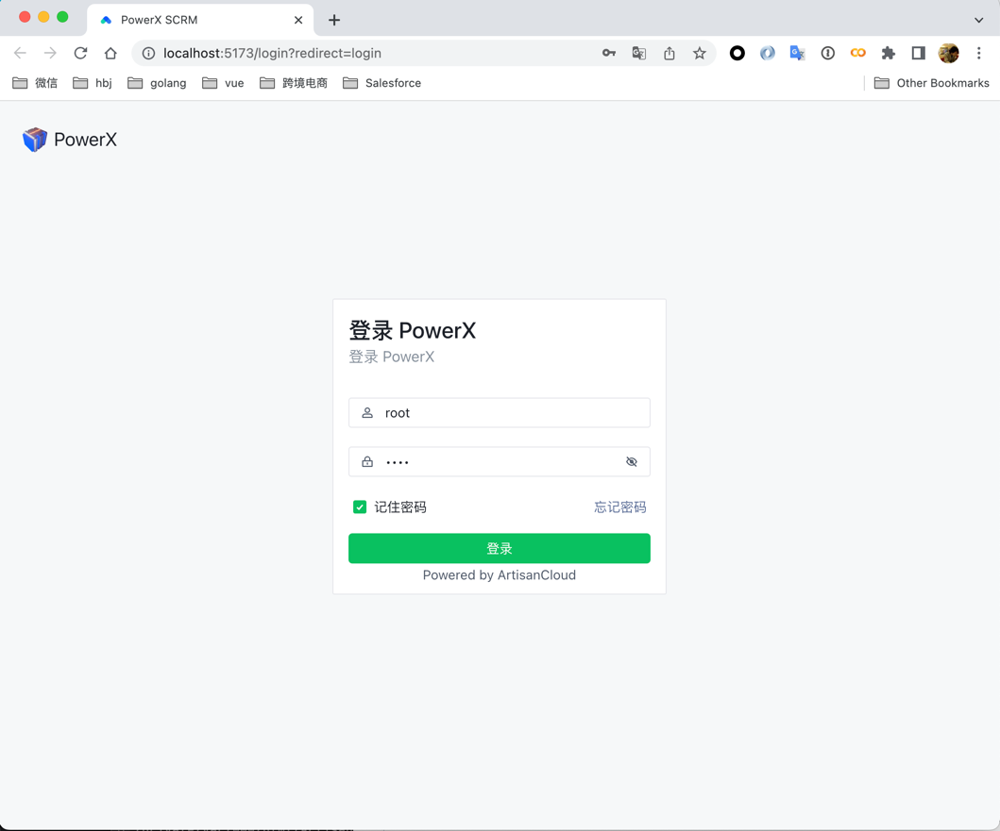

# docker-compose部署

## 定位好项目路径
### 1 进入到你到项目目录下

``` bash
> cd /{your_project_root_location}
> ls
PowerX              PowerXDashboard 

# 添加一个文件
> vi docker-compose.yaml

```
### 2 复制一下内容到docker-compose.yaml

``` yaml
version: '3.8'

services:
  postgres:
    image: postgres:latest
    container_name: postgres-PowerX
    environment:
      POSTGRES_USER: PowerX
      POSTGRES_PASSWORD: PowerXpw
      POSTGRES_DB: PowerX
    volumes:
      - ./data/postgres:/var/lib/postgresql/data
    ports:
      - "5432:5432"
    networks:
      - PowerX-network
    healthcheck:
        test: ["CMD-SHELL", "pg_isready -U PowerX"]
        interval: 10s
        retries: 5
  
  redis:
    image: redis:latest
    container_name: redis-PowerX
    ports:
      - "6379:6379"
    networks:
      - PowerX-network
    healthcheck:
      test: ["CMD", "redis-cli", "ping"]
      interval: 30s
      timeout: 10s
      retries: 5

  minio:
    image: minio/minio:latest
    container_name: minio-PowerX
    command: server --console-address ":9090" /mnt/data
    environment:
      MINIO_CONFIG_ENV_FILE: /etc/config.env
    volumes:
      - ./data/minio:/mnt/data
      - ./etc/minio.env:/etc/config.env
    ports:
      - "9000:9000"
      - "9090:9090"
    networks:
      - PowerX-network
  
  server:
    build:
      context: ./PowerX
      dockerfile: deploy/docker/Dockerfile
    container_name: PowerX-server
    volumes:
      - ./etc/powerx.yaml:/app/etc/powerx.yaml
    ports:
      - "8888:8888"
    networks:
      - PowerX-network
    depends_on:
        redis:
          condition: service_healthy
        postgres:
          condition: service_healthy
    healthcheck:
        test: ["CMD", "nc", "-z", "localhost", "8888"]
        interval: 30s
        timeout: 10s
        retries: 5
      

  web:
    build:
      context: ./PowerXDashboard
      dockerfile: deploy/docker/Dockerfile
    container_name: PowerX-web
    ports:
        - "3000:80"
    networks:
      - PowerX-network
    depends_on:
        postgres:
            condition: service_healthy
        server:
            condition: service_healthy
            
  network-tools:
      image: nicolaka/netshoot:latest
      container_name: network-tools
      command: sleep infinity
      networks:
          - PowerX-network

networks:
    PowerX-network:
        driver: bridge


```

你可以用其他编辑器来编辑docker-compose.yaml， 确保文件保存成功

``` bash
> ls
PowerX              PowerXDashboard 
docker-compose.yaml

```

### 3 添加etc/powerx.yaml

``` bash
> mkdir etc
> vi etc/powerx.yaml

```
请查看PowerX项目根目录下,etc/powerx.yaml的内容，复制粘贴到docker下的powerx.yaml的内容，然后按照自己的需求，修改


``` bash
# {PowerX}是你当前clone PowerX的改名的项目名称
> cp {PowerX}/etc/powerx.yaml etc/powerx.yaml

```

``` bash
> vi etc/minio.env

```

### 4 复制粘贴minio.env的内容

```yaml
# MINIO_ROOT_USER and MINIO_ROOT_PASSWORD sets the root account for the MinIO server.
# This user has unrestricted permissions to perform S3 and administrative API operations on any resource in the deployment.
# Omit to use the default values 'minioadmin:minioadmin'.
# MinIO recommends setting non-default values as a best practice, regardless of environment

MINIO_ROOT_USER=powerx
MINIO_ROOT_PASSWORD=powerxpw

# MINIO_VOLUMES sets the storage volume or path to use for the MinIO server.

MINIO_VOLUMES="/mnt/data"

# MINIO_SERVER_URL sets the hostname of the local machine for use with the MinIO Server
# MinIO assumes your network control plane can correctly resolve this hostname to the local machine

# Uncomment the following line and replace the value with the correct hostname for the local machine.

#MINIO_SERVER_URL="http://minio.example.net"
```

### 5 查看并且使用 docker-compose up -d启动
``` bash
> ls
PowerX              PowerXDashboard 
docker-compose.yaml etc

> docker-compose up -d
...

```

### 6 web浏览

打开浏览器，输入 localhost:3000（docker-compose默认设置了3000端口）




请确保后台PowerX是启动状态，输入账号root，密码root登陆