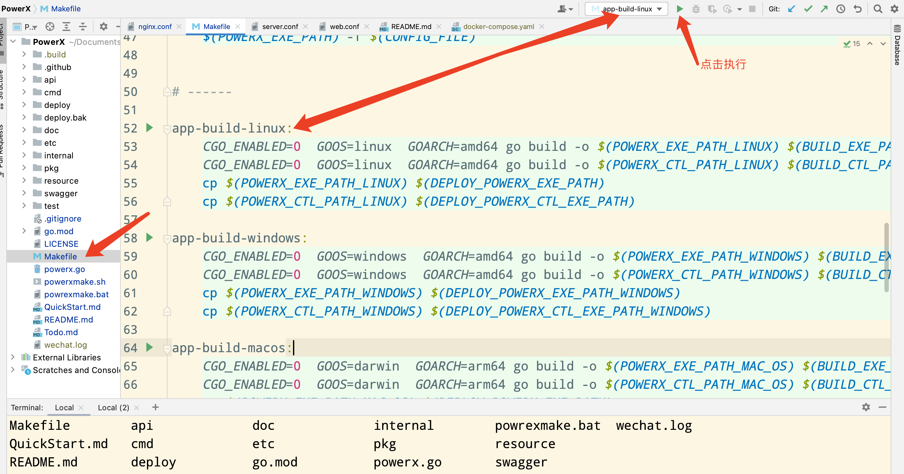
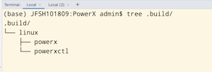
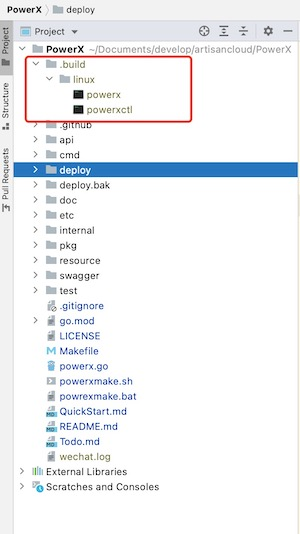
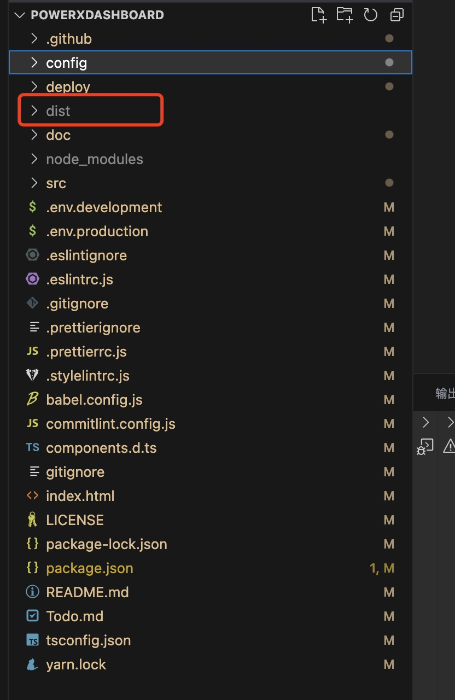
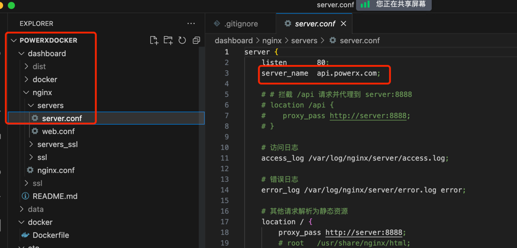
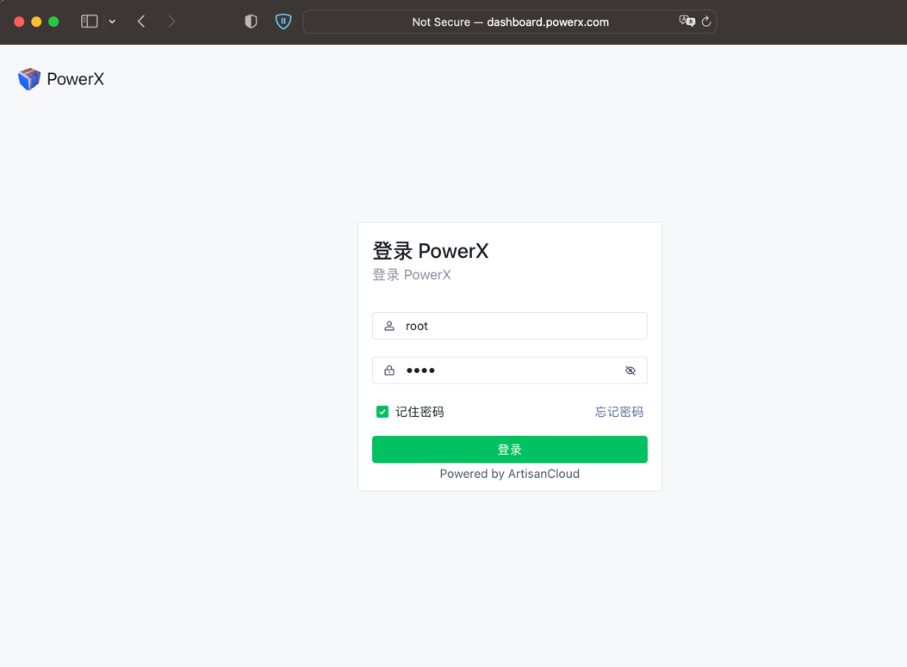

# docker-compose部署

##  定位好项目路径
###  进入到你到项目目录下

``` bash
> cd /{your_project_root_location}/
> ls
PowerX       PowerXDocker        PowerXDashboard 
```

## 编译和配置后端项目

###  1、 生成Linux系统里的powerx和powerxctl可执行文件


### 方式一：使用IDE(推荐Goland)来编译执行文件

执行Makefile里的编译命令: app-build-linux

``` bash
> cd PowerX/
```


<br>

完成后，会在当前目录下生成.build目录

``` bash
> tree .build

```



<br>

如果使用Makefile编译的，会自动拷贝powerx和powerxctl文件到PowerXDocker目录下



<br>

### 方式二： 使用命令编译执行文件

使用命令执行Makefile里的编译命令: app-build-linux

``` bash
# 编译Linux环境执行文件 linux环境:
> CGO_ENABLED=0  GOOS=linux  GOARCH=amd64 go build -o .build/linux/powerx cmd/ctl/powerxctl.go
> CGO_ENABLED=0  GOOS=linux  GOARCH=amd64 go build -o .build/linux/powerxctl cmd/ctl/powerxctl.go

# 编译Linux环境执行文件 windows环境:
> CGO_ENABLED=0  GOOS=windows  GOARCH=amd64 go build -o .build/windows/powerx cmd/ctl/powerxctl.go
> CGO_ENABLED=0  GOOS=windows  GOARCH=amd64 go build -o .build/windows/powerxctl cmd/ctl/powerxctl.go

# 编译Linux环境执行文件 mac环境:
> CGO_ENABLED=0  GOOS=darwin  GOARCH=arm64 go build -o .build/darwin/powerx cmd/ctl/powerxctl.go
> CGO_ENABLED=0  GOOS=darwin  GOARCH=arm64 go build -o .build/darwin/powerxctl cmd/ctl/powerxctl.go

# 编译好后，拷贝.build/${GOOS}目录下的文件到 PowerXDocker 目录下
#以下是linux环境
> cp .build/linux/powerx ../PowerXDocker/powerx
> cp .build/linux/powerxctl ../PowerXDocker/powerxctl

```

<br>

### 1 添加docker-compose.yaml文件

``` bash
> cd /{your_project_root_location}/PowerXDocker/
> cp docker-compose-example.yaml docker-compose.yaml
```

<br>

#### docker-compose.yaml内容参考如下

``` yaml
version: '3.8'

services:
  postgres:
    image: postgres:latest
    container_name: postgres-PowerX
    environment:
      POSTGRES_USER: PowerX
      POSTGRES_PASSWORD: PowerXpw
      POSTGRES_DB: PowerX
    volumes:
      - ./data/postgres:/var/lib/postgresql/data
    ports:
      - "5432:5432"
    networks:
      - PowerX-network
    healthcheck:
        test: ["CMD-SHELL", "pg_isready -U PowerX"]
        interval: 10s
        retries: 5
  
  redis:
    image: redis:latest
    container_name: redis-PowerX
    ports:
      - "6379:6379"
    networks:
      - PowerX-network
    healthcheck:
      test: ["CMD", "redis-cli", "ping"]
      interval: 30s
      timeout: 10s
      retries: 5

  minio:
    image: minio/minio:latest
    container_name: minio-PowerX
    command: server --console-address ":9090" /mnt/data
    environment:
      MINIO_CONFIG_ENV_FILE: /etc/config.env
    volumes:
      - ./data/minio:/mnt/data
      - ./etc/minio.env:/etc/config.env
    ports:
      - "9000:9000"
      - "9090:9090"
    networks:
      - PowerX-network
  
  server:
    build:
      context: ./PowerX
      dockerfile: deploy/docker/Dockerfile
    container_name: PowerX-server
    volumes:
      - ./etc/powerx.yaml:/app/etc/powerx.yaml
    ports:
      - "8888:8888"
    networks:
      - PowerX-network
    depends_on:
        redis:
          condition: service_healthy
        postgres:
          condition: service_healthy
    healthcheck:
        test: ["CMD", "nc", "-z", "localhost", "8888"]
        interval: 30s
        timeout: 10s
        retries: 5
      

  web:
    build:
      context: ./PowerXDashboard
      dockerfile: deploy/docker/Dockerfile
    container_name: PowerX-web
    ports:
        - "3000:80"
    networks:
      - PowerX-network
    depends_on:
        postgres:
            condition: service_healthy
        server:
            condition: service_healthy
            
  network-tools:
      image: nicolaka/netshoot:latest
      container_name: network-tools
      command: sleep infinity
      networks:
          - PowerX-network

networks:
    PowerX-network:
        driver: bridge


```

<br>

你可以用其他编辑器来编辑docker-compose.yaml， 确保文件保存成功

<br>

### 2 添加etc/powerx.yaml

``` bash
# PowerXDocker是你当前的项目名称
查看PowerXDocker项目目录,进入etc复制powerx-example.yaml为powerx.yaml，然后按照自己的需求修改
> cd PowerXDocker/etc/
> cp powerx-example.yaml powerx.yaml
> vi powerx.yaml
```

<br>

最新的配置，请参阅：[powerx-example.yaml](https://github.com/ArtisanCloud/PowerX/blob/release/v1.0.0/etc/powerx-example.yaml)

<br>

### 3 修改minio.env的内容

``` bash
> vi etc/minio.env

```
```yaml
# MINIO_ROOT_USER and MINIO_ROOT_PASSWORD sets the root account for the MinIO server.
# This user has unrestricted permissions to perform S3 and administrative API operations on any resource in the deployment.
# Omit to use the default values 'minioadmin:minioadmin'.
# MinIO recommends setting non-default values as a best practice, regardless of environment

MINIO_ROOT_USER=powerx
MINIO_ROOT_PASSWORD=powerxpw

# MINIO_VOLUMES sets the storage volume or path to use for the MinIO server.

MINIO_VOLUMES="/mnt/data"

# MINIO_SERVER_URL sets the hostname of the local machine for use with the MinIO Server
# MinIO assumes your network control plane can correctly resolve this hostname to the local machine

# Uncomment the following line and replace the value with the correct hostname for the local machine.

#MINIO_SERVER_URL="http://minio.example.net"
```

##  编译前端web项目

### 切换到前端PowerXDashboard目录，并编译前端服务
``` bash
> cd /{your_project_root_location}/PowerXDashboard/

#  node版本要在v20.x以上
> node -v
v20.4.0

#确保已经安装好npm
> npm i

> npm run build


```

###  执行完成后会在当前目录有一个dist目录


``` bash 
# 拷贝dist目录到PowerX下面
> cp -r dist /{your_project_root_location}/PowerXDocker/dashboard/

```
##  创建挂载的data目录

``` bash
#该目录是用于存放数据的
> cd PowerXDocker
> mkdir data
```


## 请先使用powerx.com的域名作为本地劫持访问域名：
PowerX默认使用两个域名来作为前后端分离机制

http://api.powerx.com 作为后台api域名  
http://dashboard.powerx.com 作为后端网页的访问入口

所以我们没有使用localhost作为默认启动，也是希望让用户先熟悉一下配置域名访问的过程。


```bash

# mac/linux 修改的hosts路径
> sudo vi /etc/hosts

# windows下使用powershell 修改的hosts路径
# 请使用管理员身份打开powershell
# 请确保你能定位到hosts路径
> vi C:\Windows\System32\drivers\etc\hosts

# 在hosts文件中，添加两个劫持域名到本地127.0.0.1
127.0.0.1 api.powerx.com
127.0.0.1 dashboard.powerx.com

```

## 启动服务


###  查看并且使用 docker-compose up -d启动
``` bash
#  运行前先确保本地docker服务已经正常启动
> cd /{your_project_root_location}/PowerXDocker
> docker-compose build --no-cache
> docker-compose up -d

...

```

###  web浏览

打开浏览器，输入 dashboard.powerx.com（docker-compose默认设置了80端口）



请确保后台PowerX是启动状态，输入账号root，密码root登陆