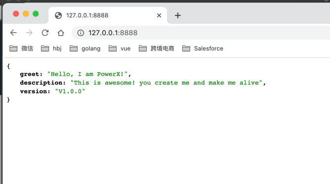
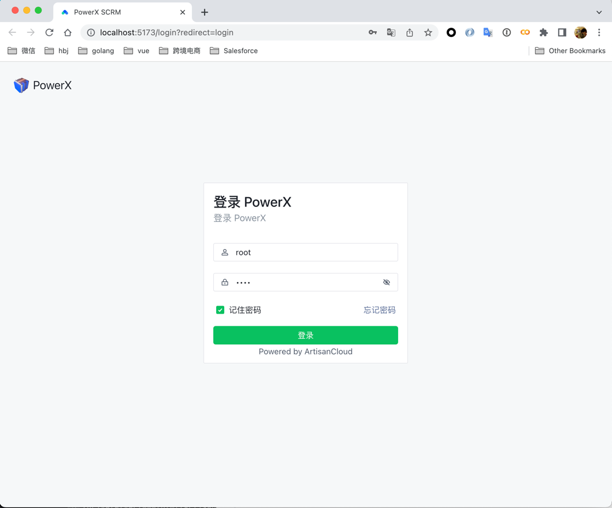

# 本地IDE启动


## 1. 使用IDE启动后台服务(推荐使用Goland) 


### 1.2.1 打开项目


### 1.2.2 打开右上角的编译工具配置


### 1.2.2 点击左上角的添加按钮


* 输入powerx.go的路径：{your_project_root_location}/PowerX/cmd/server/powerx.go
* 输入项目工作的路径: {your_project_root_location}/PowerX
* 输入 -f etc/powerx.yaml
* 可以给编译操作取名为"go build powerx.go"
* 点击按钮"OK"

### 1.2.3 启动后台服务


### 1.2.4 打开浏览器，输入访问地址 http://127.0.0.1:8888




## 2. 使用IDE启动前端服务(推荐使用WebStorm) 
[PowerXDashboard](https://github.com/ArtisanCloud/PowerXDashboard)是基于[Arco Design Vue3](https://arco.design/vue/docs/start)进行开发。

### 2.0 预安装环境


版本管理使用[yarn](https://yarnpkg.com/getting-started/install)

```bash
> yarn --verion
1.22.19

```


## 使用WebStorm打开PowerXDashboard项目


在终端，输入yarn -i,安装依赖包
```bash
> yarn -i
...
```


### 本地访问启动服务

打开浏览器，输入 localhost:5173




请确保后台PowerX是启动状态，输入账号root，密码root登陆


