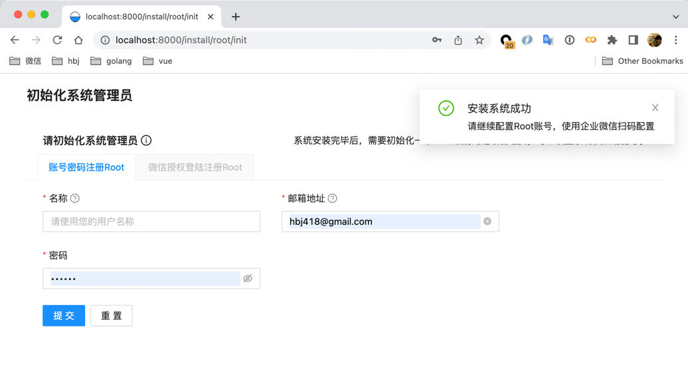
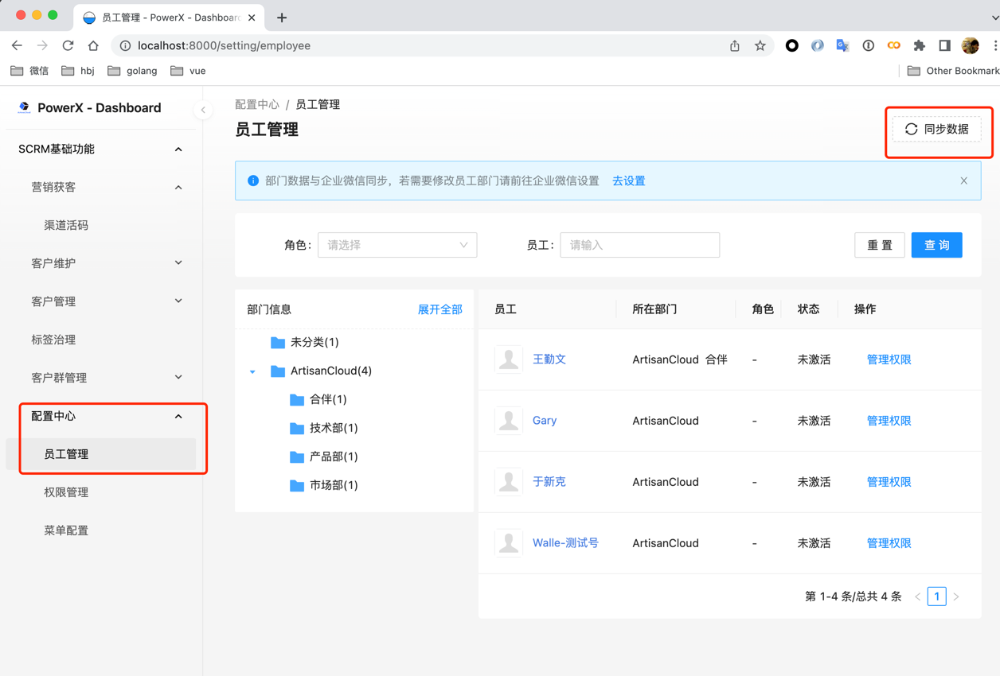

# 快速开始

## 重启后台
<span style="color:red">在安装配置完前面的参数后，后台系统会自动关闭，等待启动</span>

再次启动系统，加载新的配置
``` bash
# Linux/mac启动PowerX服务
> ./PowerX serve
"0.0.0.0:8080"

# windows启动PowerX服务
> .\PowerX.exe serve
"0.0.0.0:8080"
```


## 初始化Root账号
如果当前的环境不是正是站，或者说企业微信的回调url没有做相应的配置或者域名穿刺，
则直接使用默认的root初始化方式。



### Root用户名
- 类型: `字符串`
- 必传: `是`
- 默认值: ``

### Root邮箱地址
- 类型: `字符串`
- 必传: `是`
- 默认值: ``
- 描述: `可与企业微信账号无关`

### Root密码
- 类型: `字符串`
- 必传: `是`
- 默认值: ``
- 描述: `密码建议使用复杂的字符`


## 同步企业微信的员工和部门信息

进入配置中心->员工管理，右上角有同步数据的按钮，如果之前安装企业微信的配置无误，则数据可以被同步到后台数据库中。


