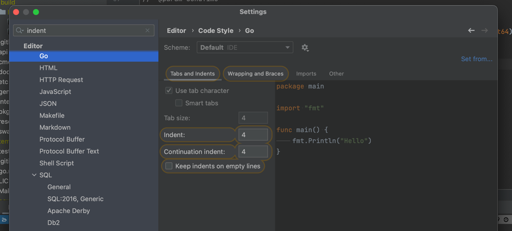

# 开发规范

## 参考 [vue](https://github.com/vuejs/vue/blob/dev/.github/COMMIT_CONVENTION.md) 规范

* feat 增加新功能
* fix 修复问题/BUG
* style 代码风格相关无影响运行结果的
* perf 优化/性能提升
* refactor 重构
* revert 撤销修改
* test 测试相关
* docs 文档/注释
* chore 依赖更新/脚手架配置修改等
* workflow 工作流改进
* ci 持续集成
* types 类型定义文件更改
* wip 开发中

## 伟大的贡献者 Pull Request:

Fork 代码!

创建自己的分支: git checkout -b feat/xxxx

提交你的修改: git commit -am 'feat(function): add xxxxx'

推送您的分支: git push origin feat/xxxx

提交pull request

## Tab占位符数量

### 后台Golang的Tab只用space数量为4

### 前端Vue的Tab只用space数量为2

## 项目设计结构介绍
* api: 配置玩api层的模块，由GoZero的GoCtl生成，
  * admin: 管理后台的api
  * mp: 小程序的api
  * custom: 自定义的api
  * plugin: 插件的api (预留目录，我们在构建一个更好的插件市场机制)
* middleware: 中间件
* router: 路由，由GoZero的GoCtl生成
* handle: 控制器的入口，由GoZero的GoCtl生成
* Logic: 业务逻辑
* UC：crud系列包括，分页列表，详情，删除，更新，增新Upsert，transaction，
* Model：表字段配置，关系表配置

## Error机制

在UseCase层中
* 如果有方法会返回err，是需要给到上层业务层判断使用
* 如不返回err，而是内部直接panic，则该error是穿透性，直接跳到外部接口

## 模型对象状态机制

### 删除状态
系统中对象的删除接口，使用软删除，在数据表中的deleted_at字段上控制

> deleted_at 必有

### 激活/启用状态
一把情况下，在未删除的记录中，如果需要用激活，或者启用状态，会有bool IsActive /  IsEnabled来表示是否启用

> bool IsActive/IsEnabled 选项

### 多态状态
业务中的对象，往往会有多态，我们一般情况下会有status去描述。你也可以追加自己的状态字段

> int8 status 选项
