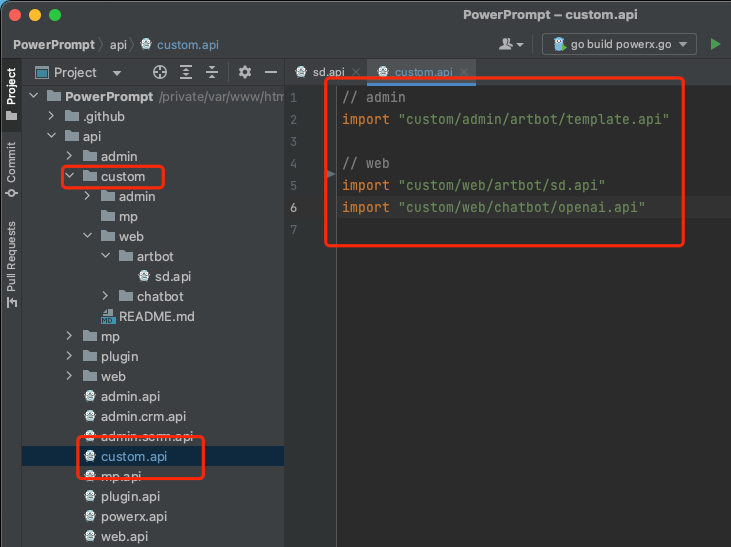
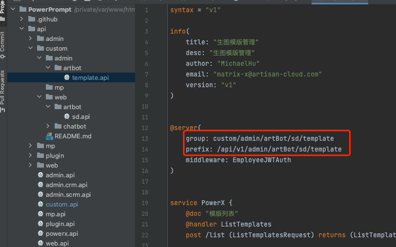
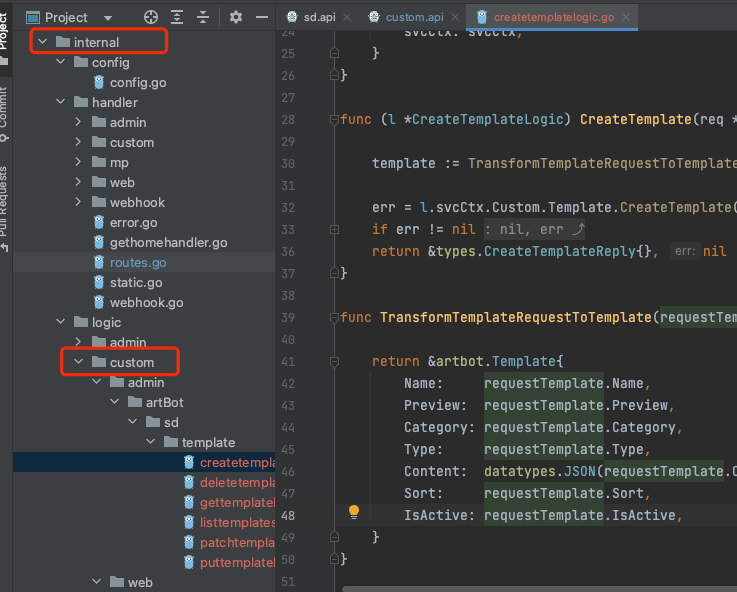
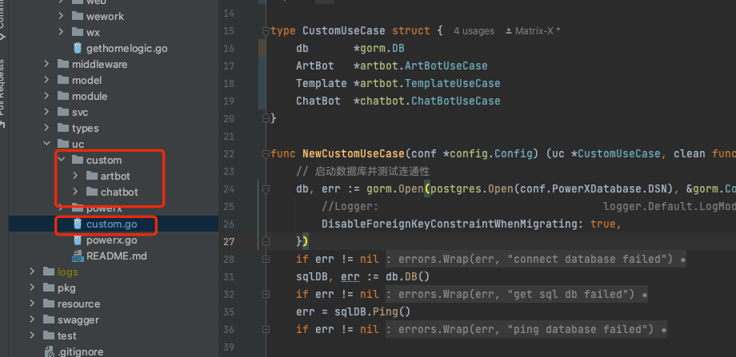
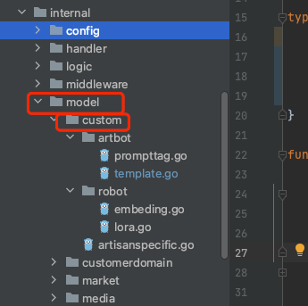

# 二开规范

举例我们自己用PowerX如何进行项目定制二开:

可以在相同作用域的结构目录下，添加

配置前端路由api层的定制路径样板
- api/custom/xxx/xxx

业务逻辑层的定制路径样板
- internal/logic/custom/xxx/xxx

用例层的定制路径样板
- internal/uc/custom/xxx/xxx

数据模型层的定制路径样板
- internal/uc/model/xxx/xxx

注意：
> 这里必须要强调一下，golang也好，前端Vue的Typescript也罢，都不能cycle引用，一旦碰到cycle，排查策略也是很头痛

> 所以我们关于PowerX的标准对象，特别是Model对象，应该是被Custom里的对象引用，也就是遵循单向引用的原则，避开引用的耦合僵局。

如果有更好的定制开发的策略，欢迎来指点我们团队，请加我们的企业微信。

