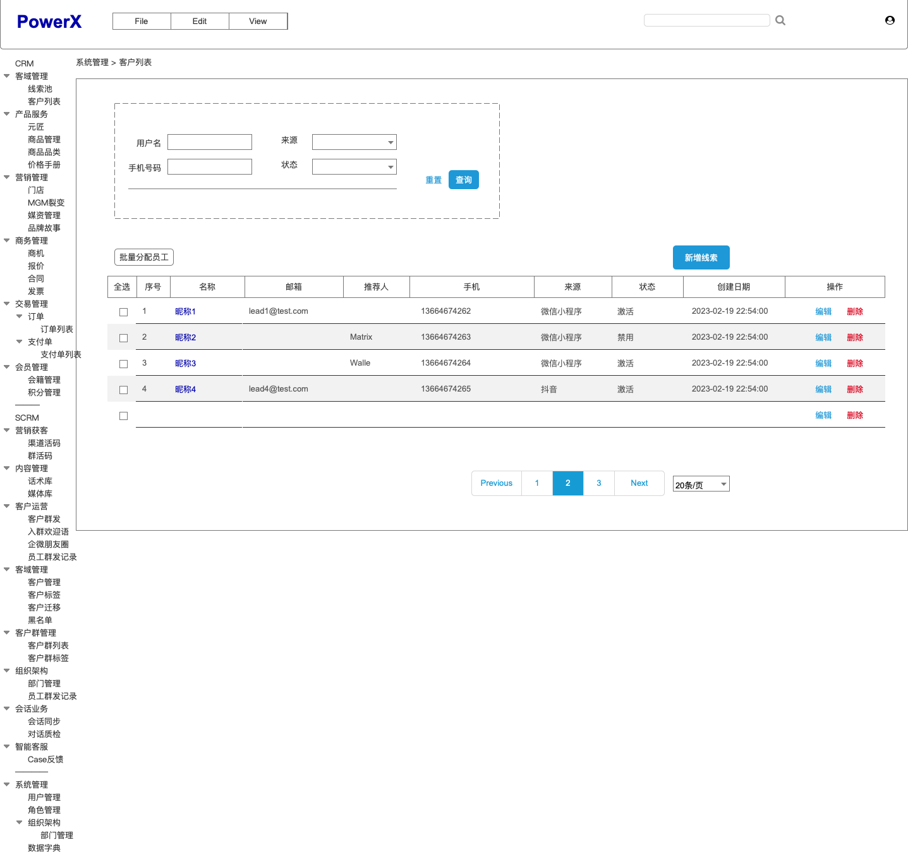

# 线索池

作为CRM系统，最基础的就是线索Lead的对象

在CRM系统中，"lead"（潜在客户）通常指的是一个潜在的销售机会或潜在客户，可能对组织的产品或服务表达了兴趣，但尚未成为正式的客户。"Lead"是一个广义的术语，可以指代任何有潜在商业价值的个人、组织或实体。

CRM系统中的"lead"可以是通过多种渠道获得的，包括在线注册、市场营销活动、广告点击、展会或口头推荐等。一旦获取到"lead"，CRM系统会记录和管理这些潜在客户的信息，以便组织能够跟进和追踪他们的兴趣，并将其转化为实际的销售机会或客户。

通常，CRM系统中的"lead"信息包括潜在客户的联系方式（例如姓名、电子邮件地址、电话号码）、兴趣领域、来源渠道、交互历史和其他相关细节。这些信息帮助销售团队了解潜在客户的需求和偏好，并通过有效的沟通和跟进，促使"lead"逐渐向销售阶段过渡。

CRM系统通过跟踪"lead"的进展情况，提供工作流程、任务提醒、通讯记录和分析报告等功能，帮助销售团队有效地管理和转化"lead"。通过CRM系统，销售团队能够更好地追踪和管理潜在客户，并提供个性化的服务和建议，以最大程度地提高销售成功的机会。

## 用例

## 用例描述

## 原型图

