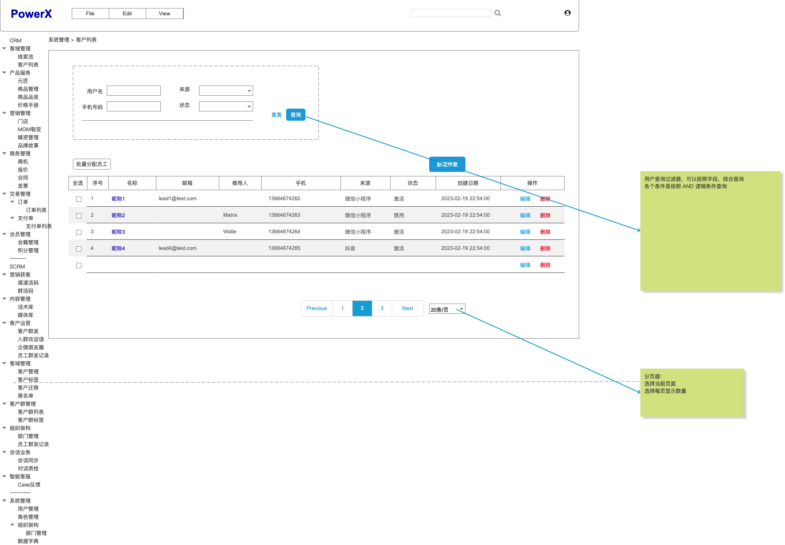

# 媒体

## 媒体类型
* 产品展示 (Product Showcase)
  * 描述：用于展示和推广具体产品的媒体内容，包括产品图片、描述和特性等。
  * 使用场景：适用于电商网站、社交媒体广告等。
* 教程和演示 (Tutorial & Demo)
  * 描述：提供产品的教程、演示和使用指南等内容，以帮助消费者了解和使用产品。
  * 使用场景：适用于电商网站、视频平台、社交媒体等。
* 买家评价 (Customer Reviews)
  * 描述：包括消费者对产品的评价、评论和反馈，用于增强产品的信任度和口碑。
  * 使用场景：适用于电商网站、社交媒体、评价平台等。
* 品牌故事 (Brand Story)
  * 描述：介绍品牌背景、价值观和故事，以建立与消费者的情感联系和品牌认同。
  * 使用场景：适用于电商网站、品牌宣传材料、社交媒体等。
* 促销活动 (Promotional Campaigns)
  * 描述：包括折扣、优惠券、限时促销等营销活动的媒体内容，用于吸引消费者购买。
  * 使用场景：适用于电商网站、电子邮件营销、社交媒体广告等。
* 社交媒体推广 (Social Media Promotion)
  * 描述：通过社交媒体平台发布的媒体内容，用于推广产品、品牌和促销活动。
  * 使用场景：适用于社交媒体平台（如Instagram、Facebook、Twitter）。
* 试用和样品 (Trial & Samples)
  * 描述：提供产品试用、样品申请和免费赠品等机会，以促进消费者的购买和试用体验。
  * 使用场景：适用于电商网站、线下活动、邮寄服务等。
* 推荐和搭配 (Recommendations & Bundles)
  * 描述：根据消费者的购买历史和喜好，推荐相关产品或组合销售的媒体内容。
  * 使用场景：适用于电商网站、购物应用程序等。
* 用户生成内容 (User-generated Content)
  * 描述：消费者创造的与产品相关的内容，包括照片、视频、评论等，用于增加社交证据和用户参与度。
  * 使用场景：适用于社交媒

## 用例

## 用例描述

## 流程图

## 原型图

