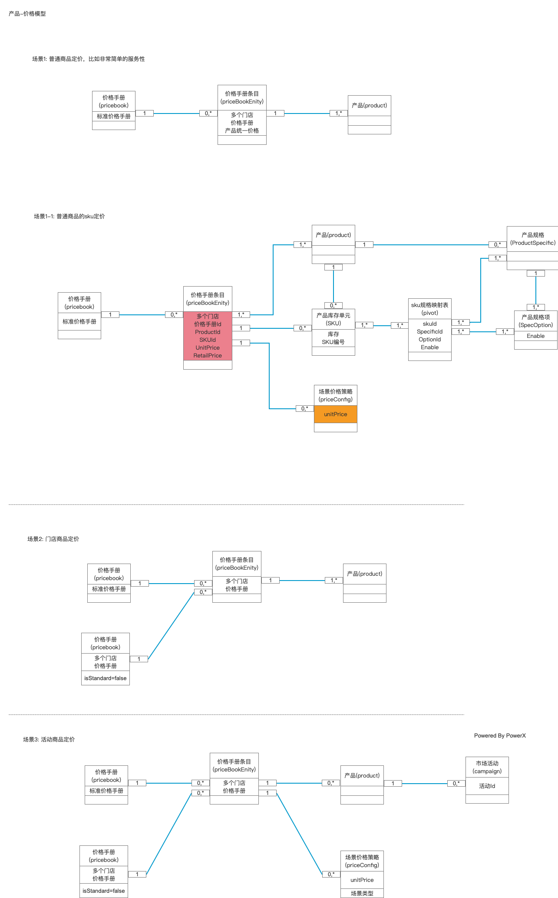

# 产品服务功能

## 业务模型：  

产品（商品）是一家品牌企业，经过市场洞察，分析客户需求，确定目标市场，进行方案设计后，提供价值的载体。

说到商品，必然离不开价格，所以企业有一套灵活性强，体系完整的报价策略，对千变万化的市场行情，就非常重要。
所以我们会提供价格手册的策略，优势：
* 应对不同地区，不同门店的价格策略
* 应对不同时期，周期性价格的策略
* 面向市场活动的价格策略
* 不同品类的商品价格策略

以上集中场景还可以自由组合，所以价格手册是一个非常有效的工具。

### 价格模型

## 用例

## 用例描述

