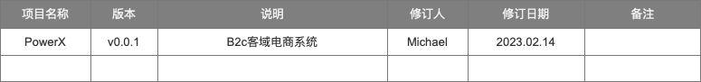

# 产品需求说明

PRD文档没有标准的规范，也没有统一的模板，每个公司都不一样，并且每个人也不一样，这个取决于个人习惯和团队要求

所以我们基本会对功能，进行信息结构、框架结构、界面结构(原型)等一系列设计步骤，阐述清楚产品的需求描述。

## 版本描述

## 目录
* [用例文档](./useCase)
* [树立参与者](./stakeholder)
* [系统功能用例分析](./system/index)
* [业务功能模块](./crm/index)
  