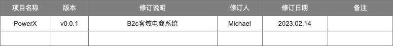

# 产品需求说明

PRD文档没有标准的规范，也没有统一的模板，每个公司都不一样，并且每个人也不一样，这个取决于个人习惯和团队要求

所以我们基本会对功能，进行信息结构、框架结构、界面结构(原型)等一系列设计步骤，阐述清楚产品的需求描述。

## 版本描述

### 版本修订

| 版本号        |    修订日期    | 修订内容                                  |
|------------|:----------------:|:--------------------------------------|
| Doc v1.0.0 | 2023-01-24 | 搭建了重构产品的产品需求方案，完成了技术实现的选型方案           |
| Doc v1.0.1 | 2023-02-24 | 完成方案的描述，完成了基本的系统功能描述，包括用户管理，角色管理，组织架构 |
| Doc v1.0.2 | 2023-03-24 | 完成线索的授权登录设计，商品后台列表的设计                 |

## 目录

* [用例文档](./useCase)
* [树立参与者](./stakeholder)
* [系统功能用例分析](./system/index)
* [业务功能模块](./crm/index)
  