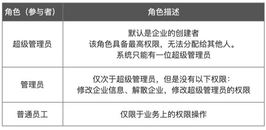
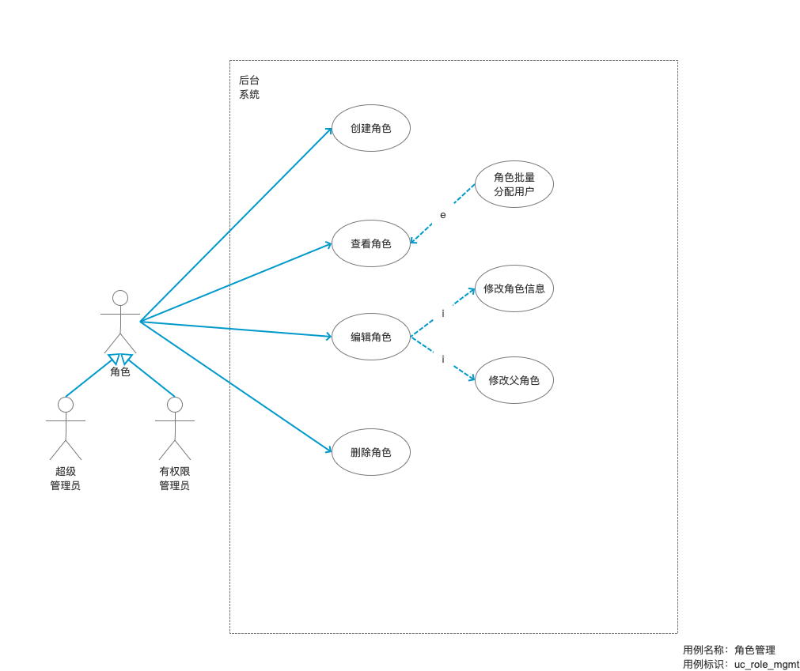
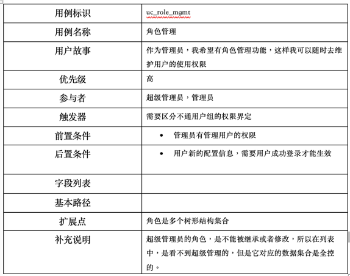
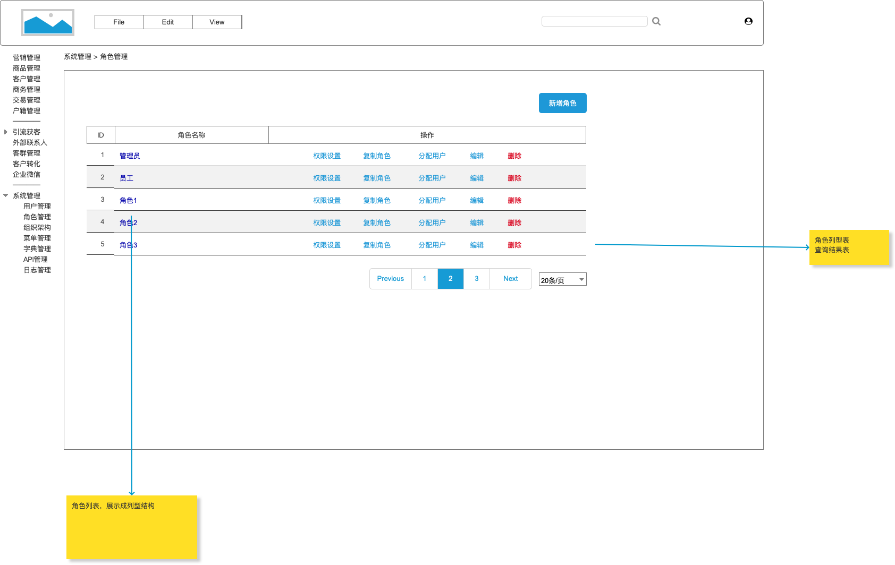

# 角色体系管理

角色管理是指管理系統中不同的人所扮演的不同角色。

**角色用于聚集用户和权限集合**，以简化对用户具有的资源访问权的管理工作。

角色是对一类用户的抽象描述。我们支持树形结构的角色关系模型。

* [创建角色](role/create.md)
* [查看角色列表](role/list.md)
* [编辑角色](role/edit.md)
* [删除角色](role/delete.md)

---

系统的角色管理是一个非常重要的设计问题，可以保证系统的安全性和数据的完整性。下面是一些设计角色管理的建议：

1. 确定角色的权限：在设计角色之前，需要明确系统中所有的权限，包括哪些功能可以被访问、修改、删除等。然后根据这些权限定义每个角色可以进行的操作。 
2. 划分角色：根据系统的需求和业务流程，划分不同的角色。例如，管理员、普通用户、审核员等。 
3. 设计角色的继承关系：有些角色可能需要继承其他角色的权限，例如管理员可以继承普通用户的权限。这样可以避免角色权限的冗余设计，同时也方便了角色的管理。 
4. 确定角色的范围：有些角色只能管理自己的数据，而不能访问其他用户的数据。在设计角色时，需要确定每个角色的数据访问范围。 
5. 管理角色的创建和修改：角色的创建和修改应该由系统管理员或授权的用户进行，并且需要记录下每个操作的时间和人员。 
6. 审计角色的使用：系统应该能够记录下每个角色的使用情况，包括谁使用了哪个角色以及使用的时间。这样可以方便对系统进行监管和审计。

总之，系统的角色管理需要根据具体业务需求进行设计，并且需要注意角色的权限、范围、继承关系等方面的问题。同时，需要考虑角色的创建、修改、审计等管理问题。

## 角色定义

本系统会默认初始化三种角色，即超级管理员，管理员，普通员工。

## 用例

## 用例描述

## 原型图

