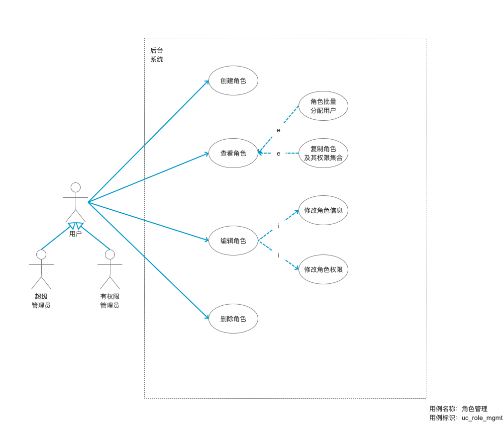

# 角色体系管理

角色管理是指管理系統中不同的人所扮演的不同角色。

**角色用于聚集用户和权限集合**，以简化对用户具有的资源访问权的管理工作。

角色是对一类用户的抽象描述。我们支持树形结构的角色关系模型。

而系统中的权限访问的界定，我们分**菜单功能权限**项和**API接口权限**。

数据访问权限的界定，一般分为：**对象（表对象）权限**，**记录（行对象）权限**，**字段权限**。
我们初期限制针对对象权限，随着业务的深入迭代，我们把颗粒度深入到字段级别的权限。

* [创建角色](role/create.md)
* [查看角色列表](role/list.md)
* [查看角色详情](role/detail.md)
* [编辑角色](role/edit.md)
* [删除角色](role/delete.md)

## 角色定义

本系统会默认初始化三种角色，即超级管理员，管理员，普通员工。

## 用例

## 用例描述

## 原型图

