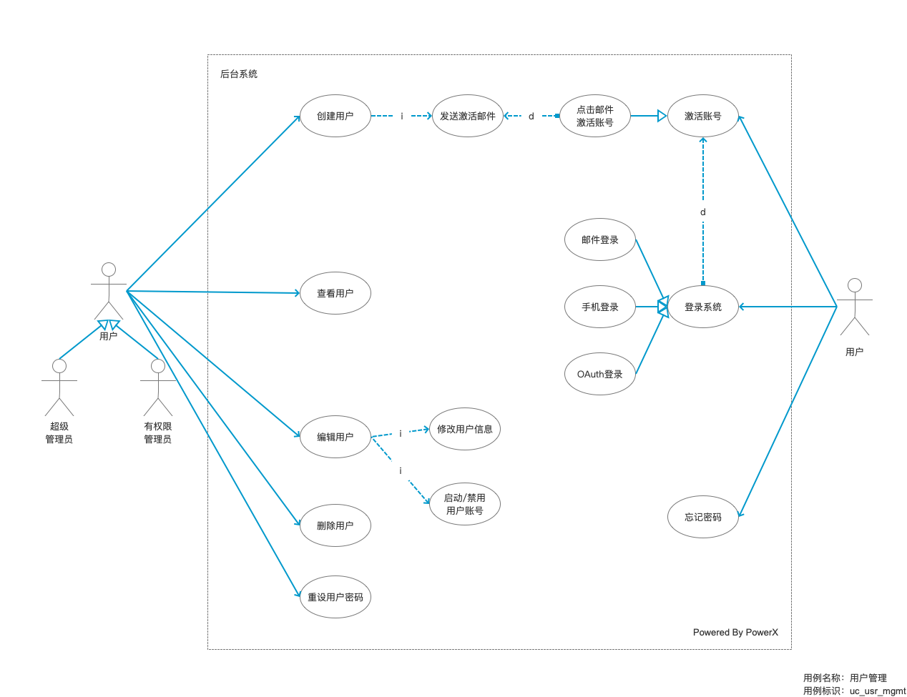

# 用户管理

用户泛指能登录到系统中使用者，比如后台系统登录的用户，大部分是企业内部员工，又或者是前端用户，那么可以是客户或消费者。

用户作为系统的核心对象，承载着不同使用者的属性，比如角色，部门，职位，职称等多维度的权限功能集合。

不管什么样的用户，只要使用系统，必然会开通注册一个账号，以及设定他们的使用权限。

用户管理是系统最基础的一项功能模块，它包含了：

* [创建用户](./user/create.md)
* [查看用户列表](./user/list.md)
* [查看用户详情](./user/detail.md)
* [编辑用户](./user/edit.md)
* [删除用户](./user/delete.md)
* [用户登录](./user/login.md)
* [重新设置密码](./user/resetPass.md)
* [重新发送激活用户](./user/resendActivateUserEmail.md)
* [启动/禁用用户](./user/enableUser.md)
* [强制退出](./user/forceLogout.md)

## 用例

## 用例描述

## 原型图

